# 前言

## 什么是受保护进程

首先，Windows Vista / Server 2008 引入了受保护进程的概念，其目的不是保护用户的数据或凭据，而是保护媒体内容以符合数字版权管理（DRM）的要求。例如，为了使蓝光媒体播放器能够读取内容同时防止复制，映像文件必须使用特殊的 Windows Media 证书进行数字签名。

在这种机制下，受保护的进程只能被未保护的进程访问非常有限的权限，如 PROCESS_QUERY_LIMITED_INFORMATION，PROCESS_SET_LIMITED_INFORMATION，PROCESS_TERMINATE 和 PROCESS_SUSPEND_RESUME

## 什么是PPL

在 Windows 8.1 / Server 2012 R2，Microsoft 引入了 PPL（Protected Process Light）概念。PPL 是对先前“受保护进程”模型的扩展，并添加了“保护级别”的概念

PPL被用于很多安全关键的系统服务，例如 Windows Defender Antivirus 服务就运行在一个PPL环境下，从而防止恶意软件试图关闭或规避这个防病毒服务

需要注意的是，启用PPL保护的进程必须由 Microsoft 或者其他被信任的实体签名，因为PPL进程的创建和修改是受到严格控制的。这一点确保了恶意软件不能创建自己的PPL进程来规避系统的安全限制

## 什么是TrustedInstaller权限

TrustedInstaller 是 Windows Vista 及其后续版本中引入的一个服务帐户。这个服务帐户在系统中具有非常高的权限级别，超过了常规的系统管理员权限。

TrustedInstaller 主要的作用是管理 Windows 的系统更新和系统组件的安装。很多核心的系统文件、注册表项和服务是由 TrustedInstaller 这个帐户拥有的，这样可以防止非授权的修改或删除这些关键的系统资源，从而提升系统的稳定性和安全性。

虽然管理员账户在 Windows 系统中具有很高的权限，但是对于 TrustedInstaller 拥有的文件或者服务，管理员账户默认是没有修改权限的。如果想要修改这些资源，管理员需要手动修改资源的所有权，将所有权从 TrustedInstaller 转移到管理员账户，然后再授予管理员账户相应的权限

​		

# PPL的加载与移除

## 1.查看进程PPL

使用管理员权限打开ProcessExplorer，点击`View->Select Columns`, 勾选上`Protection`，这样就能看到进程的保护级别了

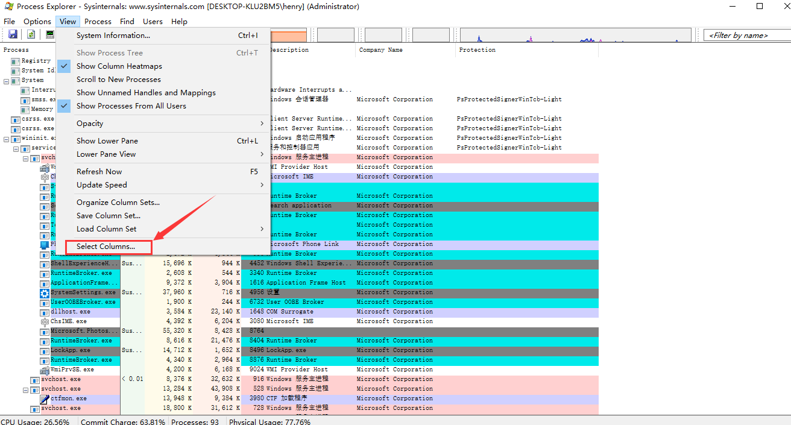	

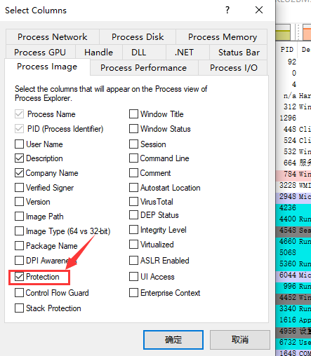	

可以发现lsass进程默认是没有加PPL的，在这种情况下是可以使用mimikatz抓取密码

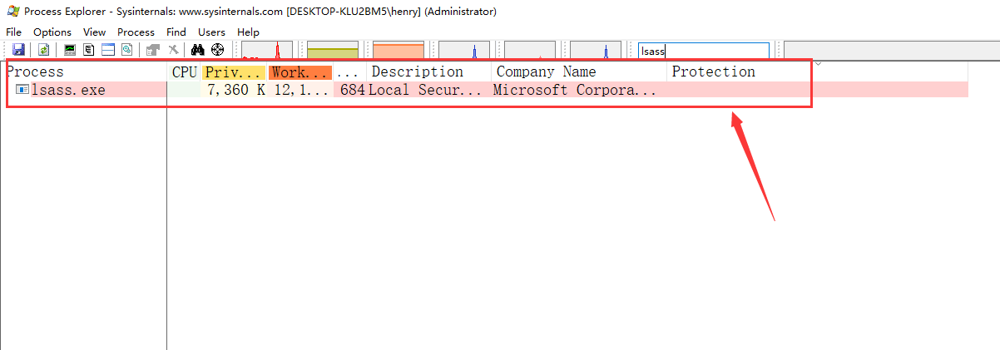

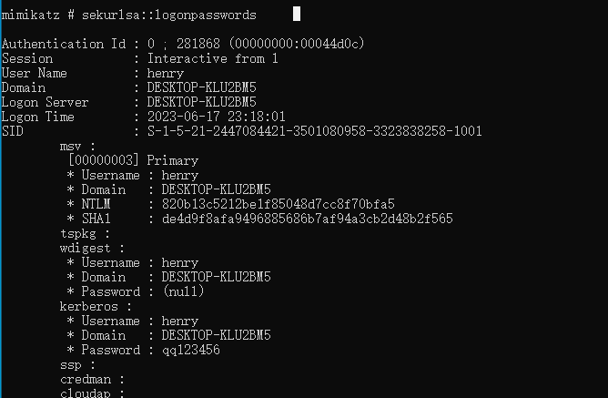	

## 2.为lsass添加PPL

打开注册表找到`HKEY_LOCAL_MACHINE\SYSTEM\CurrentControlSet\Control\Lsa`目录，添加个DWORD类型的键值`RunAsPPL`，并置其值为1

> LSA（Local Security Authority）是Windows操作系统中的一个重要组件，负责在用户登录系统时进行身份验证和生成访问令牌

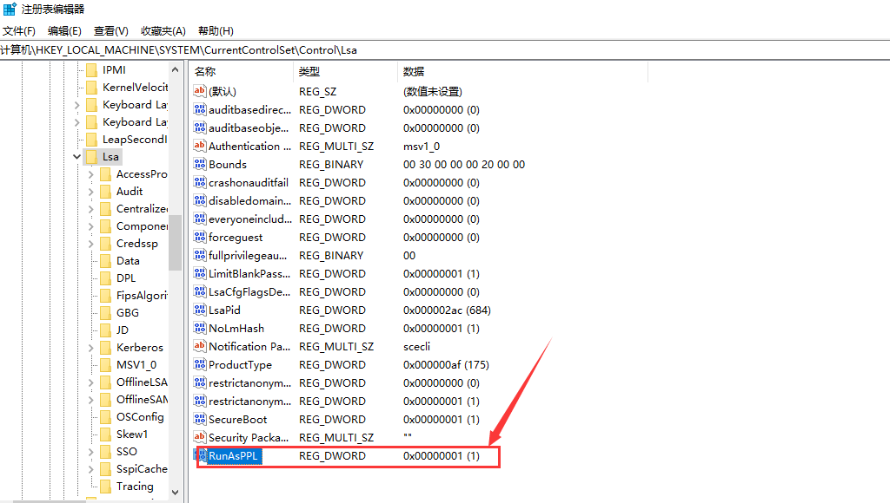	

重启系统后再次打开Process Explorer查看lsass进程，可以发现此进程被加了PPL

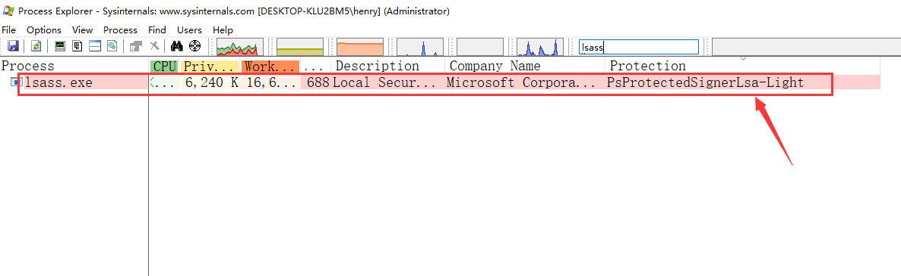

​	

尝试使用mimikatz抓取密码，抓取失败，提示报错：`Handler on memory(0x00000005)`

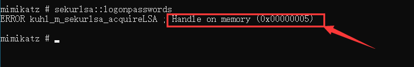	

## 3.分析mimikatz源码

根据报错提示，可以定位至`kuhl_m_sekurlsa.c`文件的`kuhl_m_sekurlsa_acquireLSA`函数，当`hData`变量的值为无效时，就会输出“Handle on memory”， 追踪`hData`变量

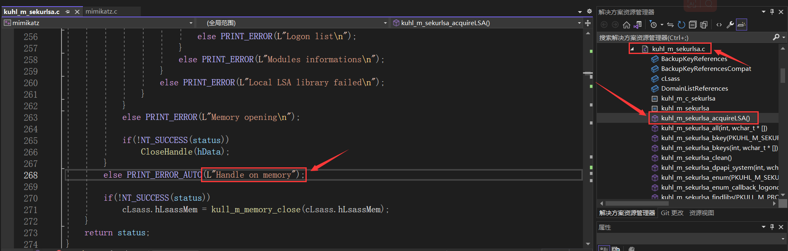

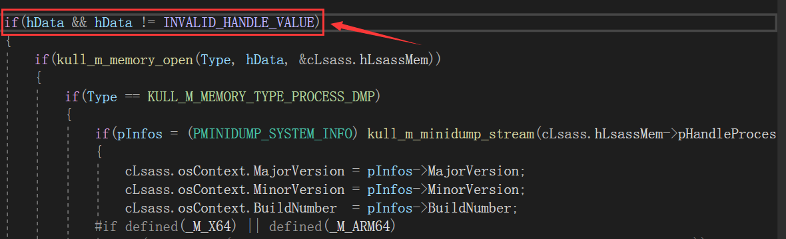	

hData的值为lsass进程的句柄， OpenProcess函数返回了一个无效的句柄，也就是说由于PPL阻止了mimikatz打开lsass进程

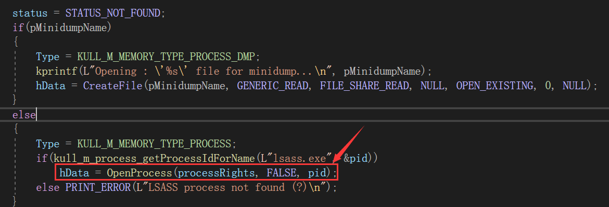

## 4.mimikztz加载驱动

可以加载mimikatz自带的驱动文件mimidrv.sys来移除lsass.exe的PPL保护，前提是你的mimikatz不会被查杀掉

- `!+`: 加载mimidrv.sys驱动文件
- `!processprotect /process:lsass.exe /remove`: 移除对lsass进程的保护

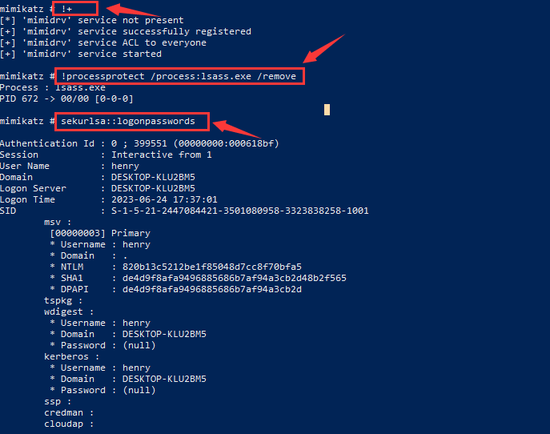	

​	

