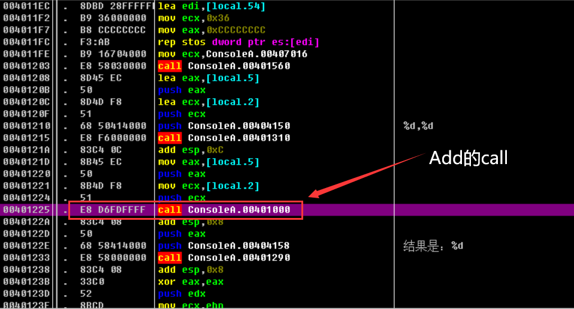
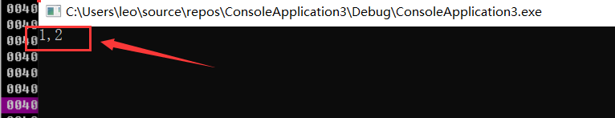
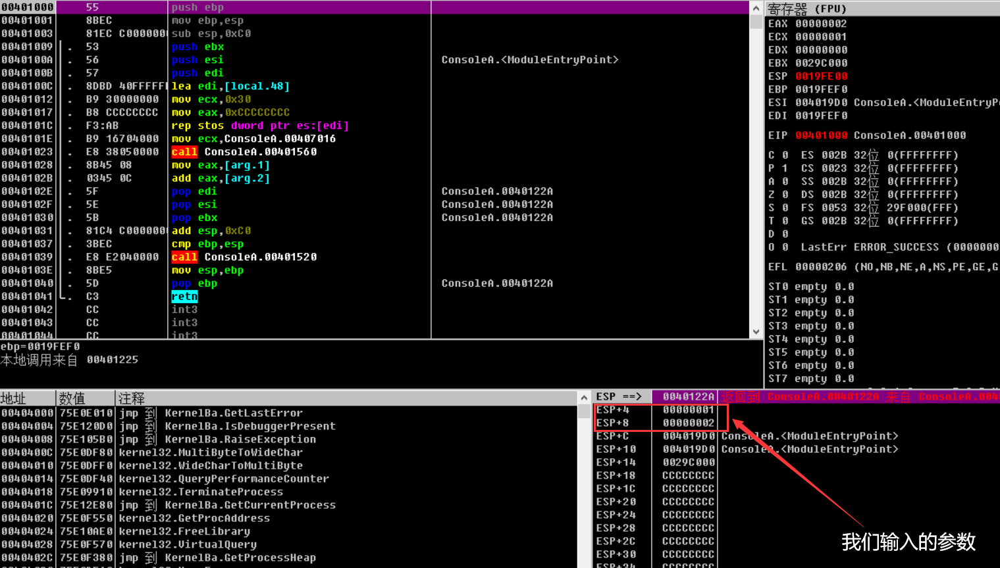
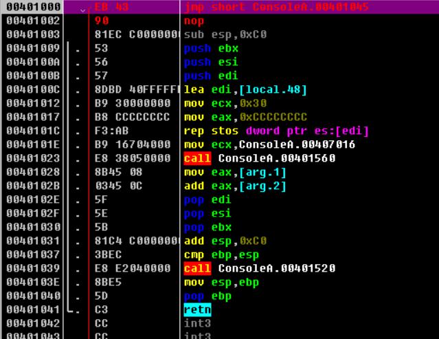
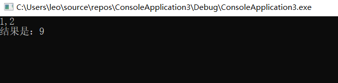
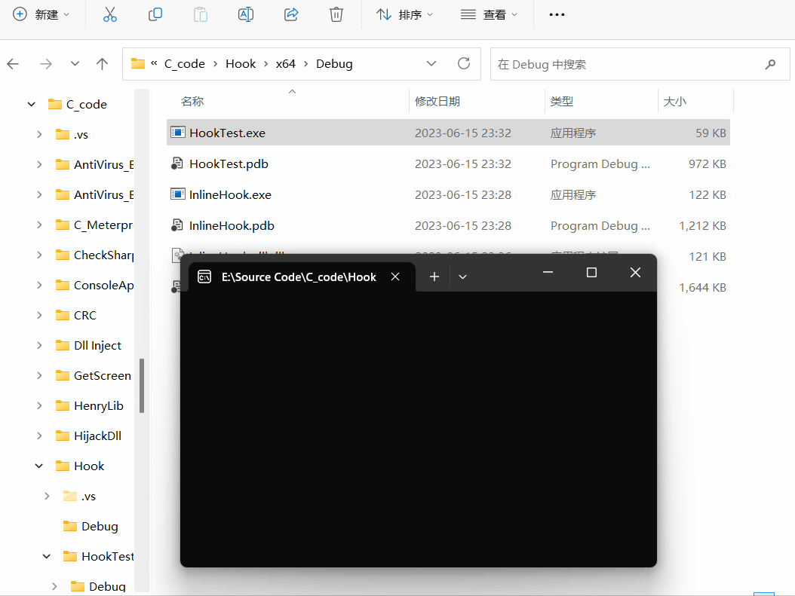
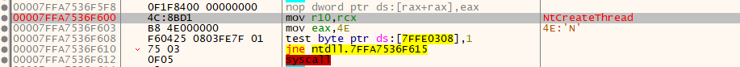
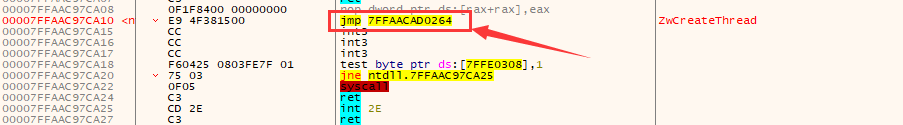
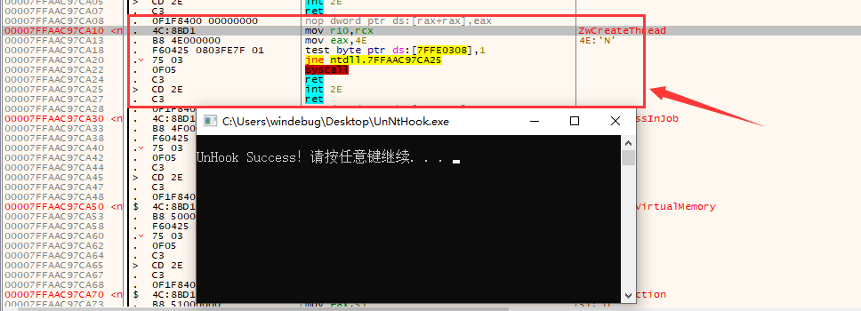

# Hook的概念

## 什么是Hook

Hook（也被称为“挂钩子”）是一种程序设计模式，它提供了一种方式去截获（或者“挂钩子”在）系统级别或者应用级别的函数调用、消息、事件等。通过使用Hook，开发者可以在不修改源程序的情况下，改变或者扩展操作系统、应用程序、驱动程序的功能


## Hook的分类

Hook通常分为两种形式，分别是修改函数代码和修改函数地址

### 修改函数代码

- **Inline Hook：**Inline Hook即内联Hook，是指直接修改目标函数的代码，通常是将目标函数的前几个字节修改为跳转指令，使得执行流跳转到我们自己的代码中。此类Hook需要备份被修改的代码，以便在执行完我们的代码后能正确地返回


### 修改函数地址

- **IAT HOOK：**IAT（Import Address Table）是进程加载动态链接库时用到的一个表，存储了DLL函数的地址。IAT Hook就是修改这个表中的函数地址，将其指向我们的代码，从而实现Hook。
- **SSDT HOOK：**SSDT（System Service Descriptor Table）是Windows系统中用于保存系统服务例程地址的表。SSDT Hook就是修改这个表中的函数地址，实现Hook。
- **IDT HOOK：**IDT（Interrupt Descriptor Table）是用于保存中断处理函数地址的表。IDT Hook就是修改这个表中的函数地址，实现Hook。
- **EAT HOOK：**EAT（Export Address Table）是动态链接库对外提供服务的函数地址表，EAT Hook就是修改这个表中的函数地址，实现Hook。
- **IRP HOOK：**IRP（I/O Request Packet）是Windows系统中用于描述I/O请求的数据结构。IRP Hook是通过修改驱动程序的IRP处理函数的指针，将其指向我们的代码，从而实现Hook。


# InlineHook

## 什么是InlineHook

Inline Hook，又称为超级Hook，是一种强大而又灵活的Hook技术。

Inline Hook的主要思想就是直接修改目标函数的代码，通常是在目标函数的开头插入一个跳转指令（jmp）。这个跳转指令会将程序的执行流跳转到我们自定义的函数中。

在我们的自定义函数中，我们可以执行任意的代码，然后再跳回目标函数的剩余部分。这样，我们就可以在不改变目标函数原有逻辑的基础上，添加自己的功能


## 一个简单的Hook实例

首先用C语言创建一个简单的加法程序

```cpp
#include<Windows.h>
#include<cstdio>

int ADD(int a,int b) {
	return a + b;
}


int main() {
	int a, b;
	scanf("%d,%d",&a, &b);
	printf("结果是：%d", ADD(a, b));
}
```


将程序拖入OD中，并且找到Add函数的call的地址并在此处下个断点




OD运行程序输入数据，这里我们输入1,2

	


F7进入Add函数的call，通过右下角的堆栈窗口可以查看上述输入的实参（1，2），也就是说，如果将这个堆栈里的参数值给修改了，那么就可以修改函数的返回值




首先在函数头部地址添加一个JMP汇编指令，跳转的地址是任意的，只要这个地址周围没有指令，这里以跳转到401045为例

	


红色部分的汇编指令就是我们自行创建的，以此来实现修改堆栈中的函数参数值

这里也要注意平衡堆栈，原先的call是有`push ebp`和`mov ebp,esp`指令的,由于添加了jmp指令导致它们被覆盖,所以这里要添上

最后的jmp指令再跳转回到401003	

	


最后程序运行结果为9,这是因为我们把参数从原先的1和2, 修改成了4和5

	


## 代码实现思路

这里我们会介绍两种实现 Inline Hook 的方法：

1. 使用 `jmp` 指令：这种方法通过插入一条 `jmp` 指令到目标函数的开始，使得函数在调用时直接跳转到我们自定义的函数。这里需要计算 `jmp` 后面的地址，因为 `jmp` 指令的目标地址是相对于下一条指令的位置计算的。计算公式为：`jmp` 后面的地址 = 目的地址 - 源地址 - 5。其中，5 是 `jmp` 指令的字节数。
2. 使用 `mov eax, address` 和 `jmp eax` 指令：这种方法首先把自定义函数的地址加载到 `eax` 寄存器，然后使用 `jmp eax` 跳转到该地址。这样，当目标函数被调用时，它会直接跳转到我们自定义的函数。

这两种方法各有优劣。使用 `jmp` 指令的方法简洁直观，但对源地址和目的地址的位置有一定的限制，如果目标和源地址之间的距离过大，可能导致 `jmp` 指令无法正确跳转。而使用 `mov eax, address` 和 `jmp eax` 的方法则没有这个问题，但需要更多的指令，可能会覆盖掉目标函数的更多代码


## 代码实现

### 1.借助eax间接jmp

```cpp
#include <windows.h> 
#include <stdio.h>    
#include <iostream>   
#include <tchar.h>    
BYTE NewCode[7] = { 0xB8, 0x0, 0x0, 0x0, 0x0, 0xFF ,0xE0 };  // 新代码，用于Hook
BYTE OldCode[7] = { 0 };                                     // 旧代码，用于保存被Hook函数的原始字节
FARPROC MessageBoxAddress;                                   // MessageBox函数的地址


// 自定义的MessageBoxA函数
int WINAPI MyMessageBoxA(HWND hWnd, LPCTSTR lpText, LPCTSTR lpCaption, UINT uType)
{
	printf("MessageBoxA 已经被Hook\n");  // 打印信息
	
	// 在调用原始函数之前，恢复原始代码
	WriteProcessMemory(INVALID_HANDLE_VALUE, (void*)MessageBoxAddress, (void*)OldCode, 7, NULL);

	// 调用原始的MessageBoxA函数
	int ret = MessageBoxA(NULL, "Hello World", "Title", MB_OK);

	// 在调用原始函数之后，再次将Hook代码写入
	WriteProcessMemory(INVALID_HANDLE_VALUE, (void*)MessageBoxAddress, (void*)NewCode, 7, NULL);
	return ret;
}


void InlineHook()
{
	HMODULE hModule_User32 = LoadLibrary("user32.dll");  //加载user32.dll模块
	MessageBoxAddress = GetProcAddress(hModule_User32, "MessageBoxA");  //获取MessageBoxA函数的地址
	printf("MessageBoxA Addr is %x\n", MessageBoxAddress);
	printf("MyMessageBoxA Addr is %x\n", MyMessageBoxA);

	// 读取MessageBoxA函数的前7个字节，并保存在OldCode数组中
	if (ReadProcessMemory(INVALID_HANDLE_VALUE, MessageBoxAddress, OldCode, 7, NULL) == 0)
	{
		printf("ReadProcessMemory error\n");
		return;
	}

	printf("OldCode is %x%x%x%x%x%x%x\n", OldCode[0], OldCode[1], OldCode[2], OldCode[3], OldCode[4], OldCode[5], OldCode[6]);

	DWORD JmpAddress = (DWORD)MyMessageBoxA - (DWORD)MessageBoxAddress - 5;  // 获取自定义的MessageBoxA函数的地址

	memcpy(&NewCode[1], &JmpAddress, 4);  // 将地址写入到NewCode的第二个字节开始的位置

	DWORD dwOldProtect = 0;  // 用于保存原始页保护
	printf("NewBytes is %x%x%x%x%x\n", NewCode[0], NewCode[1], NewCode[2], NewCode[3], NewCode[4], NewCode[5], NewCode[6]);

	// 使用VirtualProtect函数改变MessageBoxA函数所在页的保护属性，使其可读可写可执行。
	VirtualProtect(MessageBoxAddress, 7, PAGE_EXECUTE_READWRITE,&dwOldProtect);
	
	// 使用WriteProcessMemory函数将我们的Hook代码写入到MessageBoxA函数的开头。
	WriteProcessMemory(INVALID_HANDLE_VALUE, MessageBoxAddress, NewCode, 7,NULL);
	
	// 使用VirtualProtect函数恢复MessageBoxA函数所在页的保护属性。
	VirtualProtect(MessageBoxAddress, 7, dwOldProtect, &dwOldProtect);
}


void main()
{	
	InlineHook();
	MessageBoxA(NULL, "Hello World", "Title", MB_OK);
}
```

该代码首先将自定义函数`MyMessageBoxA`的地址加载到`eax`寄存器，然后通过`jmp eax`指令跳转到`MyMessageBoxA`。`OldCode`用于保存原始的`MessageBoxA`函数的前7个字节

然后通过`WriteProcessMemory`函数恢复原始的`MessageBoxA`函数的前7个字节，接着调用原始的`MessageBoxA`函数，最后再次通过`WriteProcessMemory`函数将`NewCode`写回到`MessageBoxA`函数的开头，以确保下次调用`MessageBoxA`时仍然会被Hook

在`InlineHook`函数中，程序首先获取`MessageBoxA`函数的地址，然后读取该地址的前7个字节并保存在`OldCode`数组中，接着计算出`MyMessageBoxA`函数的地址与`MessageBoxA`函数的地址之间的偏移量并保存在`NewCode`数组的第二个字节开始的位置，然后通过`VirtualProtect`函数修改`MessageBoxA`函数所在页的保护属性使其可读可写可执行，最后通过`WriteProcessMemory`函数将`NewCode`写入到`MessageBoxA`函数的开头


### 2.直接jmp

```cpp
#include <windows.h>
#include <stdio.h>
#include <iostream>

BYTE JmpOriginal[5] = { 0xE9, 0, 0, 0, 0 };  // 用于跳转到MyMessageBoxA的指令，0xE9代表JMP指令
BYTE OldCode[5] = { 0 };                      // 存储原始MessageBoxA的前5个字节
FARPROC MessageBoxAddress;                    // MessageBoxA的函数地址
void* Trampoline;                             // 桥接函数地址

// 自定义的MessageBoxA函数
int WINAPI MyMessageBoxA(HWND hWnd, LPCTSTR lpText, LPCTSTR lpCaption, UINT uType)
{
    printf("MessageBoxA 已经被Hook\n");  // 打印被Hook的信息

    // 使用桥接函数调用原始的MessageBoxA，这里需要类型转换
    int ret = ((int (WINAPI*)(HWND, LPCTSTR, LPCTSTR, UINT))Trampoline)(hWnd, lpText, lpCaption, uType);
    return ret;
}

void InlineHook()
{
    HMODULE hModule_User32 = LoadLibraryA("user32.dll");  // 加载user32.dll模块
    MessageBoxAddress = GetProcAddress(hModule_User32, "MessageBoxA");  // 获取MessageBoxA的函数地址

    DWORD JmpAddress = (DWORD)MyMessageBoxA - (DWORD)MessageBoxAddress - 5;  // 计算跳转到MyMessageBoxA的地址
    memcpy(&JmpOriginal[1], &JmpAddress, 4);  // 将跳转地址复制到JmpOriginal的第二个字节

    ReadProcessMemory(GetCurrentProcess(), MessageBoxAddress, OldCode, 5, NULL);  // 读取并保存MessageBoxA的前5个字节

    // 分配10个字节的内存空间作为桥接函数
    Trampoline = VirtualAlloc(NULL, 10, MEM_COMMIT | MEM_RESERVE, PAGE_EXECUTE_READWRITE);
    memcpy(Trampoline, OldCode, 5);  // 复制MessageBoxA的前5个字节到桥接函数

    // 计算并写入桥接函数的跳回地址
    DWORD jmpBackAddr = (DWORD)MessageBoxAddress + 5 - (DWORD)Trampoline - 5;
    memcpy((void*)((DWORD)Trampoline + 5), &JmpOriginal[0], 5);
    memcpy((void*)((DWORD)Trampoline + 6), &jmpBackAddr, 4);

    DWORD dwOldProtect;
    // 修改MessageBoxA的前5个字节的页属性，使其可读可写可执行
    VirtualProtect(MessageBoxAddress, 5, PAGE_EXECUTE_READWRITE, &dwOldProtect);

    // 替换MessageBoxA的前5个字节为跳转到MyMessageBoxA的指令
    WriteProcessMemory(GetCurrentProcess(), MessageBoxAddress, &JmpOriginal[0], 5, NULL);

    // 恢复MessageBoxA的前5个字节的原始页属性
    VirtualProtect(MessageBoxAddress, 5, dwOldProtect, &dwOldProtect);
}

void main()
{
    InlineHook();  // 实施Inline Hook
    MessageBoxA(NULL, "Hello World", "Title", MB_OK);  // 调用MessageBoxA函数
}
```

与上述代码不同的是, 这里需计算跳转到我们自定义的MyMessageBoxA函数的跳转指令。除此之外，我们还在虚拟内存分配了一块区域用来存放被覆盖的原始代码，并在其后面添加一个跳转指令，使其能够返回被Hook的函数，这样做的好处是可以避免每次调用hook函数时都需要恢复和再次修改被Hook的函数代码


### 3.使用detours库

在windows 10操作系统中由于ASLR(地址随机化)的缘故，手工实现InLine比较麻烦，这里使用微软的一个轻量级的开源库Detours，

Detours 是一个由 Microsoft Research 开发的库，用于钩取和修改 Windows API 调用和其他函数调用。你可以从其 GitHub 仓库下载它：https://github.com/microsoft/Detours

这里我使用vcpkg来按照Detours库，运行如下命令，至于如何安装和使用vcpkg可以看这篇文章：https://blog.csdn.net/xf555er/article/details/130465197

```
vcpkg install detours
```


以下是具体的实现代码：

```cpp
#include<Windows.h>
#include<stdio.h>
#include <detours/detours.h>

// 声明一个函数指针OldMessageBoxA，指向MessageBoxA函数
static int (WINAPI* OldMesssageBoxA)
(
    HWND hWnd,
    LPCSTR lpText,
    LPCSTR lpCaption,
    UINT uType
    ) = MessageBoxA;

// 自定义函数MyFunction0，当MessageBoxA被调用时，会跳转到这个函数
int WINAPI MyFunction0(HWND hWnd, LPCSTR lpText, LPCSTR lpCaption, UINT uType)
{
    // 在这个函数中，调用原来的MessageBoxA函数，显示特定的信息
    return OldMesssageBoxA(NULL, "Hook Success!", "Warming", MB_OKCANCEL);
}

int main() {
    // 开始一次新的Detour操作
    DetourTransactionBegin();
    
    // 告诉Detour这个线程将被影响
    DetourUpdateThread(GetCurrentThread());
    
    // 将OldMessageBoxA函数指针替换为MyFunction0，也就是说当MessageBoxA被调用时，跳转到MyFunction0
    DetourAttach(&(PVOID&)OldMesssageBoxA, MyFunction0);
    
    // 如果需要移除Hook，可以调用DetourDetach
    // DetourDetach(&(PVOID&)OldMesssageBoxA, MyFunction0);
    // 提交Detour操作
    DetourTransactionCommit();

    // 调用MessageBoxA，但实际上会跳转到MyFunction0
    MessageBoxA(0, 0, 0, 0);

    return 0;
}
```

定义一个函数指针 `OldMessageBoxA`，这个函数指针指向了`MessageBoxA`函数，同时定义了一个新的函数`MyFunction0`

`DetourTransactionBegin`来开始一个新的Detour操作，然后使用`DetourUpdateThread`来更新当前线程的状态，使得Detour操作能影响到当前线程

`DetourAttach`函数是Detour操作的核心，这个函数会将`OldMessageBoxA`的调用重定向到`MyFunction0`，也就是说，当其他代码尝试调用`MessageBoxA`时，实际上会调用`MyFunction0`

调用`DetourTransactionCommit`来提交Detour操作，使得之前的重定向生效。这时候，任何尝试调用`MessageBoxA`的代码，实际上都会调用`MyFunction0`

注意，如果想要取消Detour操作，只需要使用`DetourDetach`函数，将`OldMessageBoxA`和`MyFunction0`之间的重定向取消即可


## 编写Dll

### 代码实现

如下是通过detour库实现inlineHook的动态链接库代码:

```cpp
#include<Windows.h>
#include<stdio.h>
#include <detours/detours.h>

// 声明一个函数指针OldMessageBoxA，指向MessageBoxA函数
static int (WINAPI* OldMesssageBoxA)
(
    HWND hWnd,
    LPCSTR lpText,
    LPCSTR lpCaption,
    UINT uType
    ) = MessageBoxA;

// 自定义函数MyFunction0，当MessageBoxA被调用时，会跳转到这个函数
int WINAPI MyFunction0(HWND hWnd, LPCSTR lpText, LPCSTR lpCaption, UINT uType)
{
    // 在这个函数中，调用原来的MessageBoxA函数，显示特定的信息
    return OldMesssageBoxA(NULL, "Hook Success!", "Warming", MB_OKCANCEL);
}


DWORD WINAPI ThreadProc(LPVOID lpParameter)
{   
    // 开始一次新的Detour操作
    DetourTransactionBegin();

    // 告诉Detour这个线程将被影响
    DetourUpdateThread(GetCurrentThread());

    // 将OldMessageBoxA函数指针替换为MyFunction0，也就是说当MessageBoxA被调用时，跳转到MyFunction0
    DetourAttach(&(PVOID&)OldMesssageBoxA, MyFunction0);

    // 如果需要移除Hook，可以调用DetourDetach
    // DetourDetach(&(PVOID&)OldMesssageBoxA, MyFunction0);
    // 提交Detour操作
    DetourTransactionCommit();

    // 调用MessageBoxA，但实际上会跳转到MyFunction0
    //MessageBoxA(0, 0, 0, 0);
    return 0;
};

BOOL APIENTRY DllMain(HMODULE hModule,
	DWORD  ul_reason_for_call,
	LPVOID lpReserved
)
{
	switch (ul_reason_for_call)
	{
	case DLL_PROCESS_ATTACH: {
        HANDLE hThread = CreateThread(NULL, 0, ThreadProc, (LPVOID)NULL, 0, NULL);
		break;
	}
	case DLL_THREAD_ATTACH:
	case DLL_THREAD_DETACH:
	case DLL_PROCESS_DETACH:
		break;
	}
	return TRUE;
}
```


如下是用来测试InlineHook_dll的可执行程序代码, 在没被Hook的情况下会弹框提示"HelloWorld", 被Hook后会弹框提示"Hook Success!"

```cpp
#include <Windows.h>
#include <stdio.h>

int main() {
	LoadLibraryA("InlineHook_dll.dll");
	getchar();
	MessageBoxA(NULL, "HelloWorld", "窗口标题", NULL);
	return 0;
}
```


### 运行测试

执行HookTest.exe, 按回车后出现弹框, 提示"Hook Success!"

	


## 参考文章

- https://idiotc4t.com/persistence/detous-inline-hook#inline-hook-jian-jie


# 去除Ntdll的Hook

## 简介

许多杀毒软件使用钩子（hook）技术来监视系统的API函数调用，并检测潜在的恶意代码行为。Ntdll.dll是Windows操作系统的一个核心动态链接库，其中包含许多系统级API函数。通过在Ntdll上设置钩子，杀毒软件可以拦截这些API函数的调用，并检查它们的参数和返回值，以便发现可能的恶意行为


下图是没有被杀软挂钩子的NtCreateThread函数




下图是被BitDefender挂钩子的NtCreateThread函数，钩子是`jmp 7FFAACAD0264`



​	

## 代码思路

`UNHOOKntdll()`函数的主要目标是移除对`ntdll.dll`文件的任何hooks


### 1.获取被挂钩的ntdll信息

函数首先通过`GetModuleHandleA("ntdll.dll")`获取ntdll模块的句柄，这个句柄指向当前进程中已经加载的`ntdll.dll`。

`GetModuleInformation()`被用于获取ntdll模块的信息，包括模块的基地址等。此处获取到的信息将被用于后续操作


### 2.打开新的ntdll并映射至进程空间

通过调用`CreateFileA()`打开系统目录下的原始`ntdll.dll`文件。这个文件没有被任何hook修改，所以可以作为一个“清洁”的源来恢复被hook修改的部分

使用`CreateFileMapping()`和`MapViewOfFile()`函数将原始ntdll文件映射至当前进程的地址空间中


### 3.查找ntdll的text节区

遍历当前进程中加载的ntdll模块的所有section（节区）。在Windows PE文件格式（包括DLL和EXE）中，一个section是包含特定类型数据的一个内存区块，例如代码或者数据。特别地，`.text` section通常包含程序的代码


### 4.替换text节区的内容

通过调用`VirtualProtect()`改变它的内存保护属性，使其成为可读、可写、可执行。这样才能修改该内存区块的内容

通过`memcpy()`将原始ntdll文件中的`.text` section的内容复制到当前进程的ntdll模块的对应部分。这个操作实际上就是“恢复”了被hook修改过的代码，因为现在它被原始的、没有被hook的代码所替代


## 代码实现

```cpp
#include <Windows.h>
#include <TlHelp32.h>
#include <iostream>
#include <winternl.h>
#include <psapi.h>

// 智能句柄，自动管理系统资源
struct SmartHandle {
    HANDLE handle; // 系统句柄
    SmartHandle(HANDLE handle) : handle(handle) {} // 构造函数，接收系统句柄
    ~SmartHandle() { // 析构函数
        if (handle != INVALID_HANDLE_VALUE) { // 判断句柄是否有效
            CloseHandle(handle); // 如果有效，关闭句柄
        }
    }
};

DWORD UNHOOKntdll() {
    MODULEINFO mi = {}; // 定义模块信息结构体
    HMODULE ntdllModule = GetModuleHandleA("ntdll.dll"); // 获取ntdll模块的句柄
    GetModuleInformation(HANDLE(-1), ntdllModule, &mi, sizeof(mi)); // 获取模块信息，存放到mi
    LPVOID ntdllBase = (LPVOID)mi.lpBaseOfDll; // 获取ntdll模块的基址

    // 使用智能句柄打开ntdll.dll文件
    SmartHandle ntdllFile(CreateFileA("c:\\windows\\system32\\ntdll.dll",
        GENERIC_READ, FILE_SHARE_READ, NULL, OPEN_EXISTING, 0, NULL));

    // 创建文件映射，映射ntdll.dll文件
    SmartHandle ntdllMapping(CreateFileMapping(ntdllFile.handle, NULL, PAGE_READONLY |
        SEC_IMAGE, 0, 0, NULL));

    // 映射视图，得到映射地址
    LPVOID ntdllMappingAddress = MapViewOfFile(ntdllMapping.handle, FILE_MAP_READ, 0,
        0, 0);

    // 读取ntdll模块的DOS头
    PIMAGE_DOS_HEADER hookedDosHeader = (PIMAGE_DOS_HEADER)ntdllBase;

    // 读取ntdll模块的NT头
    PIMAGE_NT_HEADERS hookedNtHeader = (PIMAGE_NT_HEADERS)((DWORD_PTR)ntdllBase
        + hookedDosHeader->e_lfanew);

    // 遍历所有节
    for (WORD i = 0; i < hookedNtHeader->FileHeader.NumberOfSections; i++) {
        // 读取每个节的头信息
        PIMAGE_SECTION_HEADER hookedSectionHeader = (PIMAGE_SECTION_HEADER)
            ((DWORD_PTR)IMAGE_FIRST_SECTION(hookedNtHeader) +
                ((DWORD_PTR)IMAGE_SIZEOF_SECTION_HEADER * i));

        // 检查是否是.text节
        if (!strcmp((char*)hookedSectionHeader->Name, (char*)".text")) {
            DWORD oldProtection = 0; // 用来保存旧的保护属性
            try {
                // 修改内存保护属性为可读可写可执行
                BOOL isProtected = VirtualProtect((LPVOID)((DWORD_PTR)ntdllBase +
                    (DWORD_PTR)hookedSectionHeader->VirtualAddress), hookedSectionHeader->Misc.VirtualSize, PAGE_EXECUTE_READWRITE, &oldProtection);

                // 使用memcpy替换.text节的内容
                memcpy((LPVOID)((DWORD_PTR)ntdllBase + (DWORD_PTR)hookedSectionHeader->VirtualAddress),
                    (LPVOID)((DWORD_PTR)ntdllMappingAddress + (DWORD_PTR)hookedSectionHeader->VirtualAddress), hookedSectionHeader->Misc.VirtualSize);
            }
            catch (...) {
                // 如果在修改过程中发生异常，确保恢复内存的保护属性
                VirtualProtect((LPVOID)((DWORD_PTR)ntdllBase + (DWORD_PTR)hookedSectionHeader->VirtualAddress), hookedSectionHeader->Misc.VirtualSize, oldProtection, &oldProtection);
                throw; // 再次抛出异常，让上层调用者知道发生了异常
            }
            // 确保我们恢复了内存的保护属性
            VirtualProtect((LPVOID)((DWORD_PTR)ntdllBase + (DWORD_PTR)hookedSectionHeader->VirtualAddress), hookedSectionHeader->Misc.VirtualSize, oldProtection, &oldProtection);
        }
    }
    FreeLibrary(ntdllModule); // 释放模块
    return 0;
}


int main() {
    getchar();
    UNHOOKntdll();
	return 0;
}
```


## 运行测试

重载Ntdll后，可以发现杀软的钩子被去除掉了

	


# END
