# Invoke-Obfuscation

## 简介

Invoke-Obfuscation工具下载地址: https://github.com/danielbohannon/Invoke-Obfuscation

这是一款针对`PowerShell`文件的免杀工具, 此处对CS生成的PowerShell木马进行免杀

Invoke-Obfuscation是一款PowerShell混淆工具，可以将PowerShell脚本加密，使得它的检测和分析变得更加困难。该工具包含多种加密方法，可以单独使用也可以结合使用，以提高混淆的效果。Invoke-Obfuscation还有多个选项可以选择，如TOKEN、AST、STRING、ENCODING、COMPRESS和LAUNCHER，可以帮助你更好地混淆脚本


## 简单演示

### 1.CS生成ps木马

打开Cobalt Strike, 点击`攻击>生成后门->Payload Generator`

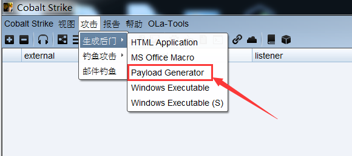			


选择相应的监听, 生成`powershell`木马

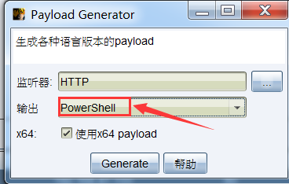	


### 2.导入模块并加载

进入`invoke-Obsfuscation`文件夹并打开powershell, 执行如下命令导入`Invoke-Obfuscation`模块

```powershell
Import-Module .\Invoke-Obfuscation.psd1
```


执行如下命令加载模块

```
Invoke-Obfuscation
```

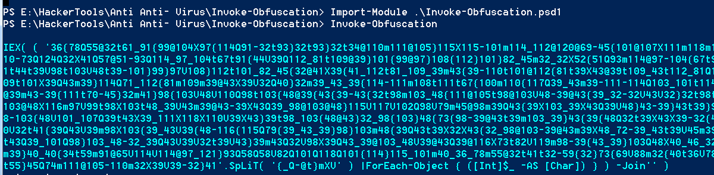


随后进入工具命令行界面, 如下图所示, 该工具支持六种加密方式:

- TOKEN: 将脚本转换为一个或多个PowerShell解析器令牌的序列

- AST: 将脚本转换为抽象语法树
- STRING: 混淆脚本中的字符串，使得脚本的意图变得模糊不清
- ENCONDING: 将脚本转换为ASCII、Unicode或Base64编码
- COMPRESS: 将脚本压缩，使得脚本的大小变小，从而使得脚本的传输和存储更加方便
- LAUNCHER: 生成一个启动器，该启动器可以在目标系统上执行混淆后的脚本

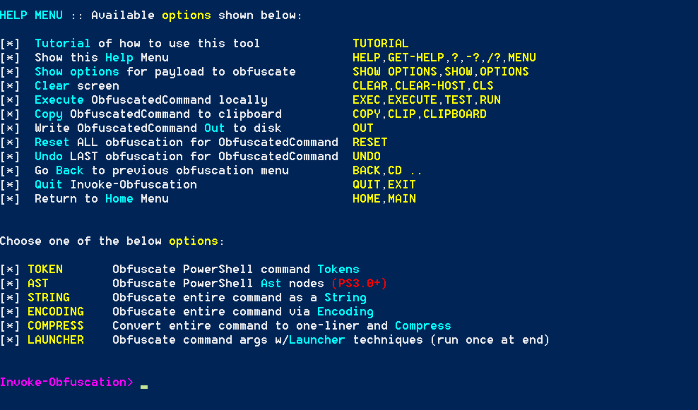	


### 3.输入要加密的脚本路径

```
set scriptpath C:\Users\hacker\Desktop\payload.ps1
```

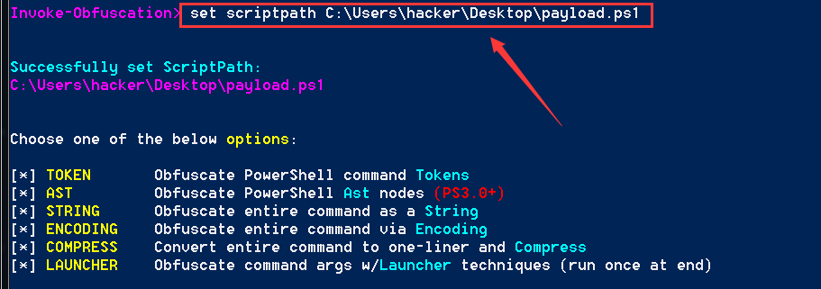	


### 4.加密脚本

此次我选择编码加密, 输入`encoding`, 随后出现8种编码加密方式, 这里我简单介绍下常用的五种加密

1. ASCII编码
2. HEX(16进制)编码
3. octal(8进制)编码
4. Binary(2进制)编码
5. AES算法加密(最常用)

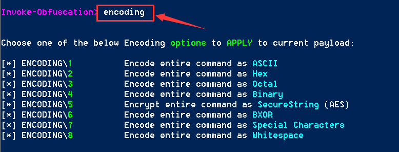	


此处我选择5, 即AES算法加密

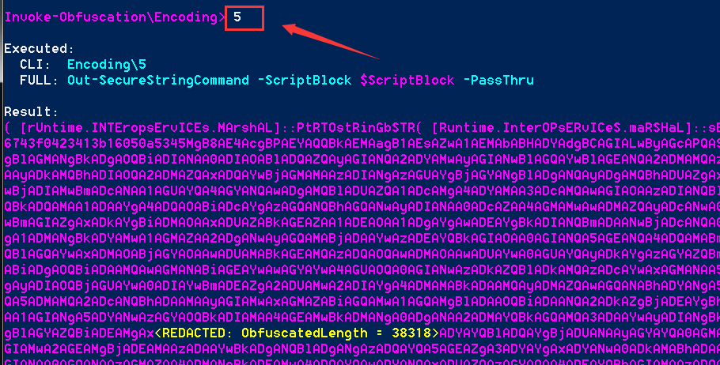		


输入`back`返回上级目录, 然后输入`string`对脚本文件进行字符串混肴, 有三种字符串混肴方法, 此处我输入2选择了第二种

	


### 5.查看加密选项

可以看到加密前和加密后的脚本内容对比, 以及采用了何种加密方法和完整的加密命令

```
show options
```

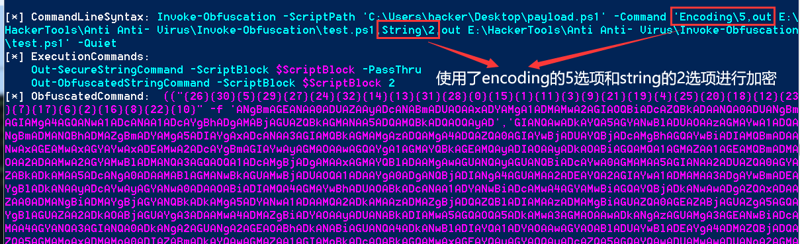	

### 6.输出脚本

输出加密后的脚本文件至工具目录

```
out test.ps1
```

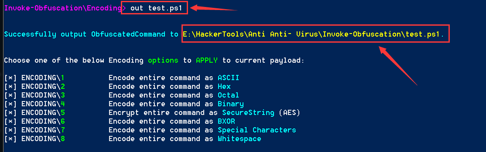


## 杀软测试	

### 火绒

使用火绒静态扫描脚本文件, 没有发现威胁

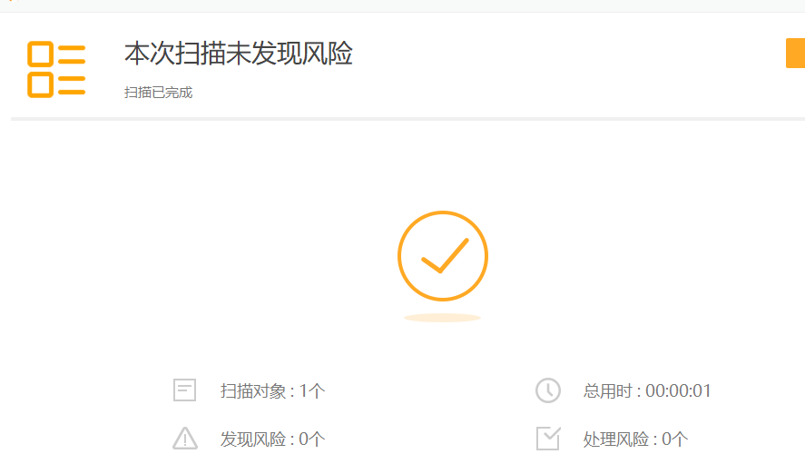	


cmd命令行输入如下命令执行脚本, 火绒没有报毒, 成功过掉火绒动态扫描

```
PowerShell.exe -ExecutionPolicy Bypass -File .\test.ps1
```

> 至于为何要加上`-ExecutionPolicy Bypass`参数, 这是因为在默认情况下, powershell的安全策略规定不允许运行命令和文件, 但是可以通过添加此参数来绕过任意一个安全保护规则, 在真实的渗透环境中经常用到此参数来执行powershell脚本

	


### WindowDefender

成功过掉WindowDefender的静态扫描

	


但是过不了WindowDefender的动态扫描

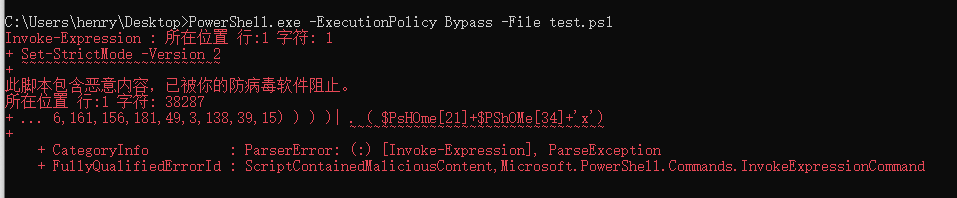	


# shellter

## 简介

Shellter是一种动态二进制程序壳程序，它可以在现有的可执行文件中隐藏恶意软件。它使用动态链接库技术来实现恶意代码的注入，并且可以在不修改现有的可执行文件的情况下进行注入。这使得它非常难以检测，因为它不会改变文件的哈希值或数字签名

Shellter的官方下载地址：https://www.shellterproject.com/

当前Shellter最新免费版本是v7.2，最新收费版本是v_pro4.7


## 简单实例

### 1.选择模式

点击shellter.exe运行工具进入命令行界面, 随后选择模式, 这里我输入A, 即选择自动模式

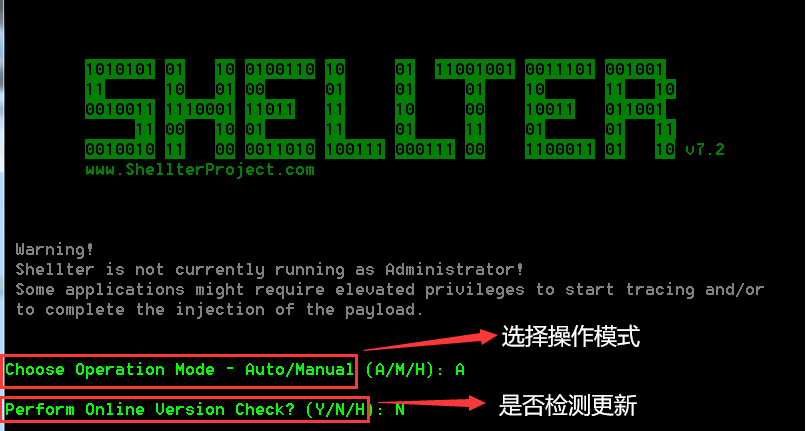		


### 2.绑定32位PE文件

填写PE文件路径并要求此PE文件是32位的, 此处我以32位的calc.exe(计算器)为例, 先将calc.exe拖到Shellter文件目录, 然后填写PE文件路径, 随后会在Shellter_Backups目录备份原PE文件

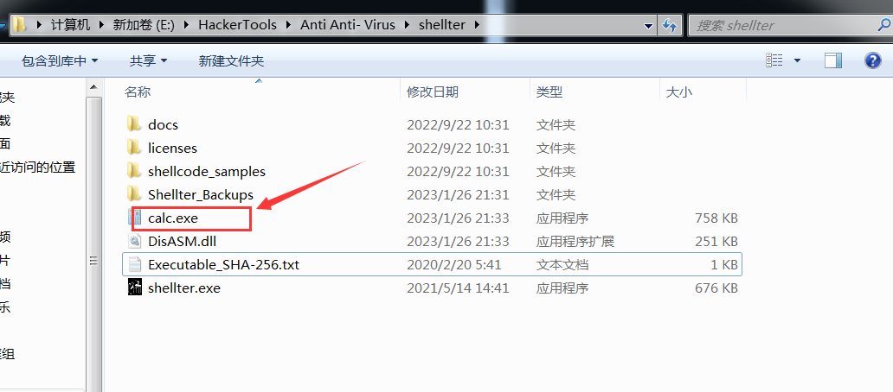	

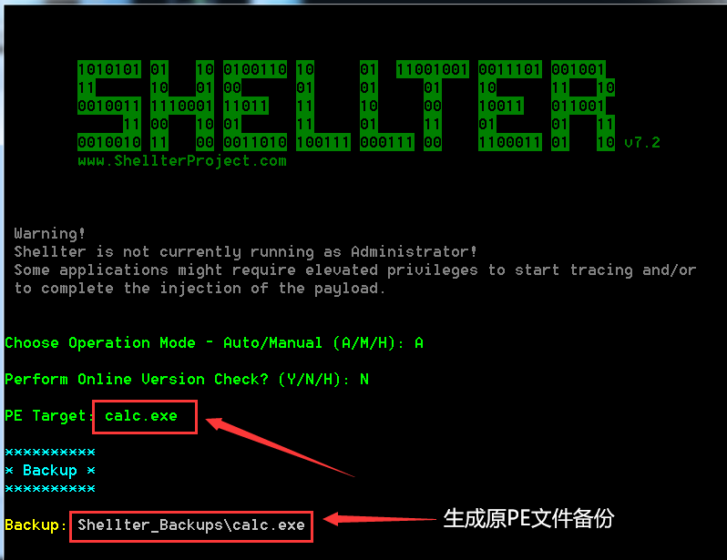			


### 3.是否开启隐身模式

询问是否启用隐身模式, 此处我选择了Yes

> 启用隐身模式后, 执行生成的免杀木马不仅可以上线, 还能正常使用原PE文件的功能, 但缺点是免杀效果差

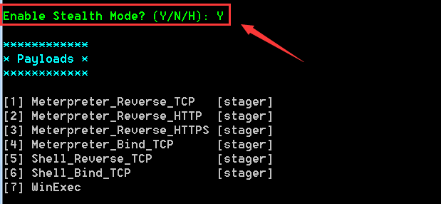	


### 4.填写监听

询问你是使用工具自带的payload还是自定义监听, 此处我输入L选择自带payload, 然后输入2选着HTTP监听

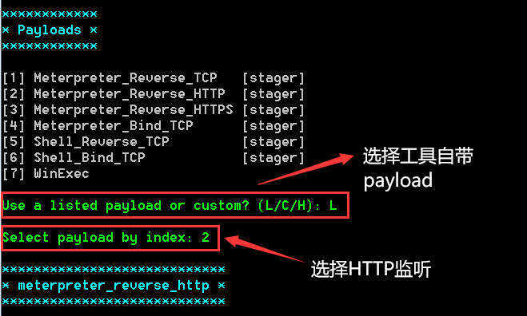	


此处我使用CS来创建监听, 监听的地址和端口是`192.168.47.155:80`, 然后在Shellter命令行中填写

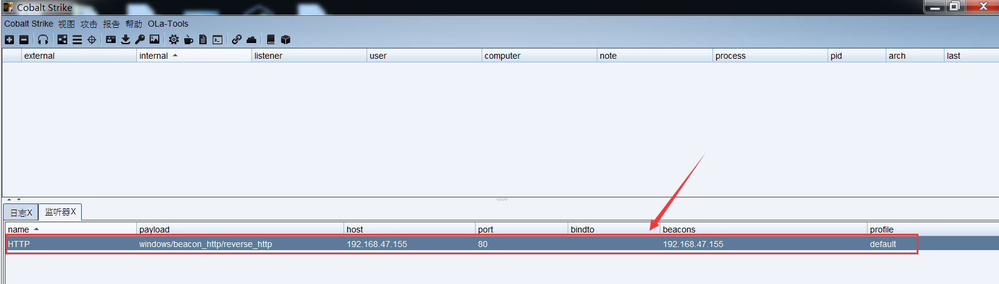

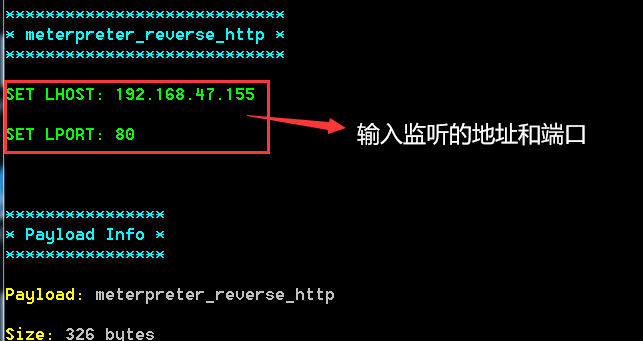		


### 5.测试效果

生成的免杀木马会覆盖原先PE文件, 执行效果如下图所示

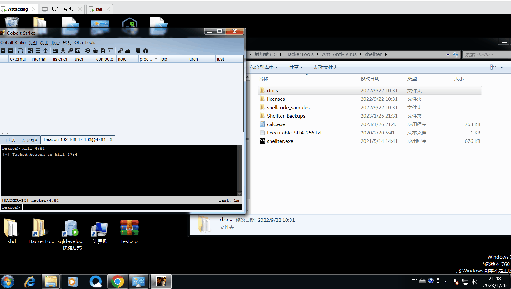	


## 杀软测试

将免杀木马发送到杀毒平台检测, 可以发现还是能绕过绝大多数杀软的, 像火绒,360杀毒这些主流杀软都能绕过, 但是这只仅仅是静态扫描, 动态扫描还是很难绕过

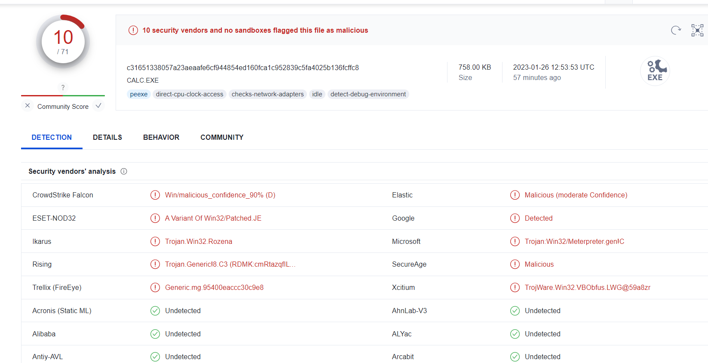	


